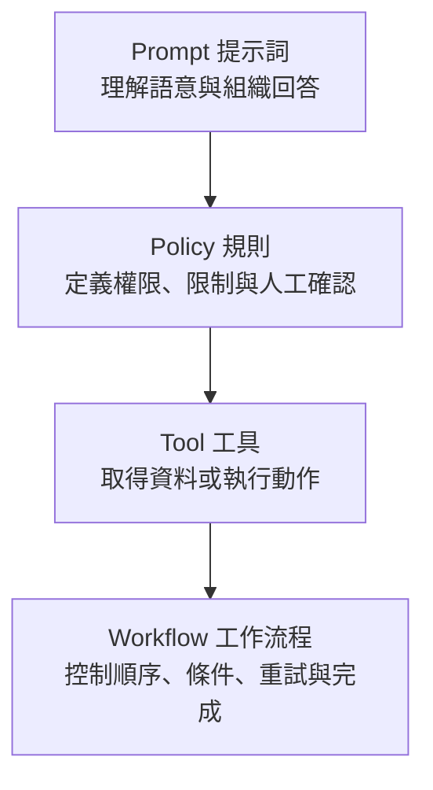

剛開始做 AI 應用時，最自然的做法通常是一直加 Prompt。回答不夠完整，就多寫一條規則；工具選錯，就再補一個條件；遇到例外，再新增一段提醒。短期內這種方式很有效，因為修改速度快，而且不需要先設計複雜架構。

但當規則愈來愈多，Prompt 很快就會開始同時承擔太多責任：既要描述角色，又要規定流程，還要決定何時查資料、遇到失敗怎麼處理。這時候真正的問題已經不是「Prompt 寫得好不好」，而是我們把應該由程式控制的事情交給了語言模型。

  *圖 1｜Prompt、Policy、Tool 與 Workflow 各自負責不同層次*

## 四個層次不要混在一起

我會把企業 AI 裡常見的設計分成四層。**Prompt** 負責告訴模型怎麼理解與回應；**Policy** 定義不能違反的規則，例如資料權限或高風險操作需要人工確認；**Tool** 提供模型取得資料或執行動作的能力；**Workflow** 則決定這些步驟應該按照什麼順序發生，以及什麼條件下要走哪一條路。

這四層可以互相配合，但不能彼此取代。Prompt 可以寫「請先查資料再回答」，卻不能保證工具一定成功執行；也可以寫「如果資料不足請重試」，但無法真正控制 Timeout、Retry 次數或失敗後要切換哪個模型。

## 為什麼企業環境特別在意工作流程（Workflow）？

一般聊天內容偶爾有一點不一致，使用者可能重新問一次就好。但企業任務通常有順序與責任。例如要建立一筆正式任務前，可能必須先確認資料來源、通過驗證，再取得人工批准。這不是「希望模型這樣做」，而是系統必須保證這樣做。

因此越靠近真實業務流程，我們越需要把重要條件從自然語言搬到程式與狀態管理中。這也是後面會介紹 LangGraph 的原因：不是因為框架比較流行，而是當代理（Agent）開始有多步驟決策後，我們需要一個更可觀察、可控制的執行方式。

## Data Machi 早期也遇過這個問題

Data Machi 初期同樣可以用一大段 System Prompt 告訴模型：如果是數據問題就查 Sheets，如果是文件問題就查 RAG，如果資訊不足就再詢問。但當資料來源、工具與例外愈來愈多，規則會彼此干擾，而且很難知道模型究竟在哪一步做錯判斷。

後來更合理的做法，是把資料取得、路由、驗證與錯誤處理拆成明確元件。Prompt 仍然重要，但它回到自己最適合的位置：負責語言理解與輸出，而不是假裝自己是一套流程引擎。

<Info>
  今天先記住一件事：Prompt 描述「希望怎麼做」，Workflow 才負責「保證怎麼做」。當任務開始涉及資料、工具、順序與例外處理，就不能只靠 Prompt。
</Info>

下一篇，我們會把前四天的觀念收在一起，直接看 Data Machi 的完整產品地圖，以及接下來 25 天會怎麼把它一層一層做出來。