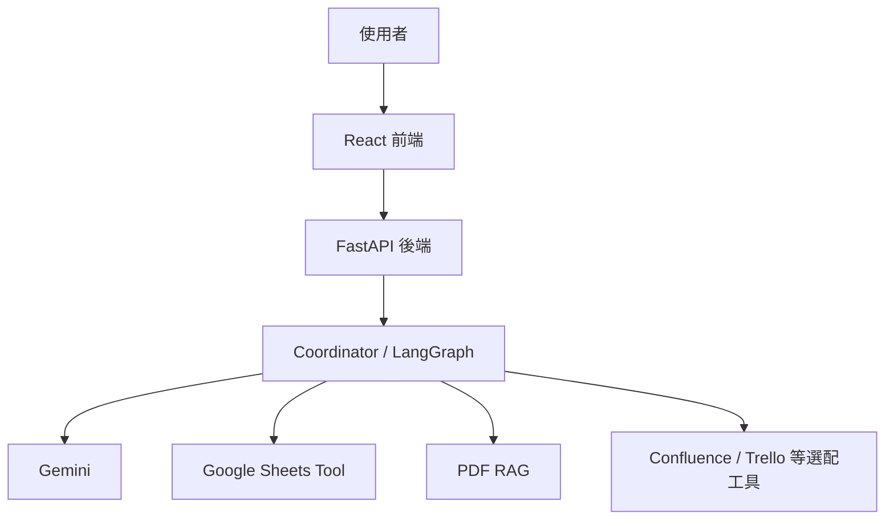
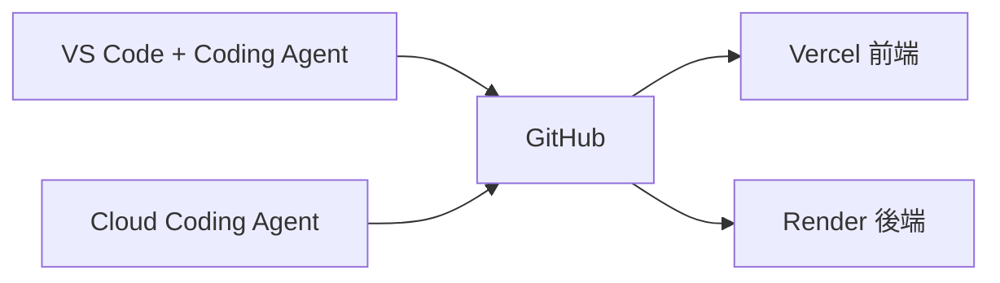

前四天我們一直在回答一個問題：企業真正需要的 AI，為什麼不能只是一個聊天機器人？答案逐漸清楚之後，接下來就要把概念放回一個具體產品中。這也是 Data Machi 出現的原因。

Data Machi 一開始並不是為了展示多少 AI 名詞，而是想解決一個很實際的工作痛點：當一個問題同時牽涉文件定義、結構化數字、專案進度與後續行動時，使用者不應該自己在多個系統之間來回切換，再把資訊人工拼起來。真正有價值的 AI，應該幫忙完成這段工作流程。

## 先看懂整張產品地圖

整個系統可以先簡化成五層：使用者透過前端提出問題；後端接收請求並管理工作流程；語言模型理解問題與整理答案；不同工具負責取得企業資料；協調者（Coordinator）則負責決定何時呼叫哪一個工具，以及結果不足時下一步怎麼做。



這裡有一個很重要的區分：**Claude Code、Codex 或其他 AI 程式開發助手（AI Coding Agent）是幫你「開發 Data Machi」的工具，不是 Data Machi 正式運作時的一部分。** 真正上線後持續服務使用者的，是前端、後端、模型與各資料來源。

實際動手前，可以先用一張表記住每個服務的角色與必要程度，之後申請帳號、設定環境變數時才不會漏掉重要的一步：

| 服務 | 在系統中的角色 | 是否必要 |
| --- | --- | --- |
| GitHub | 保存程式碼、版本與部署來源 | 必要 |
| Vercel | 部署 React 前端 | 必要 |
| Render | 執行 FastAPI 與 LangGraph 後端 | 必要 |
| Gemini API | 理解問題、選擇工具、產生回答 | 必要 |
| Google Sheets | 提供結構化資料 | 建議 |
| PDF RAG | 搜尋文件內容 | 建議 |
| Trello / Confluence | 專案進度與知識庫 | 選配 |
| Groq Whisper | 會議錄音轉文字 | 選配 |

## 動手寫程式前，先選好你的 Vibe Coding 方式

建立 Data Machi 不代表要先精通所有語法。更實際的做法是先描述目標，再讓 AI Coding Agent 協助閱讀 Repository、修改檔案、執行測試與說明錯誤——這就是 Vibe Coding。實務上大致分成三種方式：

<CardGroup cols={3}>
  <Card title="本機開發" icon="laptop-code">
    適合第一次啟動、修改多個模組、測試 PDF／音訊，以及查看完整 Terminal 錯誤。
  </Card>

  <Card title="雲端開發" icon="cloud">
    適合透過桌機或手機進行 Prompt、文案、設定與小型修正，再建立 Commit 或 Pull Request。
  </Card>

  <Card title="混合式開發" icon="arrows-rotate">
    大型修改在本機完成，臨時調整使用雲端環境，GitHub 保存唯一正式版本。
  </Card>
</CardGroup>

不論選哪一種，安全的 Vibe Coding 修改都建議走同一套流程：先讓 Agent 閱讀 Repository 但不要立刻修改；要求它列出修改計畫、影響檔案與風險；確認不會把 API Key、Token 或真實資料寫進程式碼；執行修改與測試；逐檔檢查 Diff，而不是只看 AI 的文字摘要；最後才建立 Commit 或 Pull Request。可以用類似這樣的提示詞開場：

```text
請先閱讀目前 Repository 的 README、資料夾結構與部署設定。
先不要修改，請回答：
1. 這次需求會影響哪些檔案？
2. 有哪些環境變數或外部服務相關風險？
3. 如何用最小修改完成？
4. 修改後應該如何驗收？
```

<Warning>
  Vibe Coding 不是把所有決策交給 AI。你仍需要掌握目標、資料範圍、Secret 安全與驗收標準。
</Warning>

## GitHub 為什麼會成為整個流程的中心？

如果後面要把專案部署到 Vercel 與 Render，就不能把本機電腦視為唯一正式版本。實務上更合理的方式，是把 GitHub 程式碼儲存庫視為單一正式來源（Source of Truth）：本機或雲端的 AI 程式開發助手都從同一個儲存庫修改程式，完成後提交（Commit）、推送（Push），再由部署平台從 GitHub 取得最新版。



因此 Repository、Commit、Branch 與 Pull Request 並不是額外的工程知識負擔，而是確保這個專案不會因為換一台電腦、換一個開發者或部署失敗就失去控制。可以先弄清楚這四個名詞各自的責任：

<CardGroup cols={2}>
  <Card title="Repository" icon="folder-tree">
    一個專案的中央資料夾，包含程式碼、設定、文件與版本紀錄。
  </Card>

  <Card title="Commit" icon="code-commit">
    一次有意義的修改快照。好的 Commit 應該能說明這次改了什麼，以及必要時如何回復。
  </Card>

  <Card title="Branch" icon="code-branch">
    從主要版本分出的獨立修改線，適合讓 AI Coding Agent 在不影響正式版本的情況下工作。
  </Card>

  <Card title="Pull Request" icon="code-pull-request">
    把 Branch 的修改提交給主要版本前，用來檢查 Diff、測試結果與風險的審查入口。
  </Card>
</CardGroup>

即使只有一個人開發，重要修改也建議走 Branch → Pull Request → 合併到 `main` 的流程，而不是直接改正式分支。這能避免雲端 Agent 一次改壞正式版本，也讓你手機上臨時修改的內容，回到電腦時仍能清楚看到變更範圍再決定要不要合併。

## 開始實作前，先建立自己的專案副本

如果你是從 Data Machi 的開源版本開始，第一件事情不是直接修改正式設定，而是先建立自己的副本。你可以 Fork 或複製 Repository，移除不屬於自己的品牌名稱、正式資料來源與環境設定，再建立自己的 `.env`。這樣後面所有 API Key、測試資料與部署設定才不會和原專案混在一起。

去識別化不只是改名稱。除了品牌文字，也要優先檢查以下位置，把可以推回真實組織的資訊換成中性範例：

- README、頁面標題、Logo 與前端文案
- Agent 使用的 Prompt 與資料描述
- 預設 Spreadsheet Key、Board ID、Space URL
- CORS 中的正式網域
- 部署設定檔、範例資料與測試截圖

接著建立一份只列出變數名稱、不含真實值的 `.env.example`，讓後面每一天新增的服務都能對應到同一張環境變數地圖：

```env
GOOGLE_API_KEY=
GEMINI_MODEL=
GOOGLE_SERVICE_ACCOUNT_JSON=
GOOGLE_SHEET_KEY=
TRELLO_BOARD_ID=
CONFLUENCE_URL=
VITE_API_BASE_URL=
```

這一步看起來很基本，但其實是後面安全與維護的基礎。尤其不要把 API Key、Service Account JSON 或正式環境 URL 直接寫進 GitHub。你現在只要先記得：**程式碼可以進 Repository，秘密不能。** 到 Day 28 我們會再完整處理 Secret 與權限治理。

## 本機開發：先確認前後端骨架

Data Machi 採前後端分離架構。React 前端負責畫面與互動，FastAPI 後端負責模型、資料工具與工作流。實作時應該先個別確認兩邊都能啟動，再測試前端是否能透過 API 找到後端。

```text
Browser
  ↓
React Frontend
  ↓ HTTP API
FastAPI Backend
  ↓
Model / Tools / Workflow
```

實際啟動時，後端與前端分別在兩個 Terminal 執行。後端先建立虛擬環境並安裝套件：

```bash
cd backend
python -m venv .venv
source .venv/bin/activate   # Windows 改用 .\.venv\Scripts\activate
pip install -r requirements.txt
python main.py
```

Terminal 顯示服務監聽網址後，開啟 `http://localhost:8000/docs` 確認 FastAPI 已正常啟動。接著另開一個 Terminal 啟動前端：

```bash
cd frontend
npm install
npm run dev
```

Vite 顯示 Local URL 後，用瀏覽器開啟 `http://localhost:5173`，確認畫面能載入，且輸入問題後請求真的送到了後端。如果 `localhost:5173` 打得開卻不能聊天，通常是後端未啟動、API Base URL 設錯或 CORS 問題；如果 `/docs` 打不開，先回頭看後端 Terminal 的套件或環境變數錯誤。

這裡不要急著一次把 RAG、Sheets、Coordinator 全部接上。如果前端連不到後端，你卻同時在檢查 Gemini、向量搜尋與 Google 權限，除錯會非常痛苦。實作系列後面會反覆使用同一個原則：**一次只驗證一層。**

## 我們接下來會怎麼把它做出來？

接下來 25 天不是另外一套「實作篇」，而是會直接把功能逐步加入這張架構圖。Day 06–10 先建立文件 RAG；Day 11–15 加入結構化資料工具與跨來源查詢；Day 16–20 讓系統開始自主選擇工具；Day 21–25 處理記憶、查核與 LangGraph 工作流；最後 Day 26–30 再處理可靠性、UX、安全、部署與交接。

換句話說，從今天開始，每學到一個概念，我們就會知道它實際放在 Data Machi 的哪一層，而不是把觀念與實作拆成兩套彼此平行的內容。

## 實務補充｜Demo 和真正能用的產品，差在哪裡？

真正把 Data Machi 從展示原型推向可使用產品時，會遇到四個很典型的問題：**明明有資料卻第一次查不到、模型說「我幫你查」卻沒有真的呼叫工具、同一份資料到底要不要重新查，以及任務花十幾秒時使用者不知道系統是不是壞了。** 這四件事看起來都不是炫目的 AI 技術，卻正是展示原型與可使用產品之間最常見的落差。

對非工程背景的讀者，可以把它理解成：模型能力只是「員工本身會不會做事」，產品能力還包括「資料找不找得到、流程有沒有真的執行、資訊是否過期，以及使用者是否知道進度」。後面的 Retrieval、Memory、Verification、UX 與 Workflow，其實都在逐步解決這四種真實問題。

<Accordion title="延伸理解：好的企業 AI 也需要清楚說明邊界">
  系統定位不應該是「什麼都能回答的 AI 助理」，而應清楚說明它能做什麼、不能做什麼，以及超出能力範圍時會如何處理。能處理的問題要有可靠來源；不能處理的問題要明確承認資料不足。**明確的邊界不是缺點，而是建立信任的起點。**
</Accordion>

<Info>
  今天只要記住一件事：Data Machi 不是一支 AI 程式，而是一組被 GitHub、前後端、模型、資料工具與工作流串起來的服務。先看懂整張圖，後面的每一個實作才知道自己正在改哪一層。
</Info>

下一篇開始，我們先處理第一種企業資料：文件。也就是讓 AI 從「不知道公司內容」進化成「回答前先去查資料」。