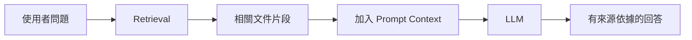

前一篇我們已經看到 Data Machi 的完整架構，而第一個要補上的能力，就是讓 AI 能取得企業文件。原因很簡單：如果模型回答前完全看不到公司的規範、報告或知識庫，它再聰明也只能靠通用知識猜測。

檢索增強生成（RAG，Retrieval-Augmented Generation）可以把這個問題理解成「把閉卷考試改成開卷考試」。模型本身不需要把所有公司文件背進參數裡，而是在收到問題後，先去文件庫找出最相關的內容，再把這些內容連同問題一起交給模型回答。

## RAG 的三個核心步驟

第一步是 **Retrieval**。系統不是把整份文件都丟進模型，而是從索引裡找出和問題最相關的幾段內容。第二步是 **Augmentation**，也就是把這些段落補進模型的上下文。最後才是 **Generation**，由模型根據找到的內容組織答案。

這裡最重要的觀念是：**RAG 並不是讓模型學會文件，而是讓模型在回答當下看見文件。** 因此當文件更新時，只要重新建立或更新索引，就能讓後續回答使用新的內容，不需要重新訓練大型模型。

## RAG 適合什麼問題？

RAG 特別適合答案已經存在於文件裡的任務，例如「差旅報銷規範是什麼」、「這份產品手冊如何定義某個功能」、「過去是否有類似客訴案例」。這些問題的重點是找到正確內容，再整理成好理解的回答。

但如果使用者問的是「昨天銷售多少」或「現在庫存剩幾件」，檢索增強生成（RAG）就不是最好的選擇，因為那是結構化而且持續更新的資料。後面我們會用工具使用（Tool Use）處理這類問題。

## 為什麼來源比回答漂亮更重要？

企業 RAG 不應該只追求「回答像不像人」，而要讓使用者可以回頭確認答案從哪裡來。因此在 Data Machi 中，文件搜尋結果最好保留來源檔名、頁面或相關片段。當答案有爭議時，使用者可以直接回到原始資料，而不是只能相信模型。

這也讓檢索增強生成（RAG）成為後續代理架構的一項重要工具：協調者（Coordinator）可以在需要文件知識時呼叫它，而不必期待模型永遠記得公司的規範。

## 延伸理解｜RAG 和 Fine-tuning 不一樣

對非工程背景的讀者，可以用「**查資料**」和「**改變模型習慣**」來區分。RAG 是回答前先翻公司資料，因此文件更新後只要更新知識庫；Fine-tuning 則比較像重新訓練模型的表達或任務習慣。企業內部規範、手冊與政策常常更新，而且答案需要能回到原始來源，因此多數知識問答場景會先考慮 RAG，而不是要求模型把公司資料全部背起來。

<Accordion title="實務踩坑：知識庫不是塞得越多越好">
  RAG 的目標不是把所有文件一次送給模型，而是在需要時找出少量、真正相關的內容。無關資料太多，反而會稀釋重要證據，也增加成本。可以把它想成開卷考試：桌上放一百本書不一定比較好，真正重要的是能快速翻到正確那一頁。
</Accordion>

<Info>
  今天先記住一件事：RAG 的核心不是「讓 AI 記住更多」，而是「讓 AI 回答前先找到正確資料」。
</Info>

下一篇，我們會把 RAG 的黑盒拆開，看一份 PDF 到底要經過哪些步驟，才會變成 AI 可以搜尋的知識庫。