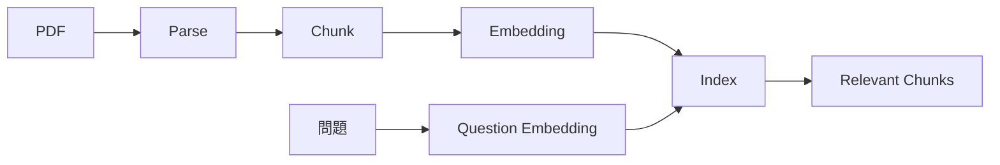

昨天我們把 RAG 理解成「回答前先查文件」，但真正開始做時，很快就會遇到下一個問題：PDF 本身並不是一個適合直接搜尋的知識庫。即使人類可以打開一份 80 頁報告慢慢看，系統也不能每次收到問題就把整份文件全部塞進模型。

因此一份文件要變成可搜尋知識，通常會經過幾個步驟：解析內容、切成適當片段、轉成向量表示，再建立索引。RAG 的品質，往往不是只取決於模型，而是在這些前處理步驟就已經決定了一大半。

## 第一步：解析（Parse），把文件內容取出來

PDF 看起來像一份文件，但內部可能是文字、圖片、表格甚至掃描頁。解析器的工作，就是盡可能把其中的文字與結構抽出來。對純文字 PDF 來說相對簡單，但如果版面有雙欄、複雜表格或大量圖片，解析結果就可能出現順序錯亂。

這也是為什麼不能把「成功讀到 PDF」當成「成功理解 PDF」。後面實作時，第一件事應該先檢查抽出的文字是否合理。

## 第二步：文件切割（Chunking），把長文件切成可搜尋片段

假設一份文件有幾萬字，直接把整份內容做成一個向量幾乎沒有意義。系統需要把內容切成較小的 chunks，讓每一塊代表一段相對完整的語意。

文件片段（Chunk）太大，搜尋回來的內容會混入太多不相關資訊；文件片段太小，又可能把同一個概念切碎。實務上通常會保留一定的重疊區段（Overlap），讓相鄰段落有部分重疊，降低重要語意剛好被切在邊界的風險。

## 第三步：Embedding，把文字轉成可比較的向量

Embedding 的目的，是把文字轉換成一組數字，使語意相近的內容在向量空間裡距離也比較接近。這讓系統不需要只靠完全相同的關鍵字，而可以搜尋「意思相近」的內容。

例如文件寫的是「顧客退貨規範」，使用者問「商品可以在幾天內退？」即使兩邊沒有完全相同的句子，語意搜尋仍有機會把正確段落找回來。

## 第四步：Index，讓查詢可以快速找到內容

所有 chunks 轉成向量後，系統會把它們保存到索引或向量資料庫中。收到新問題時，問題本身也會被轉成向量，再與文件 chunks 比較相似度，找出最相關的幾段。

## Data Machi 實作前先注意一件事

很多 RAG 問題最後會被誤判成「模型回答不好」，但真正原因可能是 PDF 根本沒有正確解析、Chunk 切得不合理，或搜尋階段沒有把正確段落找回來。因此除錯時應該先看 Retrieval 結果，再看 Generation。

這個順序很重要：如果模型從一開始就沒有拿到正確資料，再怎麼調 Prompt 也只是讓它更漂亮地回答錯誤內容。

## 進階理解｜Chunking 沒有一組萬用參數

文件切割時，最重要的是理解片段大小與重疊區段的取捨，而不是先背參數。可以把文件片段（Chunk）想成「把長文件切成可搜尋的小卡片」：切太大，一張卡片裡會混入太多不相關內容；切太小，又可能把同一條規則的前因後果拆開。重疊區段（Overlap）則像讓相鄰卡片保留少量重複內容，降低重要句子剛好被切在邊界的風險。

不同文件也適合不同切法。FAQ 可以一問一答為單位，法律條款通常要保留較完整上下文，操作手冊則可能按照標題與步驟切割。真正的做法不是找一個網路上推薦的數字，而是用真實問題測試「正確段落是否找得回來」。

<Accordion title="延伸閱讀：知識庫也需要維運">
  文件更新後，如果舊版本仍留在索引裡，新舊規則可能同時被搜尋出來；文件刪除後，對應向量也要清理；如果索引只存在伺服器暫存空間，重新部署後可能全部消失。這些問題提醒我們：**建立索引只是一次性工作，版本、刪除與持久化才是長期維運。**
</Accordion>

<Info>
  今天先記住一件事：RAG 不是把 PDF 丟給 AI 就結束，而是一條 Parse → Chunk → Embedding → Index → Retrieval 的資料流程。
</Info>

下一篇，我們會更深入看 Retrieval：為什麼傳統關鍵字搜尋和語意搜尋各有優缺點，以及什麼時候應該混合使用。