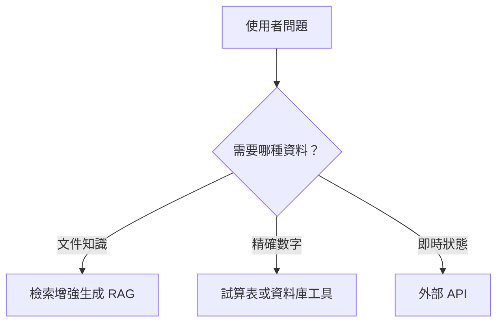

<Frame>
  
</Frame>

  *圖 1｜RAG 負責查閱知識，Tool Use 負責與外部系統互動*

完成第一個 PDF 檢索增強生成（RAG）之後，很容易產生一個期待：只要把公司資料都放進知識庫，AI 是不是就能回答所有問題？這個想法看起來很合理，但很快會遇到能力邊界。

假設主管問：「最近三個月某項指標持續下降，現在最新數字是多少？相關改善專案做到哪裡？」其中「指標定義」可能存在文件裡，RAG 很適合處理；但最新數字可能在 Google Sheets 或資料庫，專案進度則可能在 Trello。這些資料不是靜態文件，也不應該每更新一次就重新建立向量索引。

## 文件知識與即時狀態是兩種不同問題

RAG 擅長回答「文件裡寫了什麼」，例如制度、手冊、定義、歷史報告與案例。它的前提是答案已經存在於某段可檢索內容中。

但「昨天銷售多少」、「目前有幾張未完成工單」、「哪個市場成長最快」通常需要即時查詢與精確計算。這類任務如果硬塞進向量資料庫，不只更新成本高，還可能因為相似度搜尋而取回一個接近但不是最新的數字。

## RAG 不應該變成萬用資料層

不同資料有不同特性。文件可能一季更新一次，交易資料每分鐘都在變；文件適合語意搜尋，數字需要精確篩選；公開規範可以讓多人查詢，財務數字則可能需要更嚴格的權限。

因此更合理的架構不是把所有東西都轉成向量表示（Embedding），而是讓文件走 RAG、結構化資料走資料工具、即時系統走 API。模型只負責理解需求與整合結果。

## 下一步：讓 AI 會用工具

當 AI 可以呼叫外部函式或 API，能力就從「搜尋知識」往「取得狀態與執行操作」延伸。這就是工具使用（Tool Use）。

這裡也要特別釐清：RAG 和工具使用並不是競爭關係。從代理（Agent）的角度看，RAG 本身也可以被包裝成一項工具。真正重要的是系統能不能根據任務，選擇最適合的資料取得方式。

<Info>
  今天先記住一件事：RAG 解決的是「去哪裡找文件知識」，但企業工作還包含即時資料、精確計算與系統操作，這些需要工具使用。
</Info>

下一篇，我們會把工具使用拆開來看，也順便釐清 LangChain 在這裡到底扮演什麼角色。