<Frame>
  
</Frame>

<p align="center">
  *圖 1｜企業知識分散在不同系統，每個系統保存不同類型的資訊*
</p>

做到 Day 13，我們已經有兩種完全不同的資料取得方式：PDF 檢索增強生成（RAG）負責找文件知識，Google Sheets 資料工具負責取得與計算結構化數字。這時很容易冒出下一個想法：「那是不是把公司所有系統都接進來就好了？」

技術上當然可以，但真正該先做的不是列 API 清單，而是先畫出企業知識到底分散在哪裡，以及每個來源保存的是什麼。

## 同一個問題，答案常常分散在不同地方

假設主管問：「最近客服工單上升最多的是哪一類？這個類別的正式定義是什麼？改善專案現在做到哪裡？」這不是一個單一資料來源能完整回答的問題。

Google Sheets 可能保存工單明細，因此適合算出哪一類成長最多；Confluence 可能保存正式分類定義與 SOP；Trello 或 Jira 則記錄改善專案的進度、負責人與截止時間。PDF 可能還保存歷史報告或正式規範。

```mermaid
flowchart TD
    Q[一個商業問題] --> S[Google Sheets\n數字與明細]
    Q --> C[Confluence\n規範與定義]
    Q --> T[Trello / Jira\n任務與進度]
    Q --> P[PDF RAG\n報告與文件]
```



這張圖就是 Knowledge Map。它的價值不在畫得漂亮，而是逼我們先回答：**哪一種問題，應該去找哪一個 source of truth？**

不過，指定來源之後仍可能遇到另一個真實問題：兩個系統同時找到答案，內容卻不一致。這時不能讓模型自行挑一個看起來合理的版本，而要預先定義衝突規則。判斷時至少要分開看兩件事：**權威性**代表哪個來源有資格定義事實，**新鮮度**則代表資料何時更新；最新的內容不一定最正式，正式文件也不一定反映即時狀態。

| 衝突情境 | 建議判斷方式 |
| --- | --- |
| PDF 與 Confluence 的政策定義不同 | 先比較文件狀態、生效日期與內容負責人，以被指定為正式版本的來源為準 |
| Google Sheets 數字與簡報報告不同 | 優先保留原始結構化資料、查詢條件與查詢時間；簡報適合提供解讀，不應取代可重算的數字 |
| Trello／Jira 狀態與會議紀錄不同 | 以團隊指定的專案系統及最後更新時間為主要依據，會議紀錄作為補充脈絡 |
| 無法判斷哪個來源較權威 | 並列差異、來源與更新時間，交由內容負責人確認，不應由 AI 猜測 |

因此 Knowledge Map 除了記錄「資料在哪裡」，最好也記下來源負責人、更新頻率、正式版本標記與衝突時的優先規則。

## 為什麼不能把所有資料都塞進向量資料庫？

把所有內容都轉成文字再做 embedding，看起來最省事，但會失去資料本身的特性。結構化數字適合精確篩選與 aggregation；專案狀態需要即時 API；正式規範適合文件搜尋；權限敏感資料則需要保留原系統的存取控制。

如果硬把這些都塞進同一個 RAG，最後會出現幾個問題：數字不精確、資料更新不同步、權限難管理，而且回答時不知道哪一個來源才是真正 authoritative。

因此 Data Machi 的方向不是「建立一個萬能知識庫」，而是把各來源保留在最適合自己的系統裡，再透過 Tool 層統一存取。

## Confluence 與 Trello 要不要接？先看使用情境

是否要串接新的外部系統，不應該只看「技術上能不能接」。更重要的判斷是：**只有當某個來源真的回答了工作流程裡不可缺的一步，才值得接。**

如果團隊的正式定義都在 Confluence，那就建立 Confluence Tool；如果專案進度都在 Trello，就接 Trello API。如果公司用的是 Notion、Jira、資料庫或其他系統，架構原則完全相同，不需要為了 Data Machi 特別搬家。

串接時仍然要遵守前面建立的做法：API Token 不放 GitHub、先用測試資料與最小權限、先確認 API 可以正確讀取，再交給模型使用。實際申請時，Trello 與 Confluence 雖然同屬 Atlassian，憑證形式並不相同：Trello 是先在開發者頁面取得 API Key，再依授權畫面產生 User Token；Confluence 則是在 Atlassian 帳號設定中建立 API Token，並記下 Site URL 與建立 Token 的登入 Email。兩者都建議先準備匿名測試 Board 或測試 Space，再用低權限的整合帳號申請憑證，填入後端環境變數：

```env
TRELLO_BOARD_ID=
TRELLO_API_KEY=
TRELLO_TOKEN=

CONFLUENCE_URL=
CONFLUENCE_USERNAME=
CONFLUENCE_API_TOKEN=
```

## 後端用誰的 Token，就繼承誰的權限

這裡有一個很容易被忽略、卻很重要的觀念：**Trello Token 代表產生它的使用者，Confluence 的 Email \+ API Token 也是在證明「後端正在以哪個帳號讀取內容」。** 後端能看到的範圍，通常就是這個帳號原本能看到的範圍。

如果你用一個管理者帳號建立 Token，即使一般使用者原本只能看部分頁面，只要 Data Machi 沒有另外設計權限檢查，後端仍可能查到管理者看得到的全部內容。這也是為什麼不建議直接把高權限管理者 Token 當成所有使用者共用的憑證，而應該用一個專門整合、權限受限的低權限帳號。

實務上有兩種授權模式：

| 模式 | 說明 | 適合情境 |
| --- | --- | --- |
| 固定憑證 | 後端永遠使用同一組低權限 Token，所有使用者共用同一資料範圍 | 個人專案、內部測試、系統只讀取固定 Board 或 Space |
| 個別授權 | 每位使用者用自己的帳號授權，系統依個人權限存取資料 | 不同使用者應看到不同內容、需要撤銷單一使用者權限、產品要給多個組織或客戶使用 |

個別授權通常牽涉 OAuth、使用者登入、Token 保存與撤銷，屬於產品擴充階段，而不是第一版的必要條件。**目前 Data Machi 的目標情境——所有使用者共用同一批資料——用固定、低權限、只讀的整合帳號通常就足夠**，等到出現「A 使用者不該看到 B 使用者的內容」這類需求時，再評估 OAuth 也不遲。

## 工具（Tool）的價值，是把系統差異包起來

對 Coordinator 來說，它不應該知道每個 API 的細節。它只需要知道：「這個 Tool 能回答什麼、需要什麼輸入、會回傳什麼結果。」例如 `query_google_sheets` 負責數字、`search_documents` 負責文件、`get_project_status` 負責專案狀態。

這也是 Tool abstraction 的價值。後面即使把 Trello 換成 Jira，上層工作流不一定需要整個重寫，只要 Tool 的介面與輸出仍然清楚。

## 先畫地圖，再決定自動化範圍

如果你要把 Data Machi 套到自己的工作場景，可以先列出三件事：這個任務會去哪裡找資料、哪些來源是最終事實來源、哪些資料需要即時取得。這三個問題通常比「要不要用 Multi-Agent」更值得先處理。

## 進階理解｜企業知識地圖還需要一層工作流規則（Workflow Policy）

知道資料在哪裡只是第一步，實際使用時還要回答：「**先查哪裡？找不到時下一步是什麼？**」這可以整理成一套工作流規則（Workflow Policy）。它不需要寫成複雜規則，而是替常見問題建立合理的查詢順序與回退方式。

例如使用者只說「CDP 改版進度」，但 Trello 上使用的是完整名稱 `Customer Data Platform Dashboard Revamp`。比較可靠的做法可能是先到正式文件確認縮寫與專案全名，再用正式名稱查任務系統；如果文件裡也找不到，就向使用者確認，而不是一路猜下去。

可以把它想成 Knowledge Map 告訴你「公司有哪些圖書館」，Workflow Policy 則告訴你「這類問題應先去哪一間、找不到再去哪裡」。

<Accordion title="實務踩坑：跨來源整合最怕把合理推測當成紀錄">
  如果專案卡片沒有寫延遲原因，回答應該是「目前紀錄中沒有說明原因」，而不是補成「可能因跨部門溝通或資源不足」。後者可以作為待驗證假設，但不能偽裝成來源中已經存在的事實。
</Accordion>

<Info>
  今天只要記住一件事：企業知識不是一個資料庫，而是一張分散式地圖。AI 架構的工作不是把所有資料搬到一起，而是知道何時去正確的地方取正確的資訊。
</Info>

下一篇，我們會第一次把這些來源放進同一個問題中，看看跨來源查詢到底要怎麼拆。