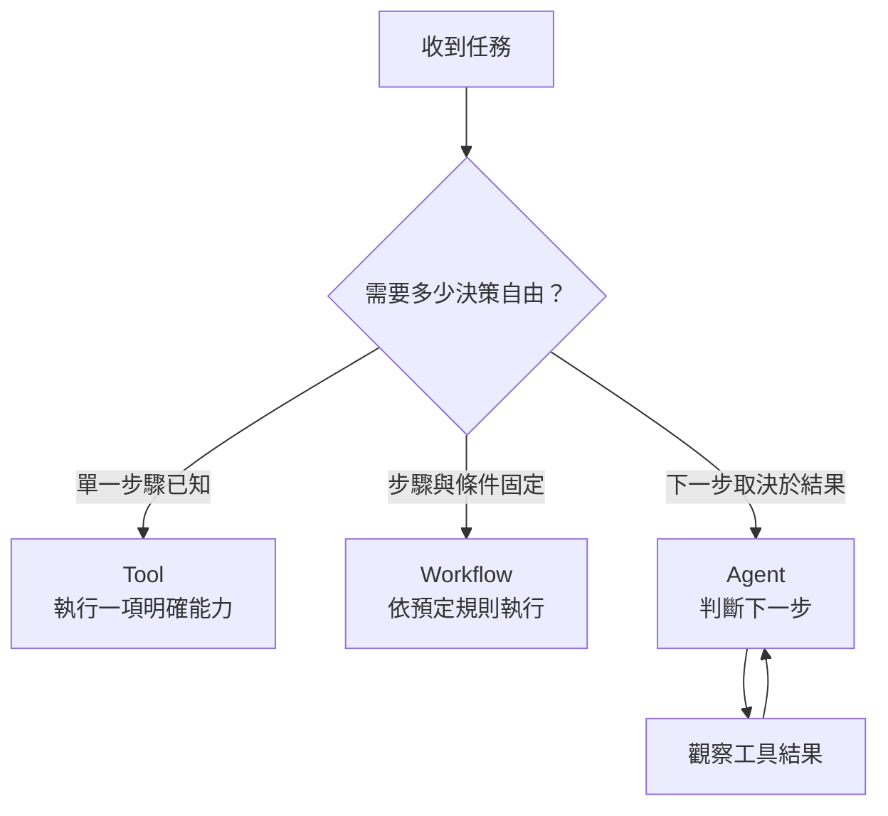

昨天我們已經完成一個跨來源流程：先查 Sheets，再根據結果查文件。這套流程可以運作，但它有一個明顯限制：所有步驟都是我們事先寫好的。只要使用者換一種問法，或任務需要第三個來源，就要再增加新的判斷條件。

這時候就會遇到一個重要分界：**工具使用（Tool Use）不等於代理（Agent）。** 一個系統可以有很多工具，卻仍然只是固定流程；真正讓它開始具有代理特性的，是系統能根據任務與中間結果，自己決定下一步。




<p align="center">
  *圖 1｜Tool、Workflow 與 Agent 的差異，在於系統需要多少動態決策*
</p>

## 工具（Tool）提供能力，代理（Agent）負責決策循環

Tool 很像一組員工可以使用的軟體：查資料、算數字、搜尋文件或讀取專案狀態。它本身不會決定何時使用，也不會理解任務是否已經完成。

Agent 則多了一層判斷。它收到問題後，會先分析需要哪些資訊，選擇工具，觀察工具回傳結果，再決定是否需要繼續查詢。如果結果不足，它可能換一個工具、調整查詢條件，甚至向使用者確認。

```text
理解任務 → 選擇工具 → 執行 → 觀察結果 → 再判斷
```

這個循環才是從自動化腳本走向 Agent 的核心。

## 固定工作流程（Workflow）與代理（Agent）各有價值

這裡很容易陷入「Agent 一定比較進階，所以什麼都應該交給 Agent」的誤區。其實如果任務步驟固定、規則明確，直接用 Workflow 往往更可靠，也更容易測試。只有當問題類型多、工具選擇需要語意理解，或中間結果會影響後續動作時，Agent 的自主判斷才真正有價值。

例如「每天 9 點產生同一份報表」幾乎不需要 Agent；但「找出問題最大的市場，確認其定義，再查看相關專案是否有改善計畫」就比較適合讓系統根據資料逐步決定。

## Data Machi 為什麼需要 Agent 層？

Data Machi 最初可以靠固定條件判斷數據問題與文件問題，但當使用者開始提出複合查詢，if/else 很快會膨脹。更合理的做法，是讓 Coordinator 先理解任務，決定呼叫哪些 tools，再把工具結果整合起來。

不過自主性愈高，也代表系統愈可能走錯路。因此接下來幾天不會只談「怎麼讓 Agent 更自由」，反而會同時討論如何觀察、驗證與控制它。

## 進階理解｜新增能力時，先問它應該是 Tool、Workflow，還是 Agent？

判斷一項能力應該做成工具、工作流程還是代理時，可以先用一個簡單的方法思考。對非工程背景讀者，可以用三個問題判斷：

1. **只要做一件明確的事嗎？** 例如查一張表、搜尋一份文件，通常就是 Tool。
2. **步驟可以事先列清楚嗎？** 例如查資料 → 驗證 → 產出報告，通常用 Workflow 更穩定。
3. **下一步必須看中間結果才知道嗎？** 如果系統需要理解語意、觀察結果、動態改變策略，才真正需要 Agent。

這個順序可以避免把簡單功能過度工程化。Agent 帶來彈性，也帶來成本、延遲與較難預測的行為，因此應該只在「決策真的無法事先寫死」的地方使用。

<Accordion title="實務踩坑：Agent 也一定有邊界">
  Agent 並不是自由行動的 AI。它只能在被授權的工具、資料範圍、停止條件與流程規則內做選擇。工具集有限、嘗試次數有限、每次行動可被記錄，才是企業環境可接受的自主性。
</Accordion>

<Info>
  今天先記住一件事：Agent 的本質不是「有很多工具」，而是能在每一步之後根據結果重新判斷下一步。
</Info>

下一篇，我們會用 ReAct 框架把這個決策循環拆得更清楚，看 Agent 如何在 Reason、Act 與 Observe 之間持續移動。