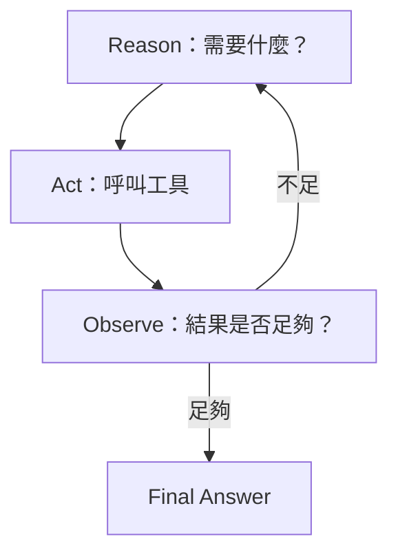

昨天我們說，代理（Agent）和固定的工具使用（Tool Use）最大差別，是代理會根據中間結果重新判斷下一步。推理與行動（ReAct）可以把這件事拆成一個很直覺的循環：先「推理（Reason）」決定目前需要什麼；接著「行動（Act）」呼叫工具；最後「觀察（Observe）」檢查工具回傳的結果，再決定要不要繼續。

這個概念看起來很簡單，但它其實解釋了代理（Agent）為什麼能處理比固定流程更模糊的任務。

## Reason：先決定現在最需要知道什麼

假設使用者問：「哪個市場的需求問題最嚴重，而且相關改善專案有沒有在進行？」Agent 不需要一開始就把所有工具全部叫一遍。它可以先判斷第一步應該查數據，找出問題最大的市場。

這裡的 Reason 不是要模型寫出長篇思考，而是讓系統能形成下一步可執行的決策：需要哪個工具、使用什麼條件，以及目前是否已經有足夠資料。

## Act：真的去執行，而不是想像結果

接著系統呼叫 Sheets Tool，取得各市場的需求數量。這個步驟非常重要，因為 Agent 的事實應該來自工具，而不是模型自己補出來。

工具回傳最好是清楚而結構化的結果，例如市場、件數、期間與資料來源，而不是一大段已經被加工過的自然語言。這樣後面的判斷比較容易維持一致。

## Observe：結果會改變下一步

假設結果顯示 TW 是最高市場，Agent 才需要進一步查與 TW 相關的改善專案。如果工具回傳空資料，它也應該先判斷是不是查詢條件錯了，而不是直接告訴使用者「沒有專案」。

真正有價值的是 Observation。沒有這一步，系統只是在第一輪做工具選擇；有了它，Agent 才能在資料不足、格式不同或工具失敗時調整策略。

## ReAct 不是讓模型無限循環

企業系統不能因為模型一直覺得「還可以再查」就無限執行。因此即使採用 ReAct，仍要設定最大步數、允許的工具範圍與停止條件。這些限制不應只寫在 Prompt，而要由程式層控制。

這也是後面 LangGraph 的重要價值：把原本隱藏在 Agent loop 裡的執行路徑，變成更明確的 State、Node 與 Edge。

## 實務補充｜Observation 不只是「看結果」，還可能改變下一個問題

這裡有一個重要觀念：如果第一次搜尋只找到部分資訊，Agent 不一定只是把同一句 query 再跑一次，而可能根據新資訊重新拆題。例如第一次知道正式專案名稱後，第二輪查詢就可以改用正式名稱；發現少一個市場對照表後，也可以先補查定義再回來計算。這才是「觀察 → 重新判斷」真正有價值的地方。

## 實務踩坑｜Agentic 不代表可以無限嘗試

循環一定要有停止條件。除了最大步數，也可以限制總執行時間、Tool call 次數或成本預算。對非工程背景讀者，可以把它想成：交給同事一個模糊任務時，也會說「最多查三個來源，如果還找不到就回來說明」，而不是讓他無限找下去。

<Info>
  今天先記住一件事：ReAct 的重點不是「模型會思考」，而是每次行動後都會觀察真實結果，再決定是否需要下一步。
</Info>

下一篇，我們會比較兩個容易混在一起的角色：Router 與 Coordinator。一個只負責把問題分流，另一個則需要把整段任務做完。