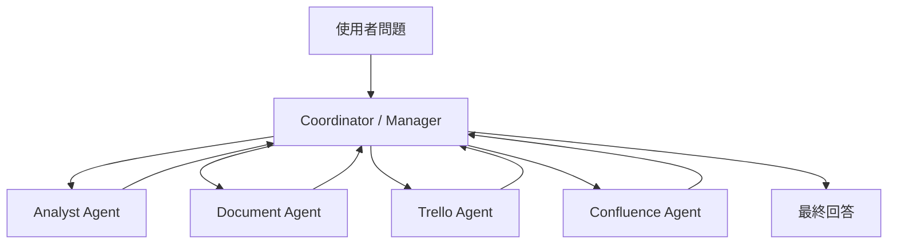

當一個 AI 系統接上愈來愈多工具，最大的挑戰不再是「能不能查」，而是「該查哪裡」，以及「這個問題是全新需求還是延續前文」。Coordinator 就像一位優秀的專案經理：它不親自執行所有工作，而是先理解需求的全貌，再把對的任務分派給對的人，並在整個過程中保持對上下文的掌握，確保最後整合出一個有意義的答案。

## Router 與 Coordinator：有什麼不同？

在 Agent 系統的設計中，「分派」這件事可以做得很簡單，也可以做得很精緻。最基本的形式是 Router，而更完整的實作是 Coordinator。

<CardGroup cols={2}>
  <Card title="Router（路由器）" icon="route">
    負責分類：判斷這個問題屬於哪個領域（如 Analyst、Trello、Confluence、Document），然後把請求轉發給對應的處理器。Router 通常只做一次決策，不管理後續流程。
  </Card>

  <Card title="Coordinator（協調者）" icon="sitemap">
    除了分類之外，還會整合前後文、觀察工具回傳結果、決定是否需要補查其他工具、管理多輪工作流程，最後把所有資訊整合成一個完整的回答。
  </Card>
</CardGroup>

<Info>
  **一個關鍵比喻**：Router 像是接待員，把訪客引導到對的部門。Coordinator 像是專案經理，理解整個需求、協調多個部門協作、追蹤進度，並在最後整合成交付成果。
</Info>

## Coordinator 的核心判斷能力

Data Machi 的 Coordinator 在接到每一條使用者訊息時，會先做一個關鍵判斷：**這條訊息與前文的關係是什麼？**

<Steps>
  <Step title="判斷訊息性質">
    這條訊息是全新的獨立問題、延續前文的追問、改寫需求，還是明確要求重新查詢？這個判斷決定了接下來的整個處理路徑。
  </Step>
  <Step title="決定是否沿用資料">
    若訊息是延續性的（如「整理成表格」「換個說法解釋」），可以沿用先前工具查詢的結果，不需要重新呼叫工具，節省時間與成本。
  </Step>
  <Step title="選擇適合的工具或領域">
    根據訊息語意，判斷應該路由到哪個領域或呼叫哪些工具（如 Analyst Agent、Trello 工具、Confluence 搜尋）。
  </Step>
  <Step title="執行並整合結果">
    觀察工具回傳的結果，決定是否需要補查，最後整合所有資訊，產生結構化的回答。
  </Step>
</Steps>

## 語意判斷如何改變分派決策

看起來很像的兩個問題，在語意上可能截然不同，需要完全不同的處理方式：

```text
使用者說「整理成表格」
→ Coordinator 判斷：延續前文，不需要重新查詢
→ 沿用先前的 Prior Tool Context
→ 呼叫格式整理功能，輸出表格

使用者說「請重新確認最新數字」
→ Coordinator 判斷：Verification Request，需要重新查詢
→ 忽略先前的工具結果（可能已過時）
→ 重新呼叫原始資料工具
→ 比較新舊結果，回報差異
```

這個看似細微的語意判斷，直接影響系統的回應速度、API 成本，以及最終答案的正確性。

## Data Machi 的分派架構

```python
def coordinator_node(state: AgentState) -> AgentState:
    latest_message = state["messages"][-1]
    conversation_history = state["messages"][:-1]
    prior_tool_context = state.get("prior_tool_context", {})
    
    # 第一步：判斷訊息與前文的關係
    message_type = classify_message_intent(
        latest_message, 
        conversation_history
    )
    # 可能的結果：
    # "new_query"        → 全新問題，需要重新查詢
    # "followup"         → 延續追問，可沿用資料
    # "reformulation"    → 改寫需求，可沿用資料
    # "verification"     → 要求重新核對，必須重新查詢
    # "format_only"      → 只是格式調整，不需要查詢
    
    # 第二步：決定是否使用先前的工具結果
    if message_type in ["followup", "reformulation", "format_only"]:
        context = prior_tool_context  # 沿用先前結果
    else:
        context = {}  # 重新查詢
    
    # 第三步：根據語意判斷應路由到哪個領域
    domain = classify_domain(latest_message)
    # 可能的結果：analyst, trello, confluence, document
    
    # 第四步：帶著判斷結果進入 Agent 循環
    return route_to_agent(domain, state, context)
```

## Domain Hint 是建議，不是命令

在 Coordinator 的設計中，有一個重要的觀念需要特別強調：領域分類器提供的是「方向建議」，而不是不可改變的最終決定。

<Note>
  **Domain Hint 的正確定位**：分類器告訴 Agent「這個問題可能需要查詢 Trello」，但實際執行時仍需考慮：工具是否可用？資料是否存在？使用者的問題是否需要先釐清？分類錯誤不代表失敗，Agent 的觀察能力可以在過程中修正方向。
</Note>

## 如果未來拆成 Multi-Agent，Coordinator 會成為 Manager

Michael Albada 將這類集中式協調方式稱為 **Manager Coordination**：由一個 Manager 負責理解整體需求、分配工作、收回結果並處理衝突，專家 Agent 主要與 Manager 溝通，而不是彼此全面互連。這種做法能簡化溝通路徑與責任分配，但也可能讓 Manager 成為單點故障或效能瓶頸。



在真正的 Manager Coordination 中，每個專家通常會有自己的 Prompt、上下文、工具集，甚至獨立的 State 與執行循環。Coordinator 的責任則包括：

1. 判斷任務應交給哪個專家。
2. 傳遞完成任務所需、但不過量的上下文。
3. 收集並比較不同專家的結果。
4. 處理衝突、失敗與重新分派。
5. 將多個輸出整合成最終交付物。

<Note>
  Data Machi 目前還不是這種完整的 Supervisor Multi-Agent。現階段比較準確的描述，是單一 Coordinator Agent 綁定多組領域工具。上圖代表未來只有在各領域需要獨立 Prompt、State、權限與工作循環時，才可能採用的演進方向。
</Note>

> **參考來源**<br />Michael Albada, _Building Applications with AI Agents: Designing and Implementing Multiagent Systems_, O’Reilly Media, 2025, Chapter 8, “Manager Coordination,” pp. 180–182.

## 常見的分派陷阱

<Accordion title="只靠關鍵字路由">
  「報告」「分析」「資料」這類詞彙出現在太多不同情境中，單純的關鍵字比對很容易把一般追問誤判成全新查詢，或把格式調整請求誤判成需要重新分析。語意與對話關係往往比單一詞彙更重要。
</Accordion>

<Accordion title="忽略對話歷史">
  每一條訊息都當作獨立問題處理，不考慮前文脈絡，會導致大量不必要的重複查詢，以及無法理解「這個」「剛才說的那個」等代名詞指稱。
</Accordion>

<Accordion title="過度分類">
  把所有問題都強制分進固定的幾個類別，忽略邊界案例。真實使用者的問題往往跨越多個領域，需要靈活整合。
</Accordion>

<Accordion title="不記錄分派決策">
  沒有記錄每次分派的理由，使得後續的 Debug 和優化非常困難。當 Agent 做出錯誤分派時，無法追溯原因。
</Accordion>

<Warning>
  **避免把 Coordinator 設計成黑盒子**。分派決策必須可觀測、可解釋、可調整。當系統做出奇怪的分派時，你需要能夠看到它的判斷理由，才能有效改進。
</Warning>

## 好的 Coordinator 知道什麼時候「不做事」

Coordinator 的一個常被忽視的能力，是知道何時不需要重新工作。

<Tip>
  當使用者說「把剛才的結果換成英文」「以表格呈現」「簡短一點」，這些都只是格式或語言上的調整，不需要重新呼叫任何資料工具。好的 Coordinator 能識別這類請求，直接在現有結果上進行轉換，大幅提升回應速度，也減少不必要的 API 費用。
</Tip>

<Info>
  今天只要記住一件事：好的 Coordinator 不只會分派工作，也知道什麼時候不需要重新工作。
</Info>

---

下一篇，我們會深入探討 Agent 如何管理記憶：在多輪對話中，哪些內容應該保留、哪些應該壓縮、哪些又必須重新查詢，才能在有限的上下文窗口中維持最高的準確度。