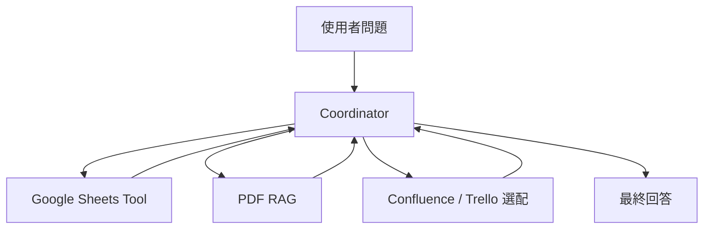

前面我們已經有 Google Sheets Tool、PDF RAG，也理解 Router 和 Coordinator 的差異。今天要把這些能力真正收進同一個協調層，讓使用者不需要知道底層有哪些工具，更不需要自己選「我要查文件」或「我要查試算表」。

這就是 Coordinator 的第一個實作版本。

## 協調者（Coordinator）不是另一個資料工具

它本身不負責算數字，也不負責搜尋 PDF。它更像一位專案經理：先理解任務，再把工作派給最適合的工具，取得結果後判斷是否足夠，最後整合回覆。



這一層的價值，是把「工具選擇」從 UI 與使用者手上拿掉。對使用者來說，他只要正常描述工作問題即可。

## 先定義每個工具（Tool）的責任邊界

Coordinator 能不能做對決策，很大一部分取決於工具描述是否清楚。例如 Sheets Tool 應該說明它負責結構化資料、統計與精確數字；Document Tool 負責政策、定義與文件內容；Project Tool 則負責任務進度。

如果每個 Tool 都寫成「可以回答公司問題」，模型就沒有足夠訊號做選擇。工具描述應該具體到讓 Coordinator 知道**什麼情況該用、什麼情況不該用**。

## 從三種最基本的路由開始

第一版不用追求很複雜。可以先測三類：純數據問題、純文件問題、複合問題。

「今年共有多少需求工單？」應該走 Sheets；「需求工單的正式定義是什麼？」應該走 Document；「哪類工單最多？那一類的定義是什麼？」則需要先走 Sheets，再用結果補查文件。

如果這三類能穩定分流，就已經比把所有事情都塞進同一個 Prompt 更可控。

## 工具結果不要只留成文字

Coordinator 取得工具結果後，最好保留結構化資訊，例如 tool name、query parameters、result、source、timestamp。這些資料後面會同時支援三件事：多輪追問時決定能不能沿用、Verification 時比對來源，以及除錯時知道哪一步出了問題。

```text
{
  tool: "google_sheets",
  result: {...},
  source: "ticket_data",
  queried_at: "..."
}
```

如果只把所有工具結果混成一段自然語言塞回 conversation history，後面會很難判斷哪些資訊是模型生成的，哪些是真正查詢回來的。

## 不要急著把所有資料來源一次加入

協調者（Coordinator）的第一版可以只管理 Google Sheets 與 PDF 檢索增強生成（RAG）。等這兩個工具穩定，再加 Confluence、Trello 或其他來源。工具數量增加並不等於代理（Agent）更成熟，真正重要的是決策是否穩定、錯誤是否可以追蹤。

同樣地，如果你之前為了實作申請了 Atlassian API，現在可以把它當成選配 Tool 接進來；如果沒有，也不影響主線。Data Machi 的架構應該允許工具替換，而不是綁死在特定 SaaS。

## 驗證 Coordinator 時要故意問模糊問題

除了正常問題，也要測試容易路由錯誤的情境。例如「最近 delivery issue 怎麼樣？」既可能要數字，也可能要專案進度。這時系統應該先從上下文判斷；如果資訊仍然不足，後面就需要 Clarification，而不是隨便挑一個工具。

這也是為什麼 Coordinator 只是開始。當多輪對話、舊結果沿用與重新查詢都加入後，我們還需要 Memory 與 Verification 來讓它更可靠。

## 實務驗收｜協調者做完後，立刻測它有沒有選對工具

協調者（Coordinator）最適合建立一組固定的分流測試。這組測試不是看回答寫得漂不漂亮，而是看系統有沒有把問題送到正確的資料來源，以及需要多步驟時有沒有按照合理順序完成。

可以先從下面這組題目開始：

| 測試題目 | 預期路徑 |
| --- | --- |
| 「今年共有多少需求工單？」 | Google Sheets 資料工具 |
| 「需求工單的正式定義是什麼？」 | 文件檢索工具 |
| 「哪一類需求最多？」 | Google Sheets 資料工具 |
| 「最多的那一類，正式定義是什麼？」 | 先查 Google Sheets，再查文件 |
| 「相關改善專案目前做到哪裡？」 | 專案工具，例如 Trello 或 Jira |
| 「哪個市場問題最多？相關專案進度如何？」 | Google Sheets → 專案工具 |
| 「把剛才的結果整理成表格。」 | 不重新查資料，沿用既有結果 |
| 「你確定嗎？請重新查一次最新數字。」 | 強制重新查原始資料來源 |

每一題先人工標記「預期路徑」，再記錄實際使用的工具與執行順序。最簡單可以先算：`正確分流題數 ÷ 總題數`。但真正重要的不是單一百分比，而是把失敗題留下來，找出系統在哪一類語句最容易選錯工具。

可以用下面格式持續累積：

| ID | 測試題目 | 預期路徑 | 實際路徑 | 是否完成任務 | 通過 |
| --- | --- | --- | --- | --- | --- |
| ROUTE-01 | 今年共有多少需求工單？ | Google Sheets | Google Sheets | 是 | ✅ |

除了明確問題，也要故意加入模糊句子，例如「最近 delivery issue 怎麼樣？」這類問題可能同時指向數字、定義或專案進度。這些題目最能看出協調者到底是在理解任務，還是只靠關鍵字猜工具。

<Info>
  今天的 milestone 是：使用者第一次不需要知道 Data Machi 底層有哪些工具。系統會自己判斷資料應該去哪裡找。
</Info>

下一篇我們會把這個 Coordinator 放進更複雜的跨來源任務，處理哪些查詢可以平行、哪些必須按照順序，以及會議內容如何進入同一條工作流。