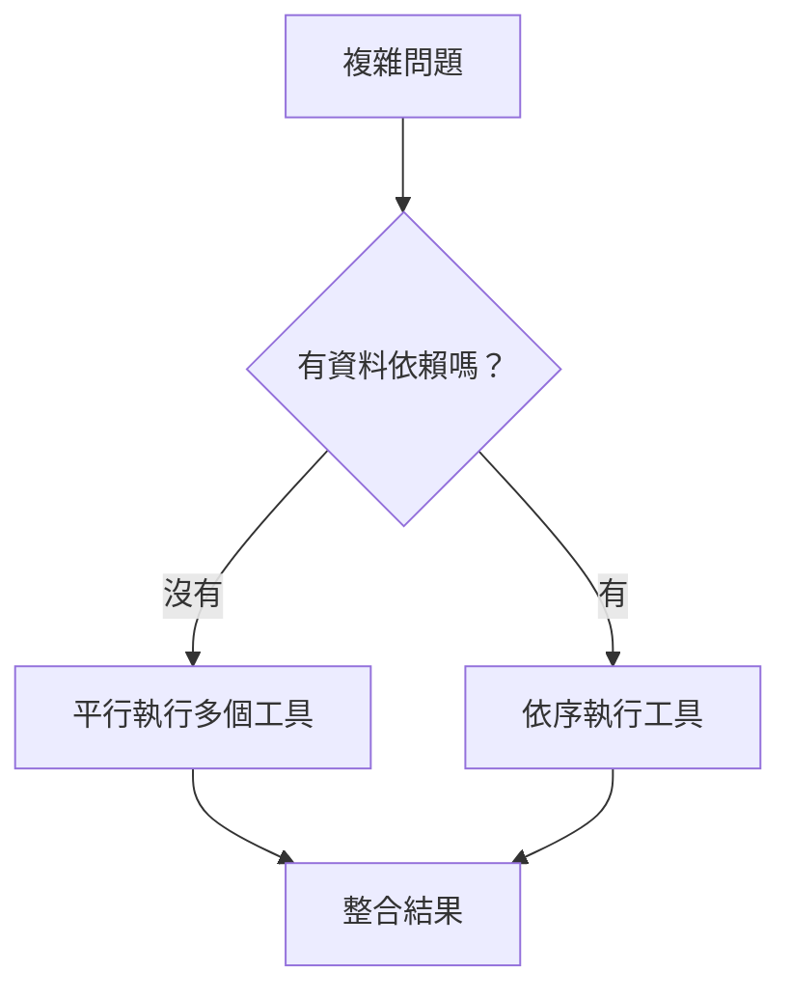
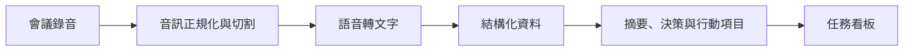

協調者（Coordinator）能選工具之後，下一個問題不是「還能接多少工具」，而是**工具之間的執行順序怎麼安排**。真實企業任務很少是一個工具呼叫就結束，更多時候是某一步的結果會影響下一步，或幾個來源其實可以同時查詢。

## 哪些可以平行？哪些不能？

如果兩個查詢彼此沒有依賴，例如同時查「今年工單總數」和「報銷規範」，就可以平行執行（Parallel Execution），降低整體等待時間。但如果第二個查詢需要第一個結果，例如「先找出成長最高的類別，再查這個類別的正式定義」，就必須依照順序執行（Sequential Execution）。

這不只是效能問題。如果順序判斷錯了，可能會在資訊還沒取得之前就使用錯誤條件查詢，最後得到一個看似完整、實際上上下文錯誤的答案。

## 複雜問題需要先拆成子問題

當一個問題包含多個意圖，協調者應該先做問題拆解（Decomposition）。比如「最近三個月核心指標為什麼下降？公司對這個指標的定義是什麼？改善專案做到哪裡？」可以拆成數據趨勢、正式定義、專案進度三個工作單元。

如果第一次查詢仍然不足，系統可以根據已取得的資訊再補查。這就是代理式搜尋（Agentic Search）的核心：搜尋不再只是一次性的「提問 → 找資料 → 回答」，而是一個可以拆題、驗證、補查與停止的循環。

## 一個完整案例：從會議錄音到行動項目

會議錄音轉行動項目，是很適合理解多步驟工作流程的案例。流程可以先對音訊做正規化與切割，再透過 Whisper 類語音轉文字服務取得逐字稿。接著讓模型依固定資料結構產生會議摘要、決策與行動項目，最後把行動項目寫入任務系統，並保留原始會議來源。

這個案例的重要性在於：**代理的價值不是多呼叫幾個 API，而是把輸入一路轉成真正可追蹤的工作結果。** 語音轉文字服務只是其中一項工具，真正重要的是整條工作流程是否能把會議內容可靠地轉成交付物。

實作上，語音辨識與文字整理是兩個不同任務，可以交給不同服務：Data Machi 用 Groq 的 Whisper 模型做語音轉文字，再交給 Gemini 整理摘要與行動項目。Groq Key 採用「使用者在會議功能中自行輸入、後端不長期保存」的方式——只隨本次轉錄請求送出，不寫進 GitHub，也不預設保存在 Render，這種做法適合個人或小型工具；若未來要多人共用，就需要重新評估集中管理與額度。瀏覽器錄音常見 WebM／Opus 格式，手機音檔格式也可能不同，語音服務不一定全部支援，因此本機通常需要先用 ffmpeg 轉成支援的格式，再送去轉錄，能降低失敗率。測試時建議準備一段 10–20 秒、不含真實姓名或會議內容的匿名音檔，並把「語音轉文字」與「文字整理」兩個階段分開檢查——如果逐字稿本身就是空的或亂碼，代表問題出在 Groq 這一段；如果逐字稿正常但摘要奇怪，問題才在 Gemini 整理這一段。

會議逐字稿也不應只讓模型「自由整理」，而應轉成固定結構，例如摘要（Summary）、決策（Decisions）、行動項目（Action Items）、負責人（Assignee）與期限（Due Date）。如果逐字稿沒有提到負責人或期限，欄位就應保持空白，而不是由 AI 猜一個人補上。**結構化輸出讓後續自動化變穩定；允許空值則讓不知道的事情保持不知道。**

<Accordion title="延伸案例：為什麼行動項目一定要保留來源？">
  一個待辦事項如果只剩「請更新 API 權限文件」，幾週後很難知道它為什麼出現。比較完整的設計會保留來源會議、原始逐字稿位置與建立時間，讓任務能回到決策背景。這正好對應 FUDAT 的最後一段：AI 不只產生內容，還要讓結果進入可以被追蹤（Track）的工作系統。
</Accordion>

## 每個步驟都要留下可追蹤結果

跨來源工作流最好不要只留下最終回答。每個節點應保留輸入、輸出、來源與錯誤狀態。這樣當使用者問「為什麼這個行動項目被建立？」時，才能一路回到逐字稿與原始會議，而不是只剩模型的一段摘要。

這也會成為後面 LangGraph 的重要基礎：當流程愈來愈長，我們需要明確的狀態（State）管理，而不是把所有資訊都塞在一個代理循環裡。

## 什麼時候應該停止查詢？

代理式工作流程不是查愈多愈好。系統需要停止條件：問題是否已經有足夠證據、關鍵來源是否都已取得、額外查詢是否真的能降低不確定性。如果答案已經充分，再多呼叫幾個工具只會增加延遲與成本。

## 階段實作四｜定義 Agent 的決策邊界

拿出 Day 15 的跨來源流程。這次不要增加更多工具，而是逐一標記哪些選擇需要語意判斷，哪些規則必須事先固定。

| 決策項目 | 你需要定義的邊界 |
| --- | --- |
| 可用工具 | Agent 可以選哪些工具？哪些永遠不可用？ |
| 問題拆解 | 可以自行拆成多少個子問題？ |
| 平行執行 | 什麼條件下才允許同時呼叫工具？ |
| 最大步數 | 最多可以查詢或重試幾次？ |
| 問題釐清 | 缺少哪些必要條件時必須追問？ |
| 停止條件 | 具備哪些證據後就應停止搜尋？ |
| 部分成功 | 某個來源失敗時，是否仍可交付其他結果？ |
| 人工介入 | 哪些判斷或動作必須交還使用者？ |

再用三種情境走查：正常取得資料、其中一個來源失敗、使用者問題缺少必要條件。每一步只記錄「選了什麼工具、取得什麼結果、下一步為什麼繼續或停止」，不需要揭露模型的內部推理。

<Check>
  保存這份「Agent 決策邊界」。Day 25 會把它轉成 State、Node、Edge 與 Failure Path，形成可交付實作的 Workflow 規格。
</Check>

## 延伸閱讀｜從固定平行到動態分派

目前的例子大多可以事先知道要查哪些來源，因此平行與順序可以在設計階段決定。但有些任務要到執行時才知道會產生多少下游工作，例如一份文件被拆成多個章節、一個研究問題被拆成多個子題，或一次搜尋找到數量不固定的候選文件。這時就需要動態分派（Dynamic Fan-out）：由前一個節點根據目前狀態產生多個工作單元，再在最後把結果彙整回來（Fan-in）。

這類模式常見於分散處理、批次文件分析與代理式搜尋。判斷原則仍然不變：**只有彼此獨立的工作才適合平行；只要後一步的輸入依賴前一步的輸出，就必須保留順序。** 另外也要注意共享 API 的速率限制、同一資源的並行寫入與交易性操作，這些情境即使技術上能並行，也不代表應該並行。

<Info>
  今天只要記住一件事：多工具架構真正的難點不是「工具數量」，而是拆題、資料依賴、停止條件與結果整合。
</Info>

下一篇我們會進入多輪對話：當使用者接著說「那去年呢？」時，代理到底應該記住什麼，又有哪些資料不能直接沿用？