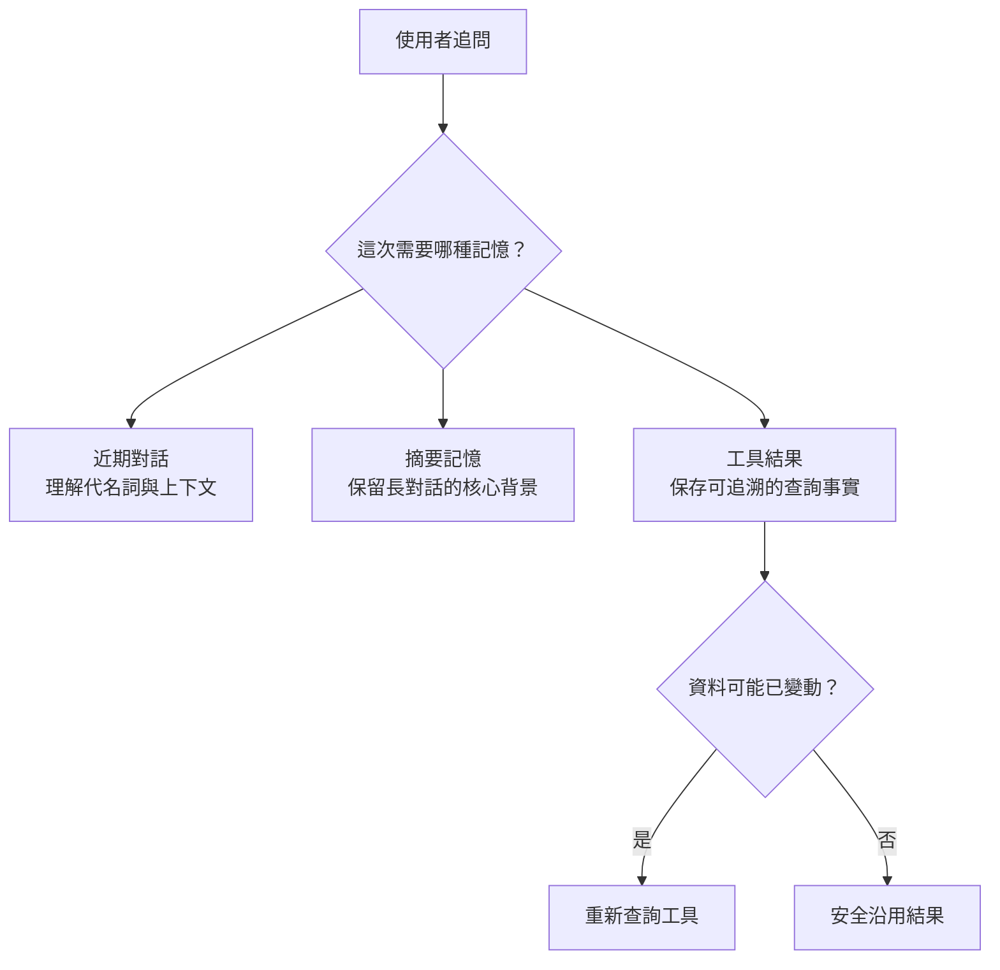

做到這裡，Data Machi 已經能選工具、跨來源查詢，也能處理一段完整工作流。但只要使用者開始追問，新的問題就會出現：系統到底該記住多少？

例如第一句問「今年哪一類工單最多？」第二句只說「那去年呢？」如果代理（Agent）完全沒有記憶，它甚至不知道「那」指的是什麼；但如果把整段對話與所有工具結果無限塞回模型，不只成本增加，也會讓舊資訊干擾新判斷。




<p align="center">
  *圖 1｜不同記憶服務不同目的，最新狀態仍應重新查詢*
</p>

## 記憶（Memory）不是把聊天紀錄全部留下來

在企業代理裡，至少可以區分三種記憶。第一種是**近期對話**，用來理解代名詞與追問；第二種是**摘要記憶**，用來保留較長對話中的核心背景；第三種是**工具結果記憶（Tool Result Memory）**，用來保存真正查詢回來的結構化結果。

這三種資訊的用途不同。近期對話偏向語意理解，工具結果則偏向事實依據。把它們混成同一段文字，後面會很難判斷哪些內容可以直接沿用。

## 對話識別碼：先把每段對話分清楚

多輪對話的第一個基礎，是每段對話都有明確的識別碼（Conversation ID）。後端收到新訊息時，只讀取這一段對話需要的上下文，而不是把使用者所有歷史一次載入。

這樣也比較容易處理多人使用情境：不同使用者、不同工作階段（Session）與不同資料權限，不會因為共享記憶而互相污染。

## 什麼可以沿用？什麼一定要重查？

這是記憶設計最重要的判斷。假設上一輪已經查到某份 PDF 的正式定義，下一輪只是問「幫我用更簡單的方式解釋」，通常可以沿用先前文件結果；但如果使用者問「現在專案進度呢？」或「今天的數字呢？」，就不應該直接拿昨天的工具結果回答。

可以用兩個問題判斷：**這份資訊本身會不會變？使用者是否明確要求最新狀態？** 只要其中一個答案是「會」，系統就應該偏向重新查詢。

## 不要讓記憶變成新的幻覺來源

模型很容易把之前生成過的回答當成事實，因此工具結果記憶最好和模型文字分開保存。可以保留工具名稱、查詢條件、來源、原始結果與查詢時間。下一輪需要沿用時，協調者（Coordinator）就能明確知道自己引用的是已查詢結果，而不是模型先前的推論。

```text
對話
  ├─ 近期訊息
  ├─ 對話摘要
  └─ 工具結果
       ├─ 資料來源
       ├─ 查詢條件
       ├─ 原始結果
       └─ 查詢時間
```

## 進階理解｜不要只記住模型摘要過的結果

工具結果記憶應盡量保留原始查詢結果，而不是只留下模型整理過的一句話。例如原始數字是 `1,487,320`，如果只記成「約 150 萬」，下一輪再做比例或比較時就失去精確性。對數字、日期、人名、狀態這類事實，原始結果才是可以追溯的依據，模型摘要只是呈現層。

## 實務踩坑｜記憶也有保存期限

不是所有記憶都能一直用。政策定義可能幾天內不變，但專案狀態、庫存或今天銷售很快就會過期。可以把工具結果想成超市食品：有些保存期長、有些保存期短。系統應根據資料性質與使用者語句判斷資料是否仍然新鮮；只要使用者要求「最新」「現在」「我剛更新」，就應偏向重新查詢。

## 實作時先解決三種追問

你可以先測「那去年呢？」這種改時間範圍的追問；「那它的定義呢？」這種跨工具追問；以及「再幫我整理成三點」這種只需要沿用結果、不需要重新查資料的追問。

實際測試時可以照順序走一輪：第一輪先問一個完整問題，例如「七月共有多少筆需求？」，等系統查完後把結果存進這段對話的 State；第二輪只用代名詞追問，例如「那其中完成的呢？」，確認 Coordinator 能從 Conversation ID、近期訊息與先前工具結果理解「那」指的是七月的需求，只是多加一個篩選條件；第三輪故意問一個缺少月份或資料來源的模糊問題，確認系統會先指出缺少哪個條件、提供可選的補充方式，而不是自己亂猜；第四輪明確要求「重新查詢」或「最新狀態」，確認系統真的再呼叫一次工具，而不是沿用剛才的結果。

如果四輪都能正確處理，就代表記憶不只是保存文字，而是真的開始支援工作上下文。常見的失敗模式也可以先記住：保存太多會讓 Prompt 越來越長、延遲與成本一起上升；保存太少會讓追問失去條件，逼使用者重複輸入；混用不同 Conversation ID 會讓對話彼此污染；而「明明要求最新，卻沿用舊的工具結果」則是最容易被使用者發現、也最傷信任感的一種錯誤。

<Info>
  今天只要記住一件事：好的記憶不是記得愈多愈好，而是知道什麼值得保留、什麼可以沿用，以及什麼必須重新查。
</Info>

下一篇我們會處理另一個真實問題：當資訊不足時，代理到底應該問使用者，還是自己重新查一次？