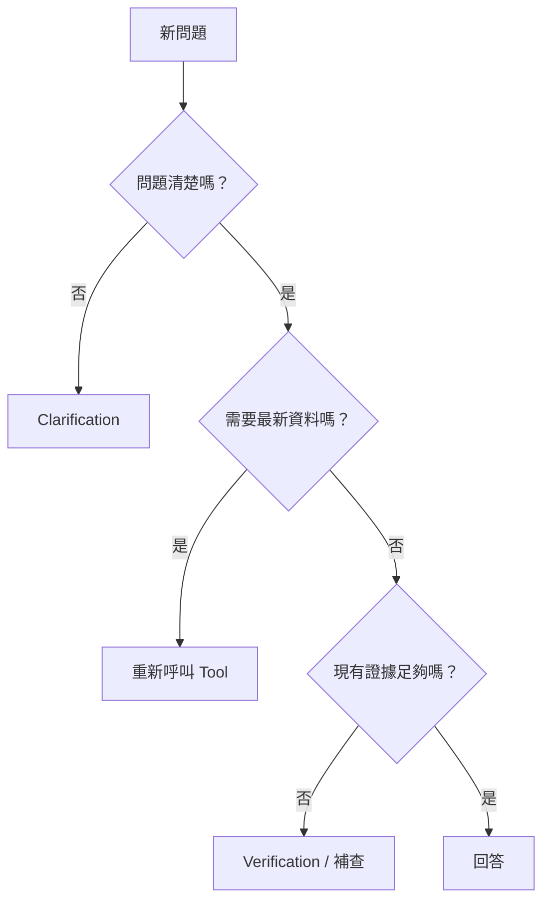

多輪對話加入記憶（Memory）之後，另一個更棘手的問題會浮現：當代理（Agent）手上的資訊不夠時，它應該自己再查一次，還是停下來向使用者確認？這個判斷如果處理不好，系統就會出現兩種極端：不是什麼都問，讓使用者覺得很煩；就是什麼都猜，最後產生錯誤答案。

## 問題釐清（Clarification）：問題本身不夠清楚時才問

假設使用者說：「幫我看一下最近的表現。」這句話缺少至少幾個資訊：什麼指標、什麼時間範圍、哪個市場？如果系統無法從前文可靠推斷，就應該提出 clarification request，而不是隨便選一個資料來源開始查。

好的 Clarification 應該只問真正影響下一步的資訊。例如已經知道使用者在談台灣市場，就沒有必要再重問市場；如果只缺時間範圍，就只確認時間範圍。

對非工程背景讀者來說，可以先記住三個簡單的追問原則：**一次只問最關鍵的一題、盡量提供具體選項、說明為什麼需要確認。** 例如與其問「你指哪個期間？」，不如問「你是指本月，還是最近 90 天？」；與其只問「ATL 是什麼？」，不如說「我找到兩個名稱相近的 ATL 專案，需要你確認是哪一個」。這樣的追問比較像可靠的同事，而不是把所有責任丟回給使用者。

## Verification：有答案不代表答案可以交付

另一種情況是工具已經回傳結果，但系統還需要確認是否能支撐最終結論。比如使用者問「為什麼指標下降」，Google Sheets 資料工具只能證明指標確實下降，卻不一定能證明原因。這時不應該直接把相關性寫成因果，而是需要補查文件、專案紀錄或其他資料來源。

Verification 的核心問題是：**目前證據足以回答使用者真正問的問題嗎？** 如果只是部分回答，就應該繼續查；如果來源彼此衝突，則應該把差異說清楚。

實作上，Verification 至少要逐項核對幾件事：回答中出現的數字是否真的存在於工具結果裡；日期、篩選條件與市場是否與使用者問題一致；文件敘述是否有來源支持；工具明明失敗了，回答有沒有假裝查詢成功；以及回答有沒有不小心洩露 Prompt、Secret 或內部錯誤細節。這幾項檢查不需要另外訓練模型，用規則或簡單比對就能攔下大部分問題。

## 重新查詢：最新狀態不能只靠 Memory

前一天提到 Tool Result Memory 可以沿用，但有些資訊天生會變，例如專案狀態、庫存、今天銷售、最新任務留言。只要使用者明確要求「現在」、「最新」、「今天」，就應該優先重新呼叫工具。

因此可以把判斷簡化成三條路：問題不清楚 → Clarification；問題清楚但證據不足 → Verification / 補查；問題清楚且需要最新資料 → 重新查詢。

## 錯誤訊息也應該是產品的一部分

如果工具失敗，不要讓模型自行補完。系統應該區分「查不到資料」、「沒有權限」、「服務暫時不可用」與「使用者條件不完整」。這些情況對下一步的處理完全不同，也會直接影響使用者是否信任系統。

做到這裡，Data Machi 已經開始具備一個可靠 Agent 應有的基本行為：知道什麼時候可以回答，也知道什麼時候不該回答。

## 進階理解｜企業 Agent 最危險的幻覺，是把推論寫成事實

幻覺不只代表「完全憑空亂講」。在企業情境裡，更常見的是幾種看起來很合理、卻特別危險的錯誤：

| 類型 | 例子 |
| --- | --- |
| **數字捏造** | 沒查資料卻回答「轉換率是 23.7%」 |
| **日期錯誤** | 把專案上線月份記成另一個版本的日期 |
| **名稱混淆** | 把兩個相似專案的負責人混在一起 |
| **邏輯填補** | 紀錄只寫「延遲」，AI 卻補成「因跨部門溝通造成」 |

例如「可能是跨部門溝通造成延遲」本身可以是一個分析假設，但如果工具結果或文件沒有相關證據，就不能寫成「延遲是由跨部門溝通造成」。

因此最終回答最好區分兩層：**Verified Fact** 必須能追溯到 Tool、RAG 或資料庫；**Analytical Hypothesis** 可以由模型提出，但要明確標示為推論或待驗證假設。這個區分比單純要求模型「不要 hallucinate」更可操作。

## 實務驗收｜故意用資訊不足的問題測系統行為

這一天最適合測的不是「答案對不對」，而是**系統在資訊不足時有沒有做出正確行為**。可以先用下面幾種情境測試：

| 測試情境 | 預期行為 |
| --- | --- |
| 「幫我看一下最近的表現。」 | 資訊不足時，只追問最關鍵的條件，例如期間或指標 |
| 前文已明確提到台灣市場，下一句只問「那最近呢？」 | 不應重複詢問已知市場，只補缺少的時間條件 |
| 「請告訴我最新的專案進度。」 | 不沿用舊記憶，重新查專案工具 |
| 「為什麼轉換率下降？」但目前只有下降數字 | 不直接把相關性寫成原因；應補查或標示為待驗證假設 |
| 兩個來源對同一規則給出不同版本 | 明確指出來源衝突與版本差異，不自行選一個當真相 |
| 使用者問一個所有資料來源都沒有答案的問題 | 明確說明缺少證據，不猜測答案 |
| 「你確定嗎？我剛剛更新資料。」 | 強制重新查詢原始來源，再比較新舊結果 |

這組測試不適合只用「答對／答錯」判斷，可以拆成四個欄位：**是否需要追問、是否需要重新查詢、目前證據是否足夠、最終是否誠實表達不確定性。**

| ID | 測試情境 | 應追問 | 應重查 | 證據足夠 | 通過 |
| --- | --- | --- | --- | --- | --- |
| VERIFY-01 | 為什麼轉換率下降？目前只有下降數字 | 否 | 視情況 | 否 |  |

當使用者說「你確定嗎？」「再查一次」「我剛更新資料」時，不應直接沿用上一輪工具結果。比較可靠的做法是把舊結果視為可能過期，強制重新查詢原始來源，再比較新舊差異。記得資料，不代表資料仍然有效。

<Info>
  今天只要記住一件事：企業代理的可信度不是來自『永遠都有答案』，而是來自它知道何時應該追問、補查或明確說資料不足。
</Info>

下一篇我們會面對架構上的限制：當這些判斷、重試與分支都塞進同一個 Agent loop，為什麼最後會變得很難控制？