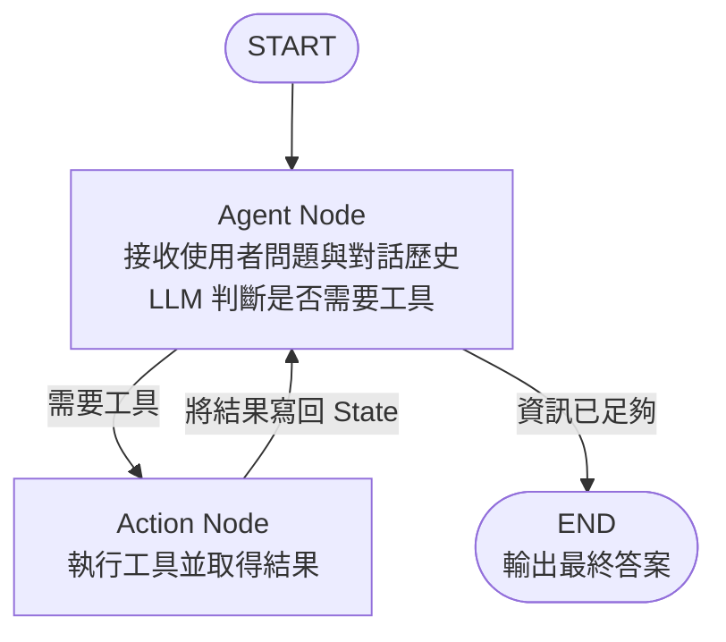
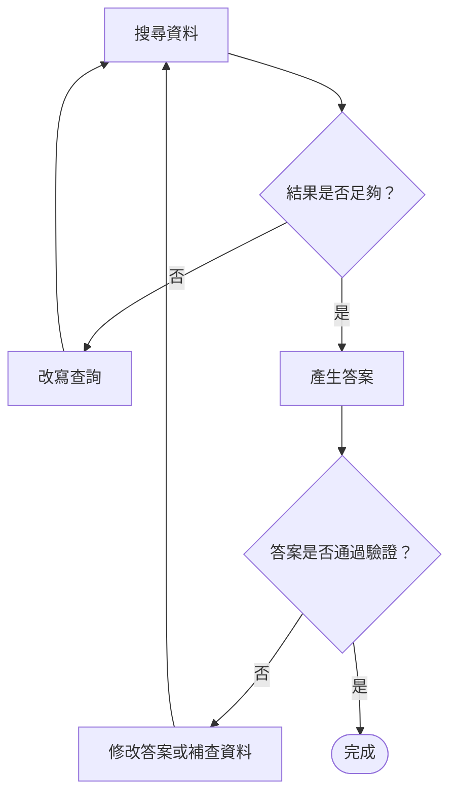
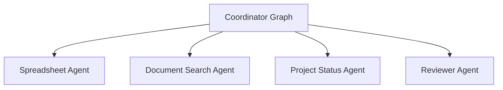
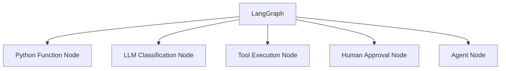
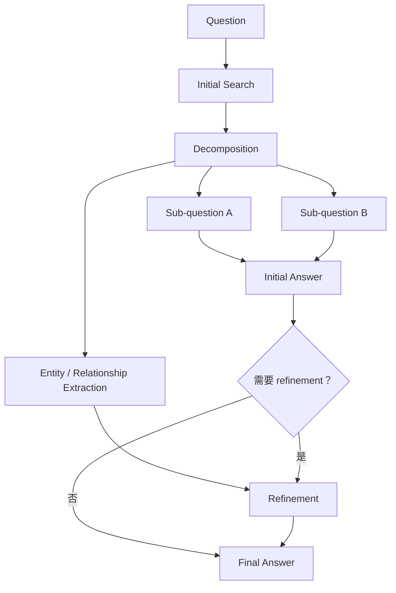

如果說 `AgentExecutor` 是把工作丟給模型、讓它自己決定怎麼做，那 LangGraph 就是在保留模型語意能力的同時，讓開發者重新拿回流程的主導權。LangGraph 的核心思想是把 Agent 的工作流表達成一張「有狀態的圖」——每個節點代表一個工作單元，每條邊代表一個流向決策，整張圖的當前進度則保存在一個結構化的 State 物件中。這不是為了把流程畫得好看，而是讓每一個步驟、每一個條件判斷、以及任務的當前狀態，都能被明確定義、追蹤與測試。

## 三個核心概念

LangGraph 的設計圍繞三個基本積木展開，理解它們就理解了整個框架的運作邏輯。

<CardGroup cols={3}>
  <Card title="State：接力棒" icon="database">
    State 是整個工作流共享的資料結構，記錄任務目前的所有關鍵資訊。每個節點從 State 中讀取它需要的資料，執行完畢後把結果寫回 State，交給下一個節點繼續使用。就像田徑接力賽中的接力棒——棒子裡承載著目前的進度與上下文，每一棒交接都是一次明確的狀態傳遞。
  </Card>

  <Card title="Node：工作站" icon="circle-nodes">
    Node 是實際執行工作的單元。它可以是一個 LLM 呼叫（讓模型做判斷）、一個工具執行（呼叫外部 API）、或任何一段普通的 Python 函式。每個 Node 接收當前 State，執行工作，然後回傳更新後的 State 片段。Node 之間互相獨立，可以單獨測試與替換。
  </Card>

  <Card title="Edge：路由決策" icon="arrow-right">
    Edge 定義節點之間的流向。最簡單的 Edge 是固定的「A 做完後一定去 B」；條件 Edge 則可以根據 State 的值選擇不同路徑，例如「若工具結果為空則走備用查詢路徑，否則繼續彙整」。Edge 把流程控制從模型的隱性決策變成程式的顯性路由。
  </Card>
</CardGroup>

### 用程式碼看三者的關係

```python
from langgraph.graph import StateGraph, END
from typing import TypedDict, Annotated
import operator

# 定義 State 結構
class AgentState(TypedDict):
    messages: Annotated[list, operator.add]  # 對話歷史，每次追加
    tool_results: dict                        # 工具執行結果
    final_answer: str                         # 最終輸出

# 定義 Node（節點函式）
def agent_node(state: AgentState):
    # 呼叫 LLM，決定下一步
    response = llm.invoke(state["messages"])
    return {"messages": [response]}

def action_node(state: AgentState):
    # 執行工具，取得結果
    tool_call = state["messages"][-1].tool_calls[0]
    result = execute_tool(tool_call)
    return {"tool_results": {tool_call["name"]: result}}

def should_continue(state: AgentState):
    # 條件 Edge：判斷是否需要繼續呼叫工具
    last_message = state["messages"][-1]
    if hasattr(last_message, "tool_calls") and last_message.tool_calls:
        return "action"
    return END

# 建立 Graph
graph = StateGraph(AgentState)
graph.add_node("agent", agent_node)
graph.add_node("action", action_node)

# 定義 Edge
graph.set_entry_point("agent")
graph.add_conditional_edges("agent", should_continue)
graph.add_edge("action", "agent")  # 工具執行完後，回到 agent 再判斷

app = graph.compile()
```

## Data Machi 的基本 Graph 結構

Data Machi 目前的核心工作流，可以用下面這個簡潔的拓撲圖表示：



這個結構看起來簡單，但它的優勢在於每一個環節都是明確的：你知道 Agent Node 負責什麼、Action Node 負責什麼、以及什麼條件會觸發哪條路徑。

<Steps>
  <Step title="START → Agent Node">
    使用者輸入進入 Agent Node。LLM 分析問題，決定是否需要呼叫工具。
  </Step>
  <Step title="Agent Node → Action Node（條件分支）">
    若 LLM 的回應包含 Tool Call，條件 Edge 將流程導向 Action Node 執行工具。
  </Step>
  <Step title="Action Node → Agent Node">
    工具執行完畢，結果附加到 State 的 messages 中，流程回到 Agent Node 再次判斷。
  </Step>
  <Step title="Agent Node → END">
    若 LLM 判斷已有足夠資訊，直接輸出最終答案，流程結束。
  </Step>
</Steps>

## 從 LangGraph 到 Graph Engineering

理解 State、Node 與 Edge 之後，下一步不是急著把所有功能都畫成 Graph，而是思考：**哪些部分需要模型自主判斷，哪些部分必須由系統明確控制？** 這種設計工作的重點，就是 Graph Engineering。

### Graph 不只是流程圖

Graph Engineering 真正設計的是五件事：

- 哪些節點使用確定性程式碼，哪些節點需要 LLM 理解語意
- 哪些路徑固定執行，哪些路徑允許模型動態選擇
- 資料不足、驗證失敗或工具錯誤時，流程應回到哪個節點
- 哪些高風險操作必須暫停並等待人工核准
- 哪些 Node 只是一次工具呼叫，哪些 Node 本身是一個完整 Agent

因此，Graph 不只是技術元件的連線方式，也是企業工作規則的可執行版本。

### Agent Graph 通常不是 DAG

傳統資料流程常使用不能回頭的 DAG，但真實 Agent 經常需要循環：



這表示 Loop 並不是 Graph 的替代方案；Loop 本身就是一種循環 Graph。Day 17 介紹的 ReAct 循環，可以被放在 Graph 的某個節點內，也可以由多個節點與條件 Edge 共同表達。

### Node 可以是一個完整 Agent

早期常見的 Graph，是編排多次 LLM 或工具呼叫；現在更常見的做法，是讓外層 Graph 編排多個具有自己工具與循環的 Agent：



外層 Graph 控制順序、交接、驗證與人工介入；每個 Agent Node 則在自己的範圍內自主選擇工具與完成子任務。這可以稱為「Graph orchestration of agents」。

### 不是所有任務都需要複雜 Graph

| 任務特性 | 較合適的架構 |
| --- | --- |
| 固定輸入、固定輸出 | Chain 或一般程式流程 |
| 少量工具、讓模型自行選擇 | Agent Loop |
| 有固定階段、分支、重試或審核 | LangGraph |
| 高度開放、路徑難以預測的研究任務 | Agent Harness 為主，外層 Graph 管理交付與安全 |
| 多個專業角色需要正式交接 | Graph 編排多個 Agent |

好的架構不是自主性越高越好，而是只在真正需要推理與探索的位置保留自主性。

## 使用 LangGraph，不代表系統一定是 Multi-Agent

LangGraph 是工作流與 Agent orchestration 的工具，但「使用 `StateGraph`」本身不能用來判斷一個系統是不是 Multi-Agent。Graph 中的 Node 可以是一般 Python 函式、一次模型判斷、工具執行器、Router、Verification Step、人工批准節點，也可以是一個擁有自己 Prompt、State 與工具循環的完整 Agent。



因此，下列兩個 Graph 都可能使用 LangGraph，但只有第二個比較接近 Multi-Agent：

```text
單一 Agent Graph：Coordinator → Tool Node → Coordinator
Multi-Agent Graph：Supervisor → Specialist Agent → Reviewer Agent
```

Michael Albada 將單一 Agent 描述為由一個 Agent 負責決策、規劃與工具使用；Multi-Agent 則需要多個 Agent 彼此分工、協調或平行處理。真正的判斷重點是「是否存在多個相對獨立的決策主體」，而不是 Graph 中有多少個 Node。

<Note>
  Data Machi 目前雖然使用 LangGraph，也有多個工具與處理節點，但核心仍是單一 Coordinator Agent。只有未來把 Analyst、Document、Trello 或 Reviewer 拆成各自擁有模型、上下文與決策循環的節點，才會進一步演變成真正的 Multi-Agent Graph。
</Note>

> **參考來源**<br />Michael Albada, _Building Applications with AI Agents: Designing and Implementing Multiagent Systems_, O’Reilly Media, 2025, Chapter 2, “Architecture Design Patterns,” pp. 32–34；Chapter 8, “From One Agent to Many,” pp. 163–177.

## 企業搜尋系統為什麼會需要 Graph？

如果流程只有：

```text
Question → Search → Answer
```

一般函式或簡單 Chain 往往就足夠。但當搜尋流程開始包含初步搜尋、問題拆解、多個子問題、文件驗證、重排序、答案驗證、再次 refinement，以及多條平行路徑時，流程就不再是一條直線。

Onyx 在設計 Agent Search 時，之所以選擇 LangGraph，核心原因不是「因為 Agent 就要用 Graph」，而是他們的邏輯流程本身已經自然包含 **Node、Edge、State、平行執行與依賴管理**。例如某些 refinement 節點必須等初版答案與 entity / relationship extraction 都完成後才能開始；另一方面，多個子問題與文件 relevance validation 又應該平行執行。



這個例子說明一個重要原則：**當工作流開始同時具備條件分支、平行化、依賴關係、循環與可重用子流程時，Graph 的價值才真正出現。**

Onyx 也特別提到，他們在原型階段驗證的重點包括 fan-out parallelization、subgraph parallelization、State management 與 streaming；正式實作後則大量使用 subgraph 來包裝可重用的搜尋流程。這些做法和「把每個業務動作拆成 Node，再用 State 與 Edge 控制流向」的 Graph Engineering 思維高度一致。

<Note>
  Data Machi 目前的 Graph 複雜度仍低於 Onyx 的 Agent Search。這裡引用 Onyx 是用來說明「什麼時候 Graph 比線性 Chain 更自然」，而不是表示 Data Machi 已經採用相同的多層 subgraph 架構。
</Note>

> **參考來源**<br />Evan Lohn & Joachim Rahmfeld, [“Beyond RAG: Implementing Agent Search with LangGraph for Smarter Knowledge Retrieval”](https://onyx.app/blog/agent-search-with-langgraph), Onyx, 2025-02-21. Onyx 說明 LangGraph 與其 Nodes、Edges、States 的自然映射，以及對 parallelization、dependency management、streaming 與 reusable subgraphs 的實際使用。

## 白箱思維：讓決策浮出水面

`AgentExecutor` 的問題是很多關鍵決策「藏在模型內部」——你只能透過觀察輸出來猜測模型在每一步做了什麼判斷。LangGraph 鼓勵的是「白箱思維」：把必須確定執行的邏輯寫成程式，讓模型專注於它真正擅長的語意理解。

<Accordion title="哪些邏輯應該寫成程式，而非交給 Prompt？">
  **適合寫成程式的邏輯：**

  - 工具結果為空時，自動改查備用來源
  - 重試次數超過上限時，強制結束並回傳錯誤
  - 高風險操作（如發送郵件、修改資料）前，暫停並等待人工批准
  - 根據使用者角色或權限，決定哪些工具可以被呼叫

  **適合交給 LLM 的邏輯：**

  - 判斷使用者問題的意圖
  - 從非結構化資料中提取關鍵資訊
  - 選擇最相關的工具與參數
  - 整合多個來源的資訊，產生自然語言回應

  程式與模型的分工越清晰，系統就越可預期、越容易除錯。
</Accordion>

以下是幾個「從 Prompt 約束轉移到程式控制」的實際範例：

```python
# ❌ 用 Prompt 約束：脆弱且不可靠
system_prompt = """
你是一個助理。當工具查詢結果為空時，請嘗試其他關鍵字再查一次。
若重試超過 3 次，請停止並告知使用者查無結果。
"""

# ✅ 用程式控制：明確且可測試
def should_retry(state: AgentState) -> str:
    if state["retry_count"] >= 3:
        return "give_up"
    if state["tool_results"].get("search") == []:
        return "retry_with_fallback"
    return "continue"

graph.add_conditional_edges("action", should_retry, {
    "give_up": "end_with_error",
    "retry_with_fallback": "fallback_search",
    "continue": "agent"
})
```

## State 設計：不只是對話歷史

在 `AgentExecutor` 中，State 基本上等於對話歷史（一個 messages list）。LangGraph 讓你自由定義 State 的結構，根據業務需求加入任何欄位：

```python
class EnterpriseAgentState(TypedDict):
    # 標準欄位
    messages: Annotated[list, operator.add]

    # 業務欄位
    user_id: str                    # 觸發此工作流的使用者
    permission_level: str           # 使用者的操作權限
    query_intent: str               # LLM 解析出的查詢意圖
    tool_results: dict              # 各工具的執行結果
    retry_count: int                # 重試次數計數器
    requires_approval: bool         # 是否需要人工批准
    audit_log: list                 # 稽核紀錄
```

這種結構化的 State 設計，讓每個節點能精確存取它需要的資訊，也讓整個工作流的「進度快照」在任何時間點都是可讀的。

<Tip>
  設計 State 時，建議把「流程控制用的欄位」（如 retry\_count、requires\_approval）和「業務資料欄位」（如 query\_intent、tool\_results）分開思考。前者服務於工作流邏輯，後者服務於最終的業務輸出。
</Tip>

## 踩坑筆記：LangGraph 不是用來取代 Prompt

<Note>
  LangGraph 讓你把部分控制權從模型移回程式，但這不代表你應該把所有邏輯都寫成 Node 和 Edge。LLM 仍然是語意理解的核心，你不可能、也不應該用程式碼描述每一個語意判斷。好的設計是：模型負責「理解與選擇」，程式負責「執行與守門」。兩者分工明確，各司其職。
</Note>

<Info>
  今天只要記住一件事：LangGraph 的價值，是把 Agent 的狀態與路徑從黑箱變成可管理的流程。
</Info>

下一篇，我們會探討當一個問題需要查詢多個獨立系統時，如何透過平行工具執行來大幅降低等待時間。