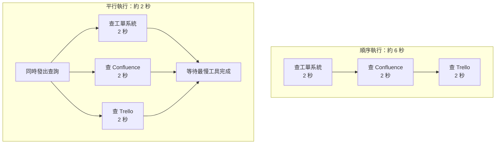
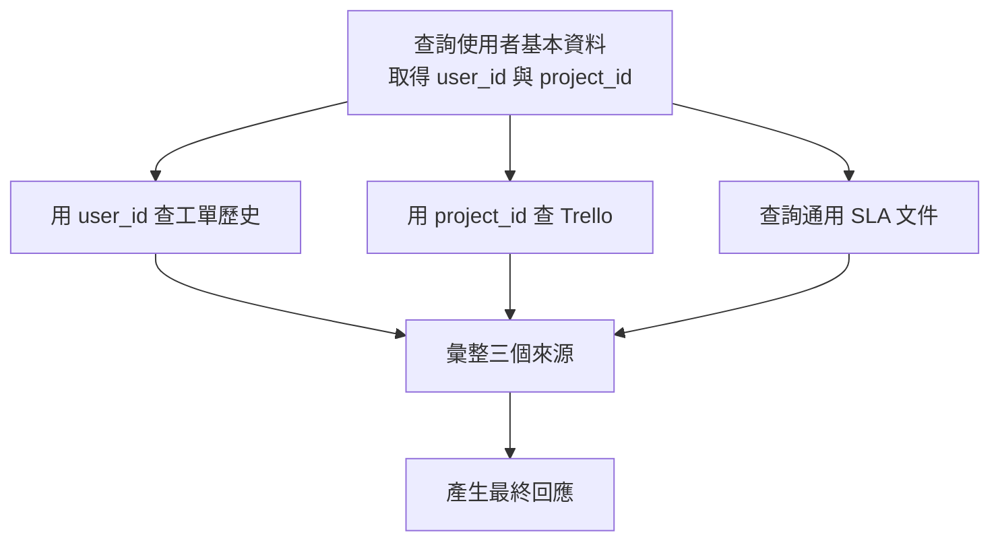
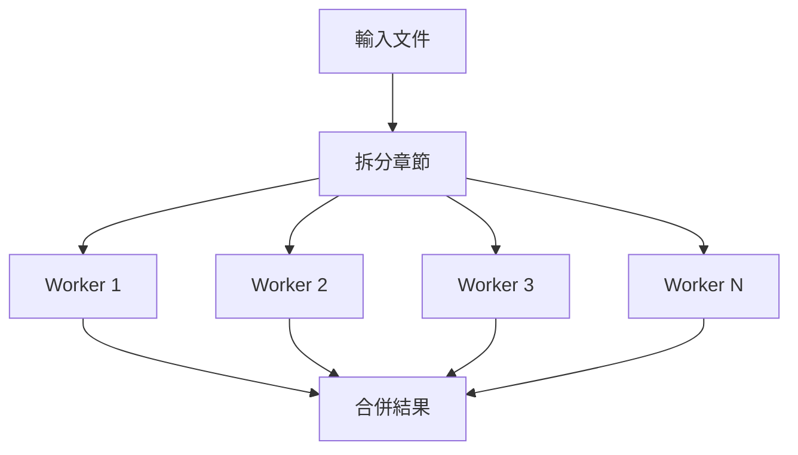
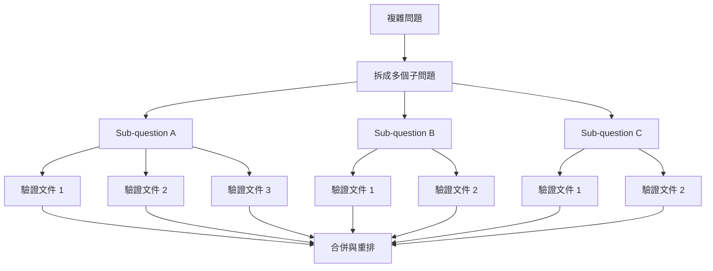
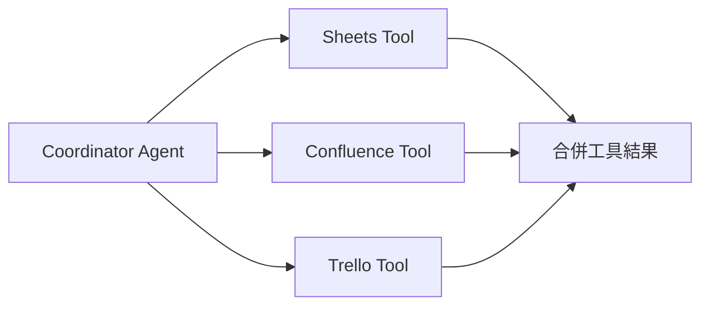
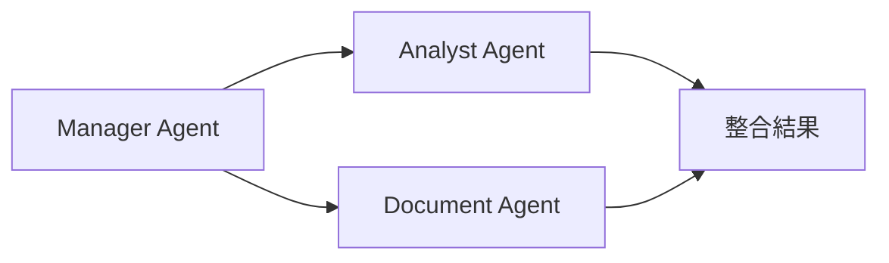

想像一個場景：使用者問「這個季度 Q3 的客訴工單有多少件，對應的 SLA 定義是什麼，目前有哪些相關 Trello 卡片正在處理？」這個問題需要同時查詢工單系統、Confluence 文件庫與 Trello 看板三個完全獨立的資料來源。如果 Agent 按順序逐一執行——先等工單系統回應、再等 Confluence、最後等 Trello——每個工具即便只花 2 秒，三個加起來就是 6 秒以上的等待。但如果三個查詢可以同時發出，整體只需要等最慢的那一個，可能只需 2–3 秒。這就是平行工具執行的核心價值：**讓彼此獨立的查詢同時進行，把累加等待變成並行等待**。

## 順序執行 vs. 平行執行

在理解「何時可以平行」之前，先直觀感受兩種執行模式的時間差異：



當查詢數量增加，順序執行的等待時間是線性累加的；平行執行的等待時間則近似於「最慢的那一個工具」的耗時。在企業 AI 系統中，這個差異會直接影響使用者體驗與系統吞吐量。

## 什麼情況可以平行，什麼情況不行？

平行執行的前提條件只有一個，但它非常關鍵：**這些查詢彼此之間沒有資料依賴**。

<CardGroup cols={2}>
  <Card title="可以平行的情況" icon="check">
    **獨立資料來源的並行查詢**

    - 同時查詢工單統計、文件定義與看板狀態
    - 同時取得多個使用者的設定資料
    - 同時搜尋多個獨立的知識庫
    - 同時呼叫多個不互相影響的外部 API

    判斷標準：A 的結果不需要作為 B 的輸入參數
  </Card>

  <Card title="必須保持順序的情況" icon="xmark">
    **存在資料依賴的串行查詢**

    - 先用非正式名稱查到正式專案代號，再用代號查 Trello
    - 先取得使用者 ID，再用 ID 查詢該使用者的工單
    - 先確認文件存在，再拉取文件內容
    - 先建立資料，再更新相關關聯

    判斷標準：B 的查詢參數需要從 A 的結果中取得
  </Card>
</CardGroup>

### 混合情況：部分平行、部分順序

實際業務中，常見的是「部分步驟可平行，部分步驟需順序」的混合拓撲：



在 LangGraph 中，這種結構可以透過 fan-out（一個節點拆成多個平行路徑）和 fan-in（多個路徑匯合到一個節點）來實現。

## 從固定平行到動態 Graph

前面的案例假設系統事先知道要查三個來源，因此可以預先定義三條平行路徑。但有些任務要到執行時，才知道需要建立多少個下游工作。

例如，一份文件可能被拆成 3 個章節，也可能是 20 個章節；一個研究問題可能產生 5 個子題，也可能產生 12 個子題。這時不能在開發階段固定寫死 Worker 數量，而要由前一個節點根據執行結果動態分派：



LangGraph 可以透過 `Send` 在執行期間建立下游任務，形成動態的 fan-out 與 fan-in。這種模式常用於 Map-Reduce、批次文件分析與多來源研究。

```python
from langgraph.types import Send

def assign_workers(state: AgentState):
    return [
        Send("analyze_section", {"section": section})
        for section in state["sections"]
    ]
```

固定平行工具呼叫與動態 Graph 的差別在於：前者事先知道要執行哪些工作；後者必須根據 State 的內容，在執行期間決定工作數量與路徑。

## Agent Search 的平行化：不只是同時呼叫三個 API

平行化在複雜 Agent Search 裡的價值，比「同時查三個系統」更進一步。Onyx 的 Agent Search 會把一個複雜問題拆成多個子問題，每個子問題都可能包含 query expansion、搜尋、文件 relevance validation、reranking 與 sub-answer generation。若這些工作全部順序執行，延遲會快速累加。

Onyx 特別強調三種需要平行化的工作：

- 多個 **sub-question** 同時處理
- 每個 sub-question 找到的多份文件，進行 **relevance validation** 時平行驗證
- **entity / relationship / term extraction** 與子問題處理同時進行

這可以用兩層 fan-out 來理解：



Onyx 在 LangGraph 中使用 Map-Reduce branches 處理同型態的文件驗證，也大量使用 subgraph，把「Search → Relevance Validation → Reranking」包裝成可重複利用的 Extended Search Retrieval 流程。這種設計的重點不是讓所有東西一起跑，而是**把真正獨立的工作拆開，避免不必要的等待，同時保留必要的依賴關係**。

<Note>
  Data Machi 目前的平行化主要是同一個 Coordinator 產生多個 Tool Call，再由 Action Node 同時執行。Onyx 的案例屬於更進階的 Graph-level parallelism：不只平行工具，也平行子問題、文件驗證與 subgraph。兩者原理相同，但複雜度不同。
</Note>

> **參考來源**<br />Evan Lohn & Joachim Rahmfeld, [“Beyond RAG: Implementing Agent Search with LangGraph for Smarter Knowledge Retrieval”](https://onyx.app/blog/agent-search-with-langgraph), Onyx, 2025-02-21. 文章說明了 sub-question parallelism、document verification 的 Map-Reduce fan-out，以及以 subgraph 進行平行化與重用的實務設計。

## Data Machi 的實作方式

當 LLM 在一個回應中產生多個 Tool Call 時，Data Machi 的 Action Node 會使用 Python 的非同步機制平行執行所有工具，再把所有 `ToolMessage` 一起交回 Agent Node 繼續判斷。

```python
import asyncio
from langchain_core.messages import ToolMessage

async def action_node(state: AgentState):
    """平行執行所有 tool calls，並等待全部完成"""
    tool_calls = state["messages"][-1].tool_calls

    # 為每個 tool call 建立非同步任務
    tasks = [
        execute_tool_async(tool_call)
        for tool_call in tool_calls
    ]

    # 平行等待所有工具完成
    results = await asyncio.gather(*tasks, return_exceptions=True)

    # 把結果包裝成 ToolMessage 回傳
    tool_messages = []
    for tool_call, result in zip(tool_calls, results):
        if isinstance(result, Exception):
            content = f"工具執行失敗：{str(result)}"
        else:
            content = str(result)

        tool_messages.append(
            ToolMessage(
                content=content,
                tool_call_id=tool_call["id"],
                name=tool_call["name"]
            )
        )

    return {"messages": tool_messages}

async def execute_tool_async(tool_call: dict):
    """根據工具名稱執行對應的非同步工具"""
    tool_name = tool_call["name"]
    tool_args = tool_call["args"]

    tool_map = {
        "search_tickets": search_tickets_async,
        "search_confluence": search_confluence_async,
        "search_trello": search_trello_async,
    }

    if tool_name in tool_map:
        return await tool_map[tool_name](**tool_args)
    raise ValueError(f"未知工具：{tool_name}")
```

### 前端狀態顯示

平行執行的另一個好處是可以讓前端即時呈現每個工具的查詢狀態，而不是讓使用者盯著一個無差別的 loading 圈圈。Data Machi 會在前端顯示每個工具的即時狀態：

```text
🔍 正在查詢工單系統...    ✅ 完成（找到 47 筆）
🔍 正在查詢 Confluence... ⏳ 查詢中
🔍 正在查詢 Trello...     ✅ 完成（找到 3 張卡片）
```

這種透明度不只是視覺上的改善，也讓使用者能即時判斷哪個系統回應較慢，以及是否有某個工具失敗需要關注。

## 平行工具執行，不等於平行 Agent

當 Coordinator 同時查詢 Google Sheets、Confluence 與 Trello 時，這代表的是 **Parallel Tool Execution**，不代表系統裡已經有三個 Agent。



這些 Tool 通常沒有自己的模型、目標、記憶、規劃循環或溝通協議。它們只是由同一個 Coordinator 同時呼叫的能力單元。只有當各個執行者能獨立理解子任務、選擇自己的工具、管理自己的上下文，並將結果交回其他 Agent 時，才比較接近平行 Agent。



Michael Albada 將平行處理列為 Multi-Agent 的可能優勢之一，但書中也另外討論了單一 Agent 內的 Parallel Tool Execution。換句話說，「同時執行」描述的是拓撲與效能策略；「是不是 Multi-Agent」則取決於執行單元是否為獨立的決策主體。

<Note>
  Data Machi 目前實作的是單一 Coordinator 產生多個 Tool Call，再由 Action Node 平行執行。這可以降低跨來源查詢的延遲，但仍屬於單一 Agent 加多工具的架構。
</Note>

> **參考來源**<br />Michael Albada, _Building Applications with AI Agents: Designing and Implementing Multiagent Systems_, O’Reilly Media, 2025, Chapter 2, “Multiagent Architectures: Collaboration, Parallelism, and Coordination,” pp. 32–34；Chapter 5, “Tool Execution,” pp. 105–109.

## 企業 AI 的延遲來源分析

延遲問題不只來自模型的推論速度。在企業 AI 系統中，整體回應時間通常由以下幾個因素共同決定：

<Accordion title="企業 AI 系統的五大延遲來源">
  | 延遲來源 | 典型耗時 | 優化方向 |
  | --- | --- | --- |
  | LLM 推論（模型本身） | 1–5 秒 | 換更快模型、使用 streaming |
  | 外部工具 API 呼叫 | 0.5–3 秒/個 | 平行執行、快取結果 |
  | 資料量與傳輸 | 視資料大小 | 限制回傳欄位與筆數 |
  | 重複查詢 | 累加 | 快取相同查詢的結果 |
  | 網路延遲（跨地區） | 50–500ms | 就近部署或使用 CDN |

  **關鍵洞察**：很多時候，把模型換成更快的版本帶來的提升遠不如消除不必要的順序等待。先分析你的延遲瓶頸在哪裡，再決定優化方向。
</Accordion>

### 快取策略的實際效益

除了平行化，快取是另一個高性價比的優化手段。對於「相同查詢參數、短時間內重複執行」的場景，直接回傳快取結果可以把工具延遲從 2 秒降到接近 0：

```python
import hashlib
import json
from functools import lru_cache
from datetime import datetime, timedelta

class ToolResultCache:
    def __init__(self, ttl_seconds: int = 300):
        self._cache = {}
        self._ttl = timedelta(seconds=ttl_seconds)

    def _cache_key(self, tool_name: str, args: dict) -> str:
        content = f"{tool_name}:{json.dumps(args, sort_keys=True)}"
        return hashlib.md5(content.encode()).hexdigest()

    def get(self, tool_name: str, args: dict):
        key = self._cache_key(tool_name, args)
        if key in self._cache:
            result, timestamp = self._cache[key]
            if datetime.now() - timestamp < self._ttl:
                return result  # 快取命中
        return None  # 快取未命中或已過期

    def set(self, tool_name: str, args: dict, result):
        key = self._cache_key(tool_name, args)
        self._cache[key] = (result, datetime.now())

# 使用快取包裝工具呼叫
cache = ToolResultCache(ttl_seconds=300)

async def cached_tool_call(tool_name: str, args: dict):
    cached = cache.get(tool_name, args)
    if cached is not None:
        return cached
    result = await execute_tool_async({"name": tool_name, "args": args})
    cache.set(tool_name, args, result)
    return result
```

## 踩坑筆記：哪些情況不適合平行？

<Warning>
  不是所有工具都適合無條件平行執行。以下幾種情況盲目平行反而會造成錯誤或系統不穩定：

  1. **速率限制共享**：若多個工具共用同一個 API 的速率限制，同時呼叫可能觸發 429 Too Many Requests
  2. **修改同一份資料**：若多個工具都會寫入同一個資源（如同時更新同一個 Trello 卡片），可能產生競態條件
  3. **明確先後依賴**：B 的輸入需要 A 的輸出，這是順序依賴，強行平行會得到錯誤的查詢參數
  4. **事務性操作**：需要原子性保證的多步驟操作（如先扣款再建立訂單）必須保持順序
</Warning>

<Tip>
  評估一個工具組合是否可以平行，可以問自己這個問題：「如果我把這些工具呼叫的順序打亂，結果會不一樣嗎？」如果答案是「不會」，通常就可以平行。
</Tip>

<Info>
  今天只要記住一件事：平行化的前提是任務彼此獨立，而不是所有工具一起呼叫。
</Info>

下一篇，我們會釐清一個在企業 AI 討論中常見的迷思：系統裡有多個工具，是否就等於 Multi-Agent 架構？