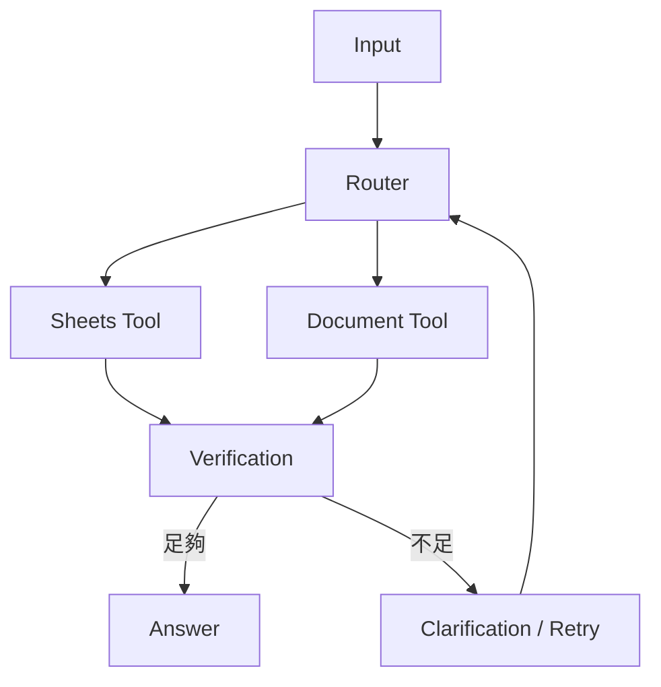

昨天我們碰到一個很實際的問題：Agent 能力愈多，執行路徑就愈難看清楚。這時候 LangGraph 才真正有價值。它不是為了讓 AI 更聰明，而是把一段多步驟任務拆成明確的狀態與節點，讓我們知道資料現在在哪裡、下一步要去哪裡，以及什麼條件會走不同分支。

如果把代理循環（Agent Loop）想成一位很自由的同事，LangGraph 比較像把工作流程畫成一張可以執行的流程圖。

## State：整段任務共同攜帶的資料

State 可以理解成工作流程裡的「接力棒」。使用者問題、最近對話、已使用的工具、Sheets 結果、RAG 來源、驗證狀態，都可以放在 State 裡。每個 Node 讀取需要的欄位，執行完再把新的結果寫回去。

這樣做的好處是，不同節點不需要靠一大段 Prompt 猜「前面發生了什麼」，而是可以明確看到目前有哪些資料。

## Node：把一個責任做成一個步驟

Node 就是一個明確工作單元。例如 `route_request` 負責判斷任務類型，`query_sheets` 負責結構化查詢，`search_documents` 負責 RAG，`verify_results` 檢查資料是否足夠，`generate_answer` 才負責最後輸出。

這種拆法最大的價值是可測試。當結果有問題時，可以單獨確認是哪個 Node 出錯，而不是只能重新看整段 Agent 對話。

## Edge：定義流程怎麼往下走

一般 Edge 表示固定下一步，Conditional Edge 則根據 State 決定分支。例如 Verification 成功就進入回答節點，失敗則回到重新搜尋；高風險操作可以先進入 Approval Node，等人工確認後再繼續。

## 平行執行、人工介入與多代理都是延伸模式

LangGraph 也能處理平行節點、人工暫停與多 Agent，但這些不需要各自變成主線的一篇文章。真正先要掌握的是：當流程有依賴、分支、重試或人工確認時，可以用 graph 把規則明確寫出來。

Multi-Agent 也不應該為拆而拆。如果單一 Coordinator 搭配多個 Tools 就能處理工作，就沒有必要額外增加 Agent 交接成本。只有當不同任務真的需要不同角色、上下文或權限時，拆分才有意義。

## 延伸閱讀｜工作流程圖（Graph）裡有很多節點（Node），不代表就是多代理（Multi-Agent）

這是非常容易混淆的地方。Graph 中可以同時存在 **Tool Node、LLM Node 與 Agent Node**：Tool Node 只執行明確操作，LLM Node 可能只做一次分類或摘要，只有 Agent Node 才通常具備自己的目標、上下文、工具集與反覆決策循環。因此「Node 很多」和「Agent 很多」是兩件不同的事。

真正值得拆成多代理（Multi-Agent），通常是因為不同角色需要不同的目標、上下文、工具組合、權限或模型，或者任務本身存在正式的角色交接，例如分析角色先產生分析、審核角色可以退回重做，再由整理角色產生最終輸出。如果只是想把 6 個工具拆成 6 個代理，往往只會增加模型呼叫、狀態傳遞與除錯成本。

<Note>
  一個實用原則：先用「單一 Coordinator \+ 多個 Tools」解決問題；只有當工具選擇混亂、上下文必須隔離、權限差異明顯或角色交接本身就是業務流程時，再考慮 Multi-Agent。
</Note>

<Accordion title="延伸閱讀：不是所有流程都需要 LangGraph">
  如果任務是固定輸入、固定輸出，一般程式流程就足夠；如果只有少量工具，而且沒有複雜的分支、重試或人工審核，簡單 Agent loop 也可能更快。只有當流程開始出現「要回頭重查」「等待批准」「平行分支」「不同失敗路徑」時，Graph 才真正比線性流程自然。**架構不是越進階越好，而是剛好能承受問題的複雜度最好。**
</Accordion>

<Info>
  今天先記住一件事：LangGraph 的核心價值不是 Agent 更多，而是讓 State 與流程變得看得見、控得住、測得到。
</Info>

下一篇，我們會把前面做好的 Coordinator 放進 LangGraph，實際建立一條 Router → Tool → Verification → Answer 的可控工作流。