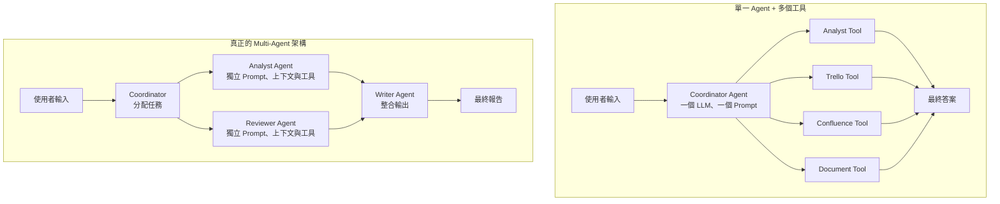
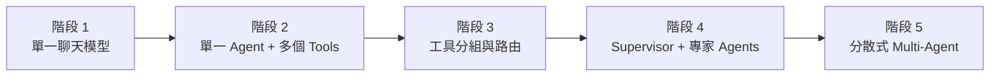
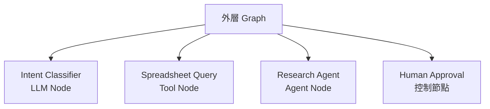

<Frame>
  
</Frame>

<p align="center">
  *圖 1｜單一 Agent 與 Multi-Agent 的架構取捨*
</p>

「我們的系統裡有 Analyst 查詢、Trello 操作、Confluence 搜尋、Document 處理四種能力，這樣算不算 Multi-Agent 架構？」這是一個在企業 AI 專案中非常常見的問題，而且答案往往出人意料：不一定。工具的數量和 Agent 的數量是兩個完全不同的維度。混淆這兩者不只是名詞上的誤用，更可能讓你在不需要複雜架構的地方引入不必要的成本與複雜度，同時在真正需要拆分的地方猶豫不決。

$$\rightarrow$$

## 工具 vs. Agent：本質差異在哪裡？

要釐清這個問題，先從定義出發。

<CardGroup cols={2}>
  <Card title="工具（Tool）" icon="wrench">
    工具是 Agent 可以呼叫的能力單元。一個工具有固定的輸入格式、固定的執行邏輯與固定的輸出格式。它本身不具備判斷能力——是 Agent 決定「什麼時候呼叫哪個工具、帶什麼參數」。工具像是螺絲起子：功能明確，由持有者決定何時使用。
  </Card>

  <Card title="Agent" icon="robot">
    Agent 是具備判斷能力的工作主體。它有自己的 Prompt（定義角色與目標）、自己的上下文（決定它能看到什麼資訊）、自己的工具集（決定它能做什麼）、以及可能獨立的模型選擇與權限設定。不同 Agent 之間存在明確的交接點。
  </Card>
</CardGroup>

### 用結構來判斷



精確的描述方式是：如果這四種能力只是四組 Tool，由同一個 Coordinator 的 LLM 選擇與呼叫，這是「**單一 Agent 加多個領域工具**」，而不是 Multi-Agent。

## 什麼時候值得真正拆分 Agent？

Multi-Agent 不是越多越好，它應該由真實的業務需求驅動。以下是幾個「拆分真的有意義」的情境：

<Steps>
  <Step title="工具太多，模型選錯的頻率升高">
    當一個 Agent 擁有超過 15–20 個工具時，LLM 在選擇工具時的準確度開始下滑——它可能呼叫功能相近但語意不同的工具，或混淆不同領域的工具。此時把工具依領域分組，交給各自的 Sub-Agent 管理，可以讓每個 Agent 的工具集保持簡潔，提升選擇準確性。

    ```text
    # 拆分前：Coordinator 要選 20 個工具中的正確一個
    # 拆分後：Coordinator 只需選「派給哪個 Agent」，每個 Agent 只有 4-5 個工具
    ```
  </Step>
  <Step title="不同領域需要隔離大量上下文">
    某些任務需要大量的領域特定背景知識。若把所有背景知識都塞進同一個 Agent 的 System Prompt，Prompt 會變得極長，而且不同領域的知識可能互相干擾。給每個領域獨立的 Agent，讓它只載入自己需要的上下文，是更乾淨的設計。
  </Step>
  <Step title="任務存在明確的角色交接">
    若業務流程本身就有「研究→審核→修正→輸出」這樣的角色區分，且不同角色之間需要正式的交接點（例如 Reviewer 可以退回 Analyst 重做），這種結構天然適合拆成不同 Agent 節點，在 LangGraph 中用明確的 Edge 表示交接邏輯。
  </Step>
  <Step title="不同角色需要不同權限或模型">
    Reviewer Agent 可能需要更強的推理模型（如 GPT-4o），而負責格式化輸出的 Writer Agent 用較便宜的模型就夠了。或者，某個 Agent 需要讀取敏感資料，而其他 Agent 不應該有這個權限。這種「差異化配置」的需求，是拆分 Agent 的合理理由。
  </Step>
</Steps>

## Data Machi 的現況：刻意保持簡單

Data Machi 目前的核心架構是一個 Coordinator 在 Agent 節點與 Action 節點之間循環，四個領域能力（Analyst、Trello、Confluence、Document）主要以工具形式存在。

<Note>
  這個選擇是刻意的，而不是暫時的妥協。對於目前的業務場景，單一 Coordinator \+ 多工具的架構已經能完整覆蓋需求，而且帶來了幾個重要優勢：架構更簡單、每次對話的模型呼叫次數更少（延遲更低）、除錯更直觀、新工具的加入更快速。
</Note>

```python
# Data Machi 目前的工具組織方式
tools = [
    # Analyst 領域
    search_tickets_tool,
    get_ticket_stats_tool,
    analyze_trends_tool,

    # Trello 領域
    search_trello_cards_tool,
    get_board_status_tool,

    # Confluence 領域
    search_confluence_tool,
    get_document_content_tool,

    # Document 領域
    generate_report_tool,
    format_output_tool,
]

# 單一 Coordinator Agent 管理所有工具
coordinator = create_react_agent(llm, tools=tools)
```

這種架構並不削弱系統價值，反而讓整個系統更容易理解與維護。

## 應該從單一 Agent 開始，還是直接設計 Multi-Agent？

Michael Albada 在《Building Applications with AI Agents》中提出一個很實用的原則：**先從最簡單的架構開始，只有當複雜度真的超出單一 Agent 的負荷時，再增加 Agent。**

單一 Agent 通常具有以下優勢：

- 實作與維護較簡單
- 模型呼叫與 Token 成本較低
- 沒有 Agent 之間的通訊與同步負擔
- 回應延遲較短
- 問題較容易追蹤與除錯

Multi-Agent 的價值則通常出現在：

- 工具數量過多，單一 Agent 的選擇準確率下降
- 任務跨越多個差異明顯的專業領域
- 不同角色需要獨立 Prompt、模型、上下文或權限
- 子任務需要平行執行、正式交接或互相審核
- 各部分需要獨立測試、部署或擴充

| 判斷面向 | 維持單一 Agent | 考慮 Multi-Agent |
| --- | --- | --- |
| 工具數量 | 數量有限、用途清楚 | 工具很多且描述容易重疊 |
| 任務範圍 | 同一工作領域 | 多個差異明顯的專業領域 |
| Prompt 與 Context | 可共用核心規則 | 需要隔離不同角色的背景資訊 |
| 權限 | 工具權限相近 | 不同角色需不同資料或操作權限 |
| 執行方式 | 單一循環可以完成 | 需要平行、交接、審核或重做 |
| 成本與延遲 | 希望保持較低 | 接受更多模型呼叫與協調成本 |

書中也提醒，Multi-Agent 雖然可能帶來專業分工、平行化、擴充性與韌性，但同時會增加通訊、同步、維護與 Token 成本。如果沒有清楚的分工理由，增加 Agent 反而可能降低效率。

> **參考來源**<br />Michael Albada, _Building Applications with AI Agents: Designing and Implementing Multiagent Systems_, O’Reilly Media, 2025, Chapter 2, “Architecture Design Patterns,” pp. 32–34；Chapter 8, “How Many Agents Do I Need?” pp. 163–177.

## Data Machi 的架構演進位置



Data Machi 目前位於第二到第三階段之間：已有單一 Coordinator、領域工具分組、工具路由與平行執行，也具備記憶、釐清與 Verification；但 Analyst、Document、Trello 與 Confluence 尚未各自成為擁有獨立模型、State 與決策循環的 Agent。

<Info>
  這不是尚未完成的缺陷，而是根據目前工具數量、任務範圍、延遲與維護成本做出的架構選擇。書中也建議，在拆成 Multi-Agent 前，可以先改善工具 description、語意選擇或階層式 Tool Selection；只有這些方式仍不足時，才進一步拆分 Agent。
</Info>

> **參考來源**<br />Michael Albada, _Building Applications with AI Agents: Designing and Implementing Multiagent Systems_, O’Reilly Media, 2025, Chapter 5, “Tool Selection,” pp. 93–105；Chapter 8, “Single-Agent Scenarios,” pp. 163–169.

## 未來可能的拆分時機

若 Data Machi 未來遇到以下需求，才會考慮真正的 Multi-Agent 拆分：

<Accordion title="可能觸發 Multi-Agent 拆分的未來場景">
  **場景一：分析師 \+ 審核師工作流**

  若需要讓 Analyst Agent 先產出分析草稿，交給 Reviewer Agent 獨立查核資料正確性，再由 Writer Agent 整理最終報告，這個「草稿→查核→報告」的流程有明確的角色交接，適合拆成三個獨立節點。

  ```mermaid
  flowchart LR
A[Analyst Agent] -->|分析草稿| R[Reviewer Agent]
R -->|通過| W[Writer Agent]
R -->|退回修正| A
W --> F[最終報告]
  ```

  **場景二：工具數量爆炸**

  若工具清單從目前的 9 個增長到 30 個以上，Coordinator 的工具選擇準確度開始下滑，就是考慮按領域拆分 Sub-Agent 的時機。

  **場景三：不同權限要求**

  若系統需要支援不同角色（普通用戶 vs. 管理員），而管理員可以執行刪除或批量更新操作，用不同 Agent 隔離權限邊界會比在工具內部做條件判斷更清晰。
</Accordion>

## Graph 裡的三種 Node

從 Graph Engineering 的角度來看，Node 不只是一種東西。理解 Node 的責任範圍，有助於避免把每個能力都錯誤包裝成 Agent。

| Node 類型 | 主要責任 | 是否自主決策 |
| --- | --- | --- |
| **Tool Node** | 執行一個明確操作，例如查詢試算表或建立卡片 | 否 |
| **LLM Node** | 完成一次分類、摘要、判斷或生成 | 有限，通常只做一次模型決策 |
| **Agent Node** | 在自己的工具與上下文中反覆判斷、行動與觀察 | 是，內部可包含完整 Loop |



因此，「Graph 中有很多 Node」不代表 Multi-Agent；只有當其中多個 Node 各自具備獨立目標、上下文、工具集與決策循環時，才是由 Graph 編排多個 Agent。

對 Data Machi 而言，現階段以單一 Coordinator 搭配多個 Tool Node 最合理；未來只有在研究、分析、查核等任務需要長時間自主執行與正式交接時，再把特定 Node 升級成 Agent Node。

## Multi-Agent 的隱藏成本

在決定拆分之前，必須誠實評估 Multi-Agent 架構帶來的額外成本：

<Warning>
  Multi-Agent 架構的複雜度是真實的：

  - **更多模型呼叫**：每個 Agent 都需要至少一次 LLM 呼叫，多個 Agent 意味著更高的 API 費用與累積延遲
  - **上下文傳遞設計**：Agent 之間如何傳遞狀態？傳遞多少資訊？遺漏什麼？這些都需要仔細設計
  - **除錯難度提升**：問題出在哪個 Agent？是交接格式錯了還是中間 Agent 的輸出有問題？排查鏈路更長
  - **責任邊界模糊**：多個 Agent 協作時，若最終輸出有誤，要追溯到哪個 Agent 的哪個決策是重要但困難的問題
</Warning>

<Tip>
  一個實用的評估框架：在考慮拆分 Agent 之前，先問「我有沒有辦法用更簡單的方式解決同樣的問題？」例如，工具選錯可以先嘗試改善工具的 description 或 Prompt；上下文太長可以先嘗試壓縮或摘要，而不是立刻引入新的 Agent。
</Tip>

<Info>
  今天只要記住一件事：Agent 架構的好壞不看角色數量，而看分工是否真的降低複雜度與風險。
</Info>

下一篇，我們會聚焦企業 AI 中最關鍵的一環：當 Agent 準備執行高風險操作時，如何設計 Human-in-the-loop 機制確保人類保有最終控制權。