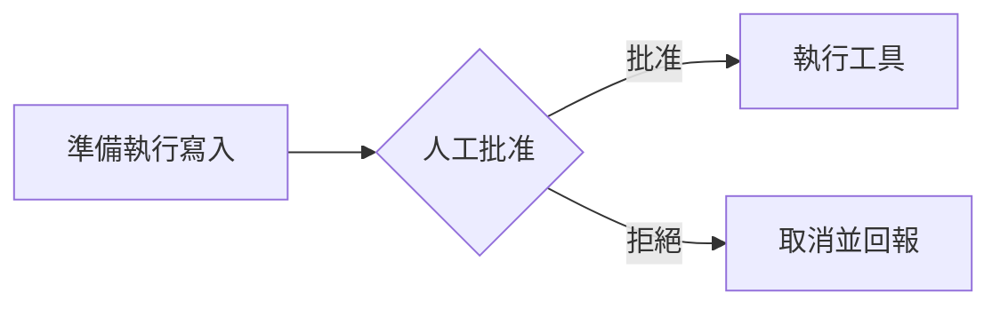

前一天我們已經理解 LangGraph 的狀態（State）、節點（Node）、連線（Edge）與條件連線（Conditional Edge）。今天要把這些概念真正放回 Data Machi，將原本偏黑箱的協調者（Coordinator）改造成一條可以觀察、測試與控制的工作流程。

## 先把過度集中的責任拆開

如果協調者同時負責理解問題、選工具、呼叫工具、判斷結果、驗證來源與生成答案，程式會愈來愈難維護。LangGraph 的做法，是把不同責任拆成節點，再用狀態傳遞資料。

這裡的狀態可以保存使用者問題、對話上下文、已選工具、工具結果、資料來源、驗證狀態與錯誤資訊。每個節點只處理自己負責的那一部分。

## 路由節點只做分流，不要讓它包辦一切

路由節點（Router）的工作，是判斷問題需要哪種能力。如果是數據問題，送到試算表工具；如果是文件問題，送到文件工具；如果是複合問題，可以建立多個分支。這個節點不需要直接生成最終回答。

這樣做的好處是：當分流錯誤時，可以單獨測路由節點；當資料錯誤時，則檢查對應的工具節點。問題不會全部混成一句「模型回答怪怪的」。

## 驗證節點是企業場景很重要的一層

工具回傳資料後，不應直接進入回答節點。驗證節點（Verification Node）可以檢查是否有來源、結果是否為空、是否滿足使用者的所有子問題，以及資料是否需要更新。

如果資訊不足，可以透過條件連線回到路由節點或指定工具重查；如果問題本身不清楚，也可以進入問題釐清節點（Clarification Node）。這就是可控工作流程比自由代理循環更容易管理的地方。

## 人工介入應該放在高風險動作之前

人工介入（Human-in-the-loop）特別適合放在會真正改變外部系統的操作之前。讀取資料與寫入、寄送、刪除等動作的風險並不相同。

例如搜尋 PDF、查詢試算表通常屬於唯讀（Read-only），可以自動執行；但寄信、建立正式任務、更新專案狀態或刪除資料，則可以在執行前增加人工批准節點。



人工介入不是代表代理不夠聰明，而是讓風險與權限有清楚邊界。

### 權限可以逐步開放，不必一步到全自動

代理的操作權限可以分成幾個成熟階段：先從唯讀開始，只讓 AI 查資料；接著允許它產生草稿；再進到「人工批准後執行」；等稽核、回滾與權限都成熟後，才逐步開放低風險自動操作。**成熟的代理不是一開始就什麼都能做，而是隨著信任與治理逐步增加權限。**

## 平行工具執行也可以放進工作流程圖

如果一個問題同時需要兩個互不依賴的來源，可以從路由節點分成兩條路徑平行執行，再等結果回到同一個整合節點。反過來，如果第二個工具需要第一個結果，就維持順序。

因此平行執行、順序執行、重試與人工批准，不需要各自變成不同的代理架構；它們只是工作流程圖中的不同模式。

## 不要為了多代理而拆代理

當每個工具都拆成一個代理，很容易讓系統變得更難理解。只有當不同角色真的有不同目標、不同上下文或不同決策責任時，多代理（Multi-Agent）才有價值。否則「一個協調者＋多個工具＋清楚工作流程」通常更容易控制。

## 階段實作五｜把設計轉成可控 Workflow 規格

拿出 Day 20 的 Agent 決策邊界，把每一項能力改寫成 State、Node 與 Edge。這份成果可以是流程圖或規格表，不要求一定使用 LangGraph；它的目的，是讓工程師或開發工具知道哪些行為必須由系統保證。

| Node | 讀取哪些 State | 產生什麼輸出 | 下一步條件 | 失敗路徑 |
| --- | --- | --- | --- | --- |
| Router | 問題、對話範圍 | 所需能力 | 單一或多來源 | 進入 Clarification |
| Tool | 工具輸入 | 結果、來源、時間 | 完成後驗證 | Timeout／權限錯誤 |
| Verification | 子問題、工具結果 | 足夠／不足 | Answer 或 Retry | 超過次數後停止 |
| Approval | 待執行動作、風險 | 批准／拒絕 | 執行或取消 | 保存狀態等待 |
| Answer | 已驗證結果 | 回答與來源 | 結束 | 回傳部分成功 |

完成後至少走查五條路徑：單一來源、跨來源、資訊不足、工具失敗，以及需要人工批准。每一條都應看得出經過哪些節點、在哪個 Edge 分流、保存哪些 State，以及何時停止。

<Check>
  保存流程圖、Node 規格與五條測試路徑。Day 30 會把它和前四階段成果、權限與可靠性規則整合成最終 Enterprise AI Blueprint。
</Check>

## 延伸閱讀｜人工介入真正困難的是「暫停後還能繼續」

在展示原型裡，人工確認看起來只是顯示一個「批准／拒絕」按鈕；真正進入長流程後，困難的是如何保存當下狀態，讓使用者幾分鐘甚至幾天後批准時，工作流程可以從原本位置繼續，而不是全部重跑。這就是檢查點（Checkpointer）、中斷與恢復（Interrupt / Resume）以及持久執行（Durable Execution）會開始變重要的地方。

```text
工作流程執行
  ↓
遇到高風險操作
  ↓
保存狀態並中斷
  ↓
等待人工批准
  ↓
批准
  ↓
載入狀態並恢復
  ↓
繼續下一個節點
```

這也是 LangGraph 類工作流與單純聊天代理很重要的差別：流程狀態本身成為產品資產，而不是只存在某次模型呼叫的上下文裡。

<Info>
  今天的里程碑是：Data Machi 不再只是一個會自己決定的代理，而是一條可以被觀察、測試、重試與人工介入的工作流程。
</Info>

下一篇開始，我們會從架構正確性走向產品可靠性：因為即使工作流程設計得再漂亮，真實 API 還是一定會遇到逾時、限流或暫時失敗。