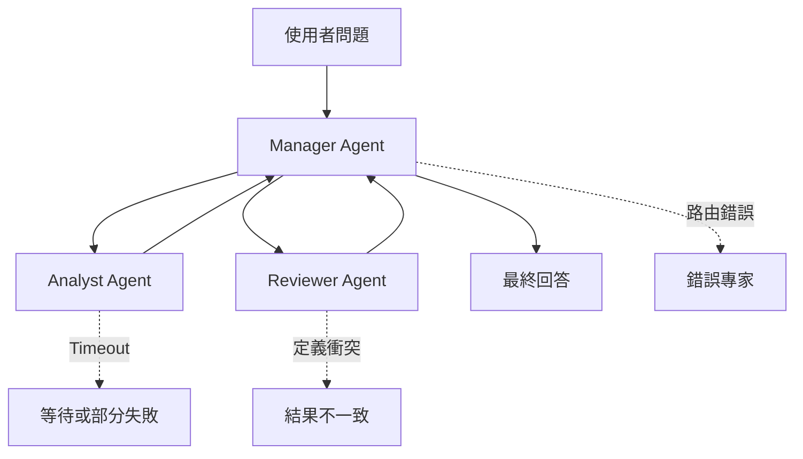

真實的企業 AI 產品不存在「模型永遠正常回答」這件事。許多 Demo 在理想環境下跑得漂亮，一旦上線就面臨模型過載、網路不穩、限流或長時間請求到一半失敗的窘境。可靠性設計不是事後補救，而是在系統架構階段就必須納入的工程紀律。

## 為什麼模型會失敗？

在企業場景中，呼叫 LLM API 可能遭遇多種非預期狀況：

<CardGroup cols={2}>
  <Card title="逾時（Timeout）" icon="clock">
    請求送出後，模型長時間未回應。常見於生成長篇報告、複雜推理或高峰時段。
  </Card>

  <Card title="限流（Rate Limit）" icon="gauge-high">
    API 回傳 HTTP 429，表示短時間內請求次數或 token 用量超出配額上限。
  </Card>

  <Card title="服務中斷（Service Error）" icon="triangle-exclamation">
    HTTP 500 或 503，代表模型服務端出現問題，通常為暫時性錯誤。
  </Card>

  <Card title="輸出截斷（Truncation）" icon="scissors">
    回應在生成到一半時被中斷，導致 JSON 不完整或文章沒有結尾。
  </Card>
</CardGroup>

## 三層可靠性設計

企業 AI 系統應建立三道防線，依序攔截不同類型的失敗：

<Steps>
  <Step title="第一層：Timeout 設定">
    為每一類請求設定合理的等待上限。超過這個時間若仍未收到回應，就主動取消請求並向使用者回報。

    **設計原則：不同任務、不同 timeout**

    | 任務類型 | 建議 Timeout |
    | --- | --- |
    | 路由判斷（是否需要查 PDF？） | 5–8 秒 |
    | 釐清問題（澄清使用者意圖） | 8–12 秒 |
    | 查核與驗證 | 10–15 秒 |
    | 最終回答生成（長文） | 30–60 秒 |
    | 會議摘要（長音檔） | 60–120 秒 |

    ```python
    import httpx
    
    async def call_llm_with_timeout(prompt: str, timeout_seconds: int = 30):
        async with httpx.AsyncClient(timeout=timeout_seconds) as client:
            try:
                response = await client.post(
                    "https://api.openai.com/v1/chat/completions",
                    headers={"Authorization": f"Bearer {API_KEY}"},
                    json={"model": "gpt-4o", "messages": [{"role": "user", "content": prompt}]}
                )
                return response.json()
            except httpx.TimeoutException:
                raise TimeoutError(f"模型在 {timeout_seconds} 秒內未回應，請稍後重試。")
    ```
  </Step>
  <Step title="第二層：Retry 策略">
    對「暫時性錯誤」（429、503、網路中斷）進行有限次重試。使用指數退避（Exponential Backoff）避免在高峰期雪上加霜。

    **Retry 的邊界條件**

    - ✅ 應重試：HTTP 429（限流）、503（服務暫時不可用）、網路逾時
    - ❌ 不應重試：HTTP 400（請求格式錯誤）、401（憑證無效）、輸出內容本身的品質問題

    ```python
    import asyncio
    import random
    
    async def retry_with_backoff(func, max_retries: int = 3, base_delay: float = 1.0):
        for attempt in range(max_retries):
            try:
                return await func()
            except RateLimitError:
                if attempt == max_retries - 1:
                    raise
                # 指數退避 + 隨機抖動，避免同時大量重試
                delay = base_delay * (2 ** attempt) + random.uniform(0, 0.5)
                print(f"第 {attempt + 1} 次重試，等待 {delay:.1f} 秒...")
                await asyncio.sleep(delay)
    ```

    <Warning>
      Retry 次數不是越多越好。在同步聊天情境中，6 次指數退避可能讓使用者盯著畫面等待超過 60 秒。企業產品必須在「成功率」與「等待體驗」之間明確取捨，建議同步情境最多 2–3 次，非同步背景任務可設定更多次。
    </Warning>
  </Step>
  <Step title="第三層：Fallback 降級">
    當主要模型經過 Retry 仍失敗時，切換到備用模型，而非重複呼叫同一個已經過載的服務。

    ```python
    async def call_with_fallback(prompt: str):
        primary_models = ["gpt-4o", "claude-3-5-sonnet-20241022"]
        fallback_model = "gpt-4o-mini"
    
        for model in primary_models:
            try:
                return await call_model(model, prompt, timeout=30)
            except (TimeoutError, RateLimitError, ServiceUnavailableError) as e:
                print(f"主要模型 {model} 失敗：{e}，嘗試下一個...")
    
        # 所有主要模型失敗，降級至輕量模型
        print(f"降級至備用模型 {fallback_model}")
        return await call_model(fallback_model, prompt, timeout=15)
    ```

    <Tip>
      Fallback 不一定是更差的選擇。對於路由判斷、問題釐清等任務，輕量模型（如 GPT-4o mini、Gemini Flash）往往速度更快、成本更低，甚至不需要等待 Fallback 才使用。
    </Tip>
  </Step>
</Steps>

## Data Machi 的實作策略

Data Machi 根據任務性質將模型呼叫分成兩大類：

**快速路徑（Fast Path）**：路由判斷、釐清問題、輸出查核

- 使用較快的輕量模型
- Timeout 設定較短（5–15 秒）
- 失敗時直接回傳錯誤，不做多次重試

**慢速路徑（Slow Path）**：最終回答生成、長文摘要、會議記錄

- 使用主力模型（GPT-4o、Gemini Pro）
- Timeout 設定較長（30–120 秒）
- 先重試 2 次，仍失敗才降級到備用模型

這樣的設計讓「最終回答」與「內部 JSON 判斷」解耦，即使路由模型偶爾失敗，也不會拖垮整體使用者體驗。

## 多 Agent 可能提升韌性，也會增加新的失敗點

Multi-Agent 架構有時能透過專業分工與備援提高韌性，例如某個 Specialist Agent 暫時不可用時，Manager 可以改走其他路徑。但這不代表增加 Agent 就會自動提升可靠性。每多一個 Agent，系統也會新增一組模型呼叫、上下文傳遞與協調依賴。

常見的新失敗模式包括：

- Manager 把任務路由到錯誤的 Agent
- 交接時遺失市場、期間或資料範圍
- 多個 Agent 對同一個名詞採用不同定義
- Agent 重複查詢或執行彼此衝突的動作
- 某個 Agent Timeout，導致整體流程等待
- Manager 本身成為單點故障或效能瓶頸
- 交接次數增加，累積 Token、延遲與 API 失敗機率



因此，從單一 Agent 拆成 Multi-Agent，並不是消除可靠性問題，而是把原本的工具選擇問題，轉變成路由、通訊、同步與一致性問題。可靠的 Multi-Agent 系統除了對模型與工具設計 Timeout、Retry 和 Fallback，也需要：

- 每個 Agent 有獨立的錯誤分類與時間預算
- 交接資料使用明確 Schema，而不是任意自然語言
- Manager 能辨識部分成功與部分失敗
- 衝突結果有 Verification 或人工升級機制
- Trace 能還原每一次分派與交接

Michael Albada 指出，Manager Coordination 能簡化專家之間的溝通，但集中式 Manager 同時可能成為單點故障與擴充瓶頸；Multi-Agent 也常因額外通訊與 Token 消耗而降低效率。

> **參考來源**<br />Michael Albada, _Building Applications with AI Agents: Designing and Implementing Multiagent Systems_, O’Reilly Media, 2025, Chapter 2, “Multiagent Architectures: Collaboration, Parallelism, and Coordination,” pp. 32–34；Chapter 8, “Manager Coordination,” pp. 180–182.

## 錯誤要說人話

<Info>
  逾時錯誤不應顯示成「API Key 錯誤」，502 不應顯示成「Something went wrong」。正確的錯誤分類，是可靠性設計的最後一哩路。
</Info>

良好的錯誤訊息應讓使用者知道：

| 實際錯誤原因 | 應顯示的訊息 |
| --- | --- |
| HTTP 429（限流） | 「目前請求量較高，請稍後 30 秒再試。」 |
| HTTP 408 / 逾時 | 「模型目前負載較重，這個問題範圍可能較大，建議縮小後再試。」 |
| HTTP 401（憑證錯誤） | 「帳號憑證有問題，請聯繫管理員確認設定。」 |
| 輸出截斷 | 「回答生成過程中斷，請重新提問或縮短問題。」 |
| 找不到相關資料 | 「未能在知識庫中找到足夠資訊，請確認 PDF 是否已上傳。」 |

<Accordion title="進階：Circuit Breaker 模式">
  在高流量企業系統中，可進一步採用 **Circuit Breaker（熔斷器）** 模式。當某個模型端點在一段時間內失敗率超過閾值，就自動「斷路」，暫停對該端點的所有請求，直到健康檢查通過為止。

  這能有效避免：在一個已知失敗的端點上浪費大量 Retry 時間，反而拖慢整體系統響應。

  ```python
  class CircuitBreaker:
      def __init__(self, failure_threshold=5, recovery_timeout=60):
          self.failure_count = 0
          self.failure_threshold = failure_threshold
          self.recovery_timeout = recovery_timeout
          self.last_failure_time = None
          self.state = "CLOSED"  # CLOSED, OPEN, HALF_OPEN
  
      def call(self, func, *args, **kwargs):
          if self.state == "OPEN":
              if time.time() - self.last_failure_time > self.recovery_timeout:
                  self.state = "HALF_OPEN"
              else:
                  raise CircuitOpenError("服務暫時不可用，請稍後再試。")
          try:
              result = func(*args, **kwargs)
              self._on_success()
              return result
          except Exception as e:
              self._on_failure()
              raise
  
      def _on_success(self):
          self.failure_count = 0
          self.state = "CLOSED"
  
      def _on_failure(self):
          self.failure_count += 1
          self.last_failure_time = time.time()
          if self.failure_count >= self.failure_threshold:
              self.state = "OPEN"
  ```
</Accordion>

## 今日重點回顧

<Info>
  今天只要記住一件事：模型失敗不是例外，而是正式產品必須預先設計的正常情境。
</Info>

下一篇，我們將討論使用者等待 Agent 工作時，介面應該如何溝通進度，讓「轉圈圈」不再是唯一的等待體驗。