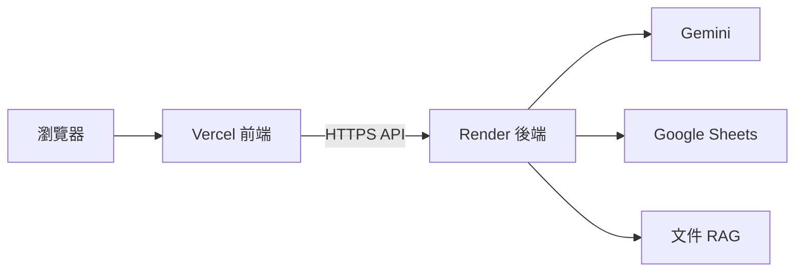

前面所有實作都還可以在本機完成，但如果 Data Machi 要真正讓其他人使用，就必須把前端與後端部署到可公開存取的環境。今天會把 Render、Vercel 與跨來源資源共享（CORS）串成一條完整部署流程。

## 先確認 GitHub 是正式版本來源

部署前，先確認目前要上線的程式碼已經提交（Commit）並推送（Push）到 GitHub。Render 與 Vercel 都會從程式碼儲存庫取得程式，因此不要再以本機某個未提交版本作為「真正最新版」。

如果專案同時有前端與後端資料夾，也要先確認各自的根目錄（Root Directory）、啟動指令與相依套件檔案是否清楚。這一步如果混亂，後面平台設定再正確也無法成功建置（Build）。

## 第一步：部署 FastAPI 後端到 Render

後端先上線，因為前端最後需要知道後端網址。建立 Render 網頁服務後，連接 GitHub 程式碼儲存庫，指定後端所在的根目錄，再設定建置指令（Build Command）與啟動指令（Start Command）。

實際指令要依專案結構為準，但核心概念是：Render 必須知道如何安裝 Python 相依套件，以及如何啟動 FastAPI 服務。常見設定大致像這樣：

```text
Root Directory: backend
Build Command: pip install -r requirements.txt
Start Command: uvicorn main:app --host 0.0.0.0 --port $PORT
```

Start Command 必須使用 Render 提供的 `$PORT`，不能寫死本機慣用的 Port。若專案已經有 `render.yaml`，也要先檢查其中路徑、Python 版本與啟動指令是否仍符合目前 Repository，而不是直接假設設定正確。

接著把本機 `.env` 裡需要的機密資訊搬到 Render 的環境變數，例如 Gemini API 金鑰、Google 服務帳號與 Confluence 或 Trello 的存取權杖，至少會包含：

```env
GOOGLE_API_KEY=
GEMINI_MODEL=
GEMINI_FAST_MODEL=
GOOGLE_SERVICE_ACCOUNT_JSON=
GOOGLE_SHEET_KEY=
ALLOWED_ORIGINS=
```

Trello、Confluence 等選配服務，只在實際使用時加入。修改 Environment Variables 後通常需要重新部署或重新啟動服務。這裡不要把 `.env` 檔直接上傳到 GitHub。

<Warning>
  部分免費方案在閒置後可能休眠，下一次請求需要等待服務重新啟動，第一次回答可能明顯較慢。前端應顯示清楚的連線與等待狀態，正式使用時也要評估方案限制。
</Warning>

## 先做健康檢查，再測 AI

後端部署成功後，第一個測試應該是最基本的健康檢查（Health Check），而不是直接問一個複雜的代理問題。先確認服務活著、網址可以存取，再逐步測 Gemini、Google Sheets 與檢索增強生成（RAG）。

這和本機除錯邏輯一樣：一次驗證一層。否則如果最終回答失敗，你不會知道是部署、模型、資料憑證還是工作流程出問題。

## 第二步：部署 React 前端到 Vercel

後端網址確認後，再建立 Vercel 專案，連接同一個 GitHub 程式碼儲存庫，指定前端的根目錄與建置設定。前端需要知道 API 要連到哪裡，因此把 Render 後端網址放進 Vercel 的環境變數。

開發環境可能使用 `localhost`，正式環境（Production）則必須指向 Render 的正式網址。這也是為什麼網址不應硬寫死在程式碼裡。所有 API 呼叫最好統一從同一個環境變數或共用 API Client 讀取，而不是散落在多個元件中：

```env
VITE_API_BASE_URL=https://your-backend.onrender.com
```

<Warning>
  任何以 `VITE_` 開頭的變數都會被打包進瀏覽器可讀取的前端程式碼，因此只能放 Backend URL 這類可公開設定。Gemini Key、Trello Token、Confluence Token 與 Service Account JSON 都不應出現在 Vercel 前端。
</Warning>

Vercel 通常也會為每個 Branch 或 Pull Request 建立 Preview URL，主要分支則對應 Production URL。Preview 很適合檢查前端版面與基本流程，但如果後端 CORS 只允許 Production URL，Preview 可能無法呼叫 Render——這也是下一步要處理的事。

## 第三步：處理跨來源資源共享（CORS）

前後端分開部署後，瀏覽器會把 Vercel 與 Render 視為不同來源。即使後端本身正常，若跨來源資源共享設定不正確，瀏覽器仍可能擋掉請求。

後端應該明確設定允許的前端網域，而不是為了省事永久使用 `*`——若後端允許所有網站跨來源呼叫，其他網站可能直接消耗你的後端配額與運算資源。正式環境、預覽環境（Preview）與本機開發可能有不同來源，可以透過環境變數管理允許清單，多個 Origin 通常以逗號分隔：

```env
# Render
ALLOWED_ORIGINS=https://your-app.vercel.app,http://localhost:5173
```

三種環境的網址關係可以先整理成一張表，避免設定時互相搞混：

| 環境 | 前端 URL | 後端 URL | 用途 |
| --- | --- | --- | --- |
| Local | `localhost:5173` | `localhost:8000` | 本機開發 |
| Preview | Vercel Preview URL | Render 正式或測試服務 | PR 驗收 |
| Production | 正式 Vercel URL | 正式 Render URL | 使用者服務 |

若請求仍然失敗，可以用這張表快速定位問題層：

| 現象 | 優先檢查 |
| --- | --- |
| 瀏覽器顯示 CORS，Render 沒收到請求 | 可能在 Preflight（`OPTIONS`）階段被擋 |
| Render 收到 `OPTIONS` 但沒有 `POST` | 檢查 CORS 允許的 Methods／Headers |
| Vercel 仍呼叫舊網址 | 環境變數更新後尚未重新部署 |
| 本機正常、正式失敗 | 正式 URL 或 allowlist 未同步 |
| Postman 正常、瀏覽器失敗 | Postman 不受瀏覽器 CORS 限制，不能當作前端測試的替代 |



## 第四步：做一輪基本驗收測試（Smoke Test）

正式上線後不要只測「首頁打得開」，而要沿著真正的使用路徑跑一輪。這一組測試的目的，是確認本機能工作的能力到了正式環境後仍然正常。

| 測試項目 | 通過條件 |
| --- | --- |
| 後端健康檢查 | 服務回傳正常狀態，而不是逾時或 5xx 錯誤 |
| 一般聊天 | 前端可以成功連到後端並取得回答 |
| PDF RAG | 可以找到文件、回答並顯示來源 |
| Google Sheets | 能成功讀取測試試算表並算出預期結果 |
| 跨來源問題 | 協調者能依序使用兩個以上來源並整合回答 |
| 錯誤憑證 | 系統顯示可理解的權限錯誤，而不是整個頁面崩潰 |
| 模型或工具逾時 | 能重試、使用備援，或明確告知使用者失敗原因 |
| 跨來源資源共享（CORS） | 正式 Vercel 網址可存取後端，未授權來源則不應任意開放 |
| 重新部署 | 必要的資料、索引或設定不應因重新部署而意外消失 |

另外再人工檢查三件事：機密資訊是否沒有出現在 GitHub、前端瀏覽器或錯誤訊息中；預覽環境是否和正式環境使用不同的資料權限；主要錯誤是否能從執行紀錄追查。

可以用這種格式留下每次部署的結果：

| ID | 測試項目 | 預期結果 | 實際結果 | 通過 |
| --- | --- | --- | --- | --- |
| PROD-01 | 後端健康檢查 | 回傳正常狀態 | 回傳正常狀態 | ✅ |

這樣每次部署後都能用同一份清單快速確認，而不是等使用者回報問題才知道某個環節失效。

## 部署不是結束，而是把問題搬到真實環境

本機可以成功，不代表正式環境一定成功。部署後常見差異包括環境變數漏設、檔案路徑大小寫、CORS、服務帳號權限、相依套件版本與持久化儲存。遇到問題時，回到我們一路使用的方式：先確認哪一層失敗，再看對應紀錄（Log），而不是一次修改很多設定。

## 延伸閱讀｜部署成功之後，才進入正式產品準備

Render 與 Vercel 上線只是第一步。企業產品還需要回答四個問題：**怎麼測、怎麼看、怎麼存、怎麼安全地更新。** 這四件事分別對應測試（Testing）、可觀測性（Observability）、持久化（Persistence）與持續整合／部署（CI/CD）。

### 測試：不要只靠人工聊天

至少要保留幾種固定測試：基本驗收測試確認服務活著；路由測試（Routing Test）確認不同問題會走到正確工具；結構測試（Schema Test）確認結構化輸出欄位沒有因模型或提示詞更新而漂移。更進一步，可以把 Day 19 的路由評估與 Day 10 的 RAG 評估納入每次發布前的回歸測試（Regression Check）。

### 可觀測性：知道系統「怎麼完成」答案

對代理系統而言，執行紀錄不應只記最終回答。開發端最好能查到工作階段、分流結果、呼叫過哪些工具、延遲時間、錯誤、模型、Token 使用量與總耗時。這些資訊不是要暴露給一般使用者，而是讓維護者在結果變差時知道問題出在哪一層。

```text
工作階段
  ├─ 分流與上下文判斷
  ├─ 呼叫過的工具
  ├─ 資料來源與延遲
  ├─ 模型與 Token 使用量
  ├─ 驗證結果
  └─ 最終狀態
```

### 持久化：重新部署後，資料不能全部消失

雲端服務的暫存磁碟不等於永久儲存。對話歷史可以放 PostgreSQL，PDF 原檔放物件儲存（Object Storage），向量索引使用 pgvector 或其他持久化儲存，短期工作階段狀態才考慮 Redis。這一層如果沒設計，系統重啟後「記憶消失」其實不是代理問題，而是基礎架構問題。

### 持續整合與部署：讓每次修改都有最低安全網

GitHub 推送後可以自動跑程式碼檢查、型別檢查、單元測試與基本驗收測試，再進入建置與部署。AI 程式開發助手可以讓修改速度變快，但修改愈快，越需要自動測試來防止功能退步。

<Info>
  今天的里程碑是：Data Machi 第一次不再只存在於你的電腦上，而是成為一個可以從瀏覽器真正使用的產品。
</Info>

明天是最後一天。我們會做正式驗收、資產交接與維護規劃，並回頭看這 30 天是怎麼從聊天一路走到產品。