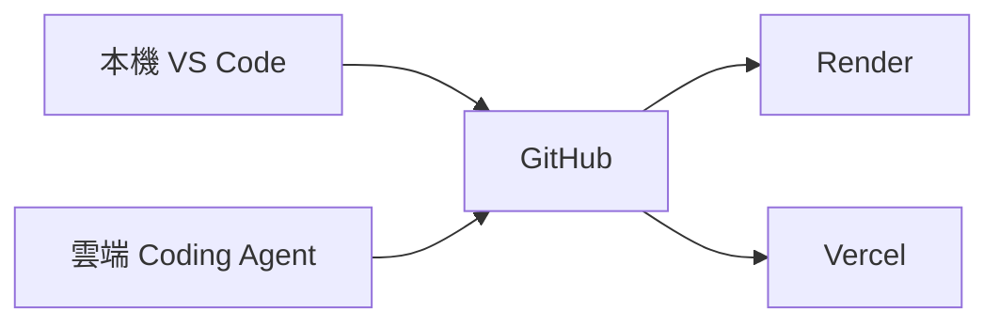
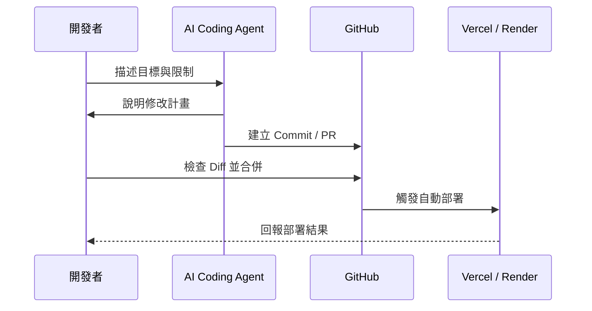

建立 Data Machi 不代表你必須先熟悉所有程式語法。更實際的方式是：先描述目標，再讓 AI Coding Agent 協助閱讀 Repository、修改檔案、執行測試與說明錯誤。

## 三種開發方式



<CardGroup cols={3}>
  <Card title="本機開發" icon="laptop-code">
    適合第一次啟動、修改多個模組、測試 PDF／音訊，以及查看完整 Terminal 錯誤。
  </Card>

  <Card title="雲端開發" icon="cloud">
    適合透過桌機或手機進行 Prompt、文案、設定與小型修正，再建立 Commit 或 Pull Request。
  </Card>

  <Card title="混合式開發" icon="arrows-rotate">
    大型修改在本機完成，臨時調整使用雲端環境，GitHub 保存唯一正式版本。
  </Card>
</CardGroup>

## 我實際使用的流程

開發 Data Machi 時，我主要在本機 VS Code 中搭配 Claude Code 或 Codex。需要遠端處理時，則透過 Claude Code 的桌面或手機介面開啟雲端環境，直接從 GitHub Repository 繼續修改。



## 什麼情況適合哪一種方式？

| 情境 | 建議方式 |
| --- | --- |
| 第一次啟動前後端 | 本機 VS Code |
| 修改 Agent 架構或多個工具 | 本機 VS Code |
| 修改 Prompt、README、錯誤文案 | 本機或雲端皆可 |
| 手機臨時修正 | 雲端 Coding Agent |
| 測試 PDF、音訊、檔案上傳 | 本機較合適 |
| 查看正式部署狀態 | Vercel／Render Dashboard |

## 完成一次安全的 Vibe Coding 修改

### 步驟 1：讓 Coding Agent 閱讀 Repository

先要求 AI 閱讀 README、資料夾結構與相關設定，不要立刻修改。

### 步驟 2：要求它提出修改計畫

請 AI 列出預計修改的檔案、修改原因、可能風險與驗收方式。

### 步驟 3：確認安全限制

明確限制不要把 API Key、Token、真實資料或正式網址寫入程式碼。

### 步驟 4：執行修改與測試

確認計畫合理後再開始修改，並要求執行與本次需求直接相關的測試。

### 步驟 5：檢查 Diff

逐檔查看新增與刪除內容，而不是只閱讀 AI 的文字摘要。

### 步驟 6：建立 Commit 或 Pull Request

完成驗收後再建立 Commit；影響範圍較大的修改則建立 Pull Request 進行審查。

## 建議 Prompt

```text
請先閱讀目前 Repository 的 README、資料夾結構與部署設定。
先不要修改，請回答：
1. 這次需求會影響哪些檔案？
2. 有哪些環境變數或外部服務相關風險？
3. 如何用最小修改完成？
4. 修改後應該如何驗收？
```

<Warning>
  Vibe Coding 不是把所有決策交給 AI。你仍需要掌握目標、資料範圍、Secret 安全與驗收標準。
</Warning>

## 使用本機 VS Code 與 AI Coding Agent

1. 用 VS Code 開啟 Data Machi Repository 根目錄。
2. 開啟 Terminal，確認目前路徑位於專案資料夾。
3. 啟動 Claude Code、Codex 或其他 AI Coding Agent。
4. 先要求 Agent 閱讀 README、資料夾結構與部署設定，不要立刻修改。
5. 檢查 Agent 提出的修改計畫後，再讓它開始執行。

**圖 1｜VS Code、Terminal 與 AI Coding Agent 的工作區**

> \[圖片預留位置：VS Code Explorer、Terminal 與 Agent 對話區的完整畫面\]

_圖說：本機開發時，Repository、Terminal 與 AI Coding Agent 通常會同時使用。開始修改前，先讓 Agent 閱讀專案並說明計畫，避免在不了解架構時直接改動多個檔案。_

## 使用雲端 Coding Agent

1. 登入雲端 Coding Agent。
2. 連接 GitHub 帳號並選擇 Data Machi Repository。
3. 選擇要工作的 Branch；重要修改不要直接在 `main` 進行。
4. 建立雲端工作環境後，先要求 Agent說明目前 Repository 狀態。
5. 完成修改後建立 Commit 或 Pull Request，交由 GitHub 保存正式版本。

**圖 2｜雲端 Coding Agent 連接 Repository 與 Branch**

> \[圖片預留位置：Repository 選擇、Branch 選擇與建立工作環境的畫面\]

_圖說：雲端 Agent 應連接指定 Repository 與 Branch。教學截圖使用公開範例名稱，並遮蔽帳號、私人 Repository 與組織資訊。_

## 檢查 Diff 再提交

1. 開啟 Source Control 或 Agent 提供的變更清單。
2. 逐一檢查被修改的檔案。
3. 確認新增與刪除內容符合原本需求。
4. 搜尋是否誤加入 API Key、Token、真實網址或企業資料。
5. 執行測試後，才建立 Commit 或 Pull Request。

**圖 3｜提交前檢查檔案 Diff**

> \[圖片預留位置：變更檔案清單與 Diff 檢視，標示新增、刪除與 Commit／PR 入口\]

_圖說：不要只閱讀 Agent 的文字摘要。提交前必須實際檢查 Diff，確認修改範圍、Secret 安全與測試結果，再建立 Commit 或 Pull Request。_

下一篇會說明 GitHub 如何把本機、雲端開發與自動部署串在一起。