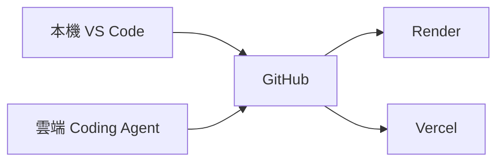
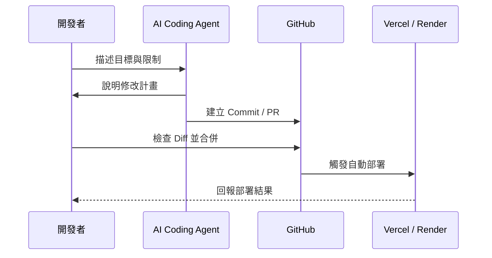

建立 Data Machi 不代表你必須先熟悉所有程式語法。更實際的方式是：先描述目標，再讓 AI Coding Agent 協助閱讀 Repository、修改檔案、執行測試與說明錯誤。

## 三種開發方式



<CardGroup cols={3}>
  <Card title="本機開發" icon="laptop-code">
    適合第一次啟動、修改多個模組、測試 PDF／音訊，以及查看完整 Terminal 錯誤。
  </Card>

  <Card title="雲端開發" icon="cloud">
    適合透過桌機或手機進行 Prompt、文案、設定與小型修正，再建立 Commit 或 Pull Request。
  </Card>

  <Card title="混合式開發" icon="arrows-rotate">
    大型修改在本機完成，臨時調整使用雲端環境，GitHub 保存唯一正式版本。
  </Card>
</CardGroup>

## 我實際使用的流程

開發 Data Machi 時，我主要在本機 VS Code 中搭配 Claude Code 或 Codex。需要遠端處理時，則透過 Claude Code 的桌面或手機介面開啟雲端環境，直接從 GitHub Repository 繼續修改。



## 什麼情況適合哪一種方式？

| 情境 | 建議方式 |
| --- | --- |
| 第一次啟動前後端 | 本機 VS Code |
| 修改 Agent 架構或多個工具 | 本機 VS Code |
| 修改 Prompt、README、錯誤文案 | 本機或雲端皆可 |
| 手機臨時修正 | 雲端 Coding Agent |
| 測試 PDF、音訊、檔案上傳 | 本機較合適 |
| 查看正式部署狀態 | Vercel／Render Dashboard |

## 安全的 Vibe Coding 節奏

1. 先要求 AI 閱讀專案，不要立刻修改。
2. 要求它列出會修改的檔案與原因。
3. 限制不要把 API Key、Token 或真實資料寫入程式碼。
4. 修改後查看 Diff，而不是只看 AI 的文字說明。
5. 執行本篇驗收，再建立 Commit。

## 建議 Prompt

```text
請先閱讀目前 Repository 的 README、資料夾結構與部署設定。
先不要修改，請回答：
1. 這次需求會影響哪些檔案？
2. 有哪些環境變數或外部服務相關風險？
3. 如何用最小修改完成？
4. 修改後應該如何驗收？
```

<Warning>
  Vibe Coding 不是把所有決策交給 AI。你仍需要掌握目標、資料範圍、Secret 安全與驗收標準。
</Warning>

## 建議補充的操作截圖

> 📸 **操作截圖建議｜本機 VS Code \+ AI Coding Agent** 截取 VS Code 中 Repository、Terminal 與 Claude Code／Codex 對話區的整體畫面，標示「閱讀專案、提出計畫、修改檔案、執行測試」的工作區域。

> 📸 **操作截圖建議｜雲端 Coding Agent 連接 Repository** 顯示如何選擇 GitHub Repository、Branch 與建立雲端工作環境；Repository 名稱與帳號資訊請使用公開範例。

> 📸 **操作截圖建議｜檢查 Diff 再提交** 截取變更檔案清單與 Diff 檢視畫面，標示新增、刪除內容，以及建立 Commit／Pull Request 前應檢查的位置。

下一篇會說明 GitHub 如何把本機、雲端開發與自動部署串在一起。