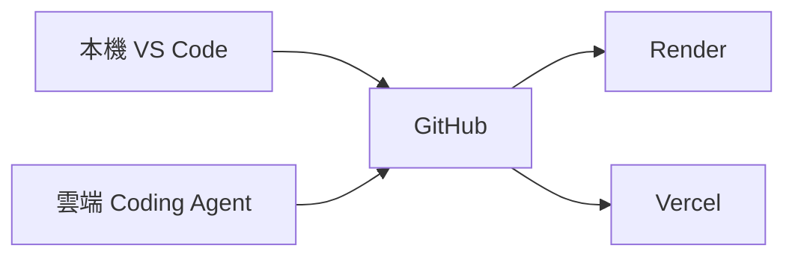
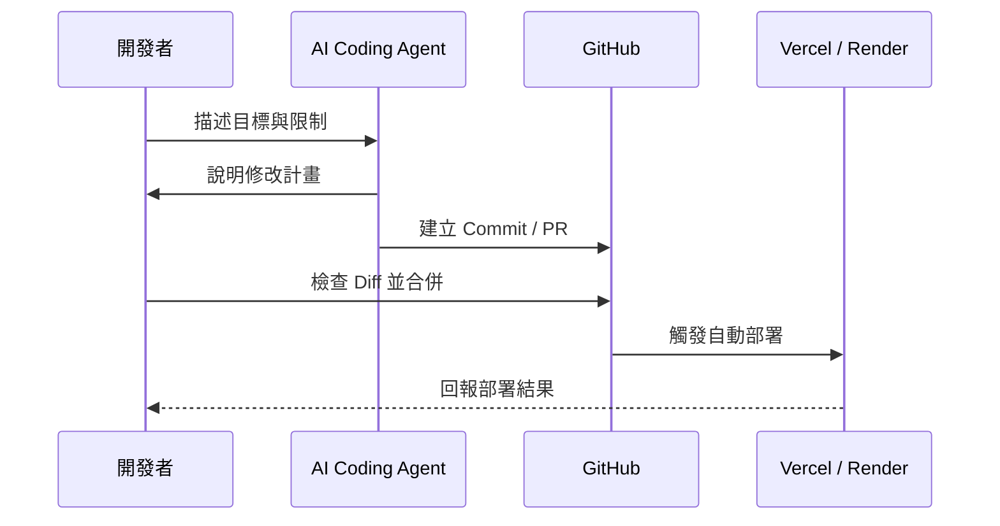

建立 Data Machi 不代表你必須先熟悉所有程式語法。更實際的方式是：先描述目標，再讓 AI Coding Agent 協助閱讀 Repository、修改檔案、執行測試與說明錯誤。

## 三種開發方式



<CardGroup cols={3}>
  <Card title="本機開發" icon="laptop-code">
    適合第一次啟動、修改多個模組、測試 PDF／音訊，以及查看完整 Terminal 錯誤。
  </Card>

  <Card title="雲端開發" icon="cloud">
    適合透過桌機或手機進行 Prompt、文案、設定與小型修正，再建立 Commit 或 Pull Request。
  </Card>

  <Card title="混合式開發" icon="arrows-rotate">
    大型修改在本機完成，臨時調整使用雲端環境，GitHub 保存唯一正式版本。
  </Card>
</CardGroup>

## 我實際使用的流程

開發 Data Machi 時，我主要在本機 VS Code 中搭配 Claude Code 或 Codex。需要遠端處理時，則透過 Claude Code 的桌面或手機介面開啟雲端環境，直接從 GitHub Repository 繼續修改。



## 什麼情況適合哪一種方式？

| 情境 | 建議方式 |
| --- | --- |
| 第一次啟動前後端 | 本機 VS Code |
| 修改 Agent 架構或多個工具 | 本機 VS Code |
| 修改 Prompt、README、錯誤文案 | 本機或雲端皮可 |
| 手機臨時修正 | 雲端 Coding Agent |
| 測試 PDF、音訊、檔案上傳 | 本機較適合 |
| 查看正式部署狀態 | Vercel／Render Dashboard |

## 完成一次安全的 Vibe Coding 修改

### 步驟 1：讓 Coding Agent 閱讀 Repository

先要求 AI 閱讀 README、資料夾結構與相關設定，不要立即修改。

### 步驟 2：要求它提出修改計畫

請 AI 列出預計修改的檔案、修改原因、可能風險與驗收方式。

### 步驟 3：確認安全限制

明確限制不要把 API Key、Token、真實資料或正式網址寫入程式碼。

### 步驟 4：執行修改與測試

確認計畫合理後再開始修改，並要求執行與本次需求直接相關的測試。

### 步驟 5：檢查 Diff

逐檔查看新增與刪除內容，而不是只閱讀 AI 的文字摘要。

### 步驟 6：建立 Commit 或 Pull Request

完成驗收後再建立 Commit；影響範圍較大的修改則建立 Pull Request 進行審查。

## 建議 Prompt

```text
請先閱讀目前 Repository 的 README、資料夾結構與部署設定。
先不要修改，請回答：
1. 這次需求會影響哪些檔案？
2. 有哪些環境變數或外部服務相關風險？
3. 如何用最小修改完成？
4. 修改後應該如何驗收？
```

<Warning>
  Vibe Coding 不是把所有決策交給 AI。你仍需掌握目標、資料範圍、Secret 安全與驗收標準。
</Warning>

下一篇會說明 GitHub 如何把本機、雲端開發與自動部署串在一起。