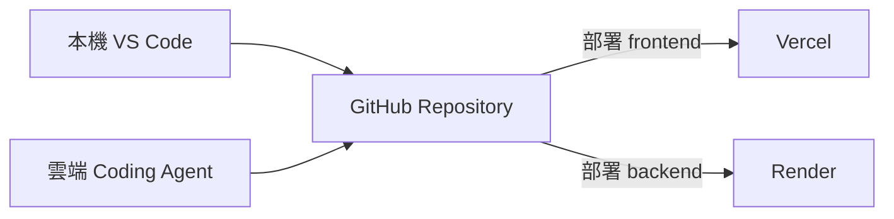
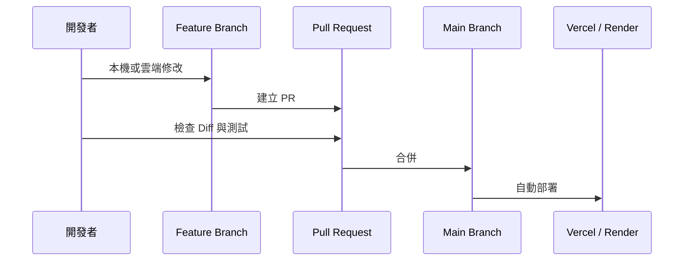

在這套開發流程中，GitHub 不只是放程式碼的地方，而是本機、雲端 Coding Agent、Vercel 與 Render 共同依賴的版本中心。



## 你需要理解的四個概念

<CardGroup cols={2}>
  <Card title="Repository" icon="folder-tree">
    一個專案的中央資料夾，包含程式碼、設定、文件與版本紀錄。
  </Card>

  <Card title="Commit" icon="code-commit">
    一次有意義的修改快照。好的 Commit 應該能說明這次改了什麼，以及必要時如何回復。
  </Card>

  <Card title="Branch" icon="code-branch">
    從主要版本分出的獨立修改線，適合讓 AI Coding Agent 在不影響正式版本的情況下工作。
  </Card>

  <Card title="Pull Request" icon="code-pull-request">
    把 Branch 的修改提交給主要版本前，用來檢查 Diff、測試結果與風險的審查入口。
  </Card>
</CardGroup>

## 建議的版本流程



即使只有一個人開發，也建議重要修改使用 Branch 與 Pull Request。這能避免雲端 Agent 直接改壞正式版本，也讓你在手機上修改後，回到電腦時仍能清楚看到變更範圍。

## 建立自己的專案副本

你可以 Fork 開源專案，或建立新的 Repository 再複製程式碼。公開教學版本應先檢查並移除：

- 組織與品牌名稱
- 真實使用者、部門或市場資料
- 預設 Spreadsheet、Board 或 Space ID
- 正式環境網址
- API Key、Token 與 Service Account JSON

## GitHub 如何觸發部署？

Vercel 與 Render 都可以連接指定 Repository 與 Branch。當主要分支更新後，平台會重新讀取程式、安裝依賴、建置並部署。部署失敗時，不代表 GitHub 有問題，而可能是套件、環境變數或啟動指令設定錯誤。

## 本篇驗收

- 你有自己的 Repository，而不是直接修改原始專案。
- `main` 保持可運作，修改在獨立 Branch 進行。
- 能找到 Commit、Branch、Pull Request 與 Actions／Deployments。
- Repository 中搜尋不到任何真實 Secret。

## 建議的 Vibe Coding Prompt

```text
請先閱讀目前 Repository 的資料夾結構、README 與部署設定。
不要立即修改。請先說明：
1. 前端與後端位於哪裡
2. 哪些檔案可能包含品牌或環境設定
3. 這次修改應建立在哪一個 Branch
4. 修改後需要驗收哪些功能
```

<Warning>
  正式專案不應只存在於某位開發者的個人 GitHub 帳號。準備上線前，應將 Repository 放入公司 Organization，至少配置兩位可管理成員。完整的所有權、備援管理者與離職交接做法，會在〈實作 17｜權限與資訊安全〉集中處理。
</Warning>

<Info>
  AI Coding Agent 可以更換，但 GitHub 應該是所有開發方式共用的唯一正式版本來源。
</Info>

## 認識 Repository、Branch 與 Commit

進入自己的 GitHub Repository 後，先確認目前所在 Branch、最新 Commit 與專案檔案列表。這三個位置會是後續版本管理最常使用的入口。

**圖 1｜GitHub Repository 的主要操作區域**

> \[圖片預留位置：Repository 首頁，標示 Branch 選擇器、最新 Commit 與檔案列表\]

_圖說：Repository 首頁會顯示目前 Branch、最新 Commit 與專案檔案。開始修改前先確認自己位於正確 Repository 與 Branch，避免把變更提交到錯誤版本。_

## 從 `main` 建立 Feature Branch

1. 回到 Repository 首頁。
2. 點選 Branch 選擇器。
3. 輸入新 Branch 名稱，例如 `feature/add-sheets-tool`。
4. 確認新 Branch 是從最新的 `main` 建立。
5. 切換到新 Branch 後，再開始交給 AI Coding Agent 修改。

**圖 2｜建立新的 Feature Branch**

> \[圖片預留位置：Branch 選擇器與建立新 Branch 的操作畫面\]

_圖說：重要修改應在獨立 Branch 進行。名稱建議描述這次工作的目的，例如 `feature/add-sheets-tool` 或 `fix/render-timeout`，不要使用難以辨識的隨機名稱。_

## 建立 Pull Request 並檢查 Diff

1. 將修改提交到 Feature Branch。
2. 在 GitHub 建立 Pull Request。
3. 填寫修改目的、影響範圍與測試方式。
4. 開啟 **Files changed**，逐一檢查新增與刪除內容。
5. 確認沒有 Secret、真實網址或企業資料後，再合併到 `main`。

**圖 3｜建立 Pull Request 並填寫修改說明**

> \[圖片預留位置：Pull Request 建立頁面，標示標題、說明與 base／compare Branch\]

_圖說：PR 說明應讓未參與修改的人也能理解改動目的、測試結果與可能風險。建立前請再次確認 base 是 `main`，compare 是本次 Feature Branch。_

**圖 4｜在 Files changed 檢查 Diff**

> \[圖片預留位置：Files changed 頁面，標示新增、刪除與檔案清單\]

_圖說：Files changed 是合併前最重要的檢查畫面。逐檔確認修改是否符合需求，並特別搜尋 API Key、Token、Email、正式網域與硬編碼設定。_

## 確認自動部署狀態

PR 合併後，GitHub 可能顯示 Vercel、Render 或 GitHub Actions 的部署檢查。若狀態失敗，應先點進詳細頁面查看是哪一個階段出錯。

**圖 5｜查看 Deployments 或 Actions 狀態**

> \[圖片預留位置：GitHub 的 deployment check、Actions 或 Environments 狀態\]

_圖說：部署成功代表平台完成建置，不代表功能一定正確。狀態失敗時，點進詳細 Log 判斷是套件、環境變數、建置指令或程式錯誤；成功後仍要到正式網站執行功能驗收。_

下一篇將建立 API Key、Secret 與環境變數的放置地圖。