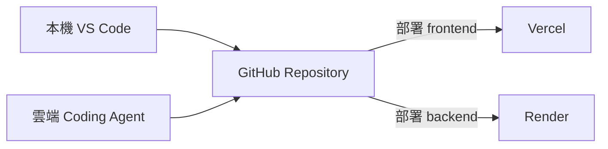
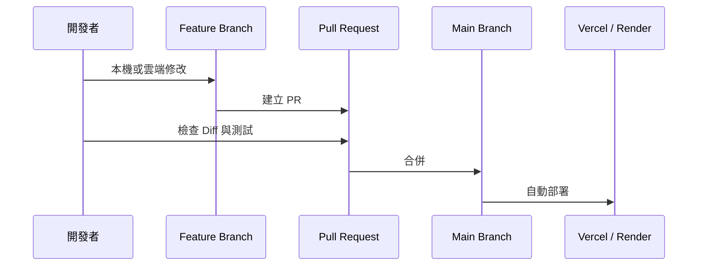

在這套開發流程中，GitHub 不只是放程式碼的地方，而是本機、雲端 Coding Agent、Vercel 與 Render 共同依賴的版本中心。



## 你需要理解的四個概念

<CardGroup cols={2}>
  <Card title="Repository" icon="folder-tree">
    一個專案的中央資料夾，包含程式碼、設定、文件與版本紀錄。
  </Card>

  <Card title="Commit" icon="code-commit">
    一次有意義的修改快照。好的 Commit 應該能說明這次改了什麼，以及必要時如何回復。
  </Card>

  <Card title="Branch" icon="code-branch">
    從主要版本分出的獨立修改線，適合讓 AI Coding Agent 在不影響正式版本的情況下工作。
  </Card>

  <Card title="Pull Request" icon="code-pull-request">
    把 Branch 的修改提交給主要版本前，用來檢查 Diff、測試結果與風險的審查入口。
  </Card>
</CardGroup>

## 建議的版本流程



即使只有一個人開發，也建議重要修改使用 Branch 與 Pull Request。這能避免雲端 Agent 直接改壞正式版本，也讓你在手機上修改後，回到電腦時仍能清楚看到變更範圍。

## 建立自己的專案副本

你可以 Fork 開源專案，或建立新的 Repository 再複製程式碼。公開教學版本應先檢查並移除：

- 組織與品牌名稱
- 真實使用者、部門或市場資料
- 預設 Spreadsheet、Board 或 Space ID
- 正式環境網址
- API Key、Token 與 Service Account JSON

## GitHub 如何觸發部署？

Vercel 與 Render 都可以連接指定 Repository 與 Branch。當主要分支更新後，平台會重新讀取程式、安裝依賴、建置並部署。部署失敗時，不代表 GitHub 有問題，而可能是套件、環境變數或啟動指令設定錯誤。

## 本篇驗收

- 你有自己的 Repository，而不是直接修改原始專案。
- `main` 保持可運作，修改在獨立 Branch 進行。
- 能找到 Commit、Branch、Pull Request 與 Actions／Deployments。
- Repository 中搜尋不到任何真實 Secret。

## 建議的 Vibe Coding Prompt

```text
請先閱讀目前 Repository 的資料夾結構、README 與部署設定。
不要立即修改。請先說明：
1. 前端與後端位於哪裡
2. 哪些檔案可能包含品牌或環境設定
3. 這次修改應建立在哪一個 Branch
4. 修改後需要驗收哪些功能
```

<Info>
  AI Coding Agent 可以更換，但 GitHub 應該是所有開發方式共用的唯一正式版本來源。
</Info>

下一篇將建立 API Key、Secret 與環境變數的放置地圖。