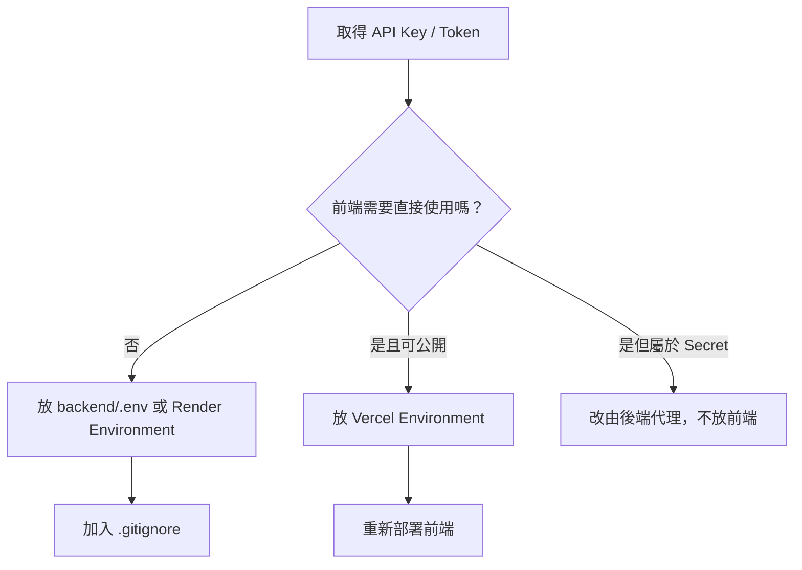

Data Machi 會使用多種 API Key、Token、網址與 Service Account 憑證。最常見的問題不是不會申請，而是**不知道取得之後應該放在哪裡**。



## 四個位置的差異

| 位置 | 適合放什麼 | 不應放什麼 |
| --- | --- | --- |
| `backend/.env` | 本機 Gemini、Trello、Confluence、Sheets 憑證 | 不提交 GitHub |
| Render Environment | 正式後端 Secret 與服務設定 | 不放在公開程式碼 |
| Vercel Environment | 前端需要的 Backend URL、公開設定 | 私密 API Key |
| GitHub | `.env.example`、變數名稱與說明 | 真實 Key、Token、JSON |

## Data Machi 的 Secret 地圖

```env
# 後端：本機 .env / Render Environment
GOOGLE_API_KEY=
GOOGLE_SERVICE_ACCOUNT_JSON=
TRELLO_API_KEY=
TRELLO_TOKEN=
CONFLUENCE_API_TOKEN=

# 前端：本機 .env / Vercel Environment
VITE_API_BASE_URL=
```

<Warning>
  任何以 `VITE_` 開頭的變數，都可能被打包進瀏覽器可以讀取的前端程式。不要把 Gemini、Trello、Confluence 或 Service Account Secret 放在前端。
</Warning>

## 本機與正式環境為什麼要分開？

本機 `.env` 只存在你的電腦；Render 與 Vercel 不會自動讀取它。部署後必須到各平台 Dashboard 重新建立對應的 Environment Variables。反過來，平台上的 Secret 也不會自動下載到本機。

## 本篇驗收

- `.gitignore` 已排除 `.env`、金鑰 JSON 與本機索引檔。
- GitHub 只保留 `.env.example`，內容沒有真實值。
- 前端只保存 Backend URL 等可公開設定。
- 每次新增環境變數後，都知道是否需要重新部署。

## 建議的 Vibe Coding Prompt

```text
請檢查 Repository 中所有可能包含 Secret 的位置，包括 .env、JSON、前端環境變數與硬編碼網址。
先列出風險，不要顯示任何完整金鑰值。
請將可公開設定與私密設定分開，並更新 .env.example 與 .gitignore。
```

<Note>
  把 Secret 放對位置，只解決「不要外洩」；它不代表憑證的所有權、權限範圍與離職交接已經完成。正式部署前，還要在〈實作 17｜權限與資訊安全〉盤點資產所有者、備援管理者、最小權限與 Token 輪替方式。
</Note>

## 建議補充的操作截圖

> 📸 **操作截圖建議｜本機 `.env` 與 `.env.example` 差異** 並排顯示 `.env` 含有本機實際值、`.env.example` 僅保留變數名稱；實際值一律改成假資料。

> 📸 **操作截圖建議｜`.gitignore` 排除敏感檔案** 截取 `.gitignore` 中排除 `.env`、Service Account JSON、索引檔與其他本機檔案的規則。

> 📸 **操作截圖建議｜Render Environment Variables** 顯示後端 Secret 應新增在 Render 的位置，僅保留變數名稱，所有值完整遮蔽。

> 📸 **操作截圖建議｜Vercel Environment Variables** 顯示前端只放 `VITE_API_BASE_URL` 等可公開設定，並標示 Production、Preview、Development 的套用範圍。

下一篇會開始申請第一個必要服務：Gemini API。