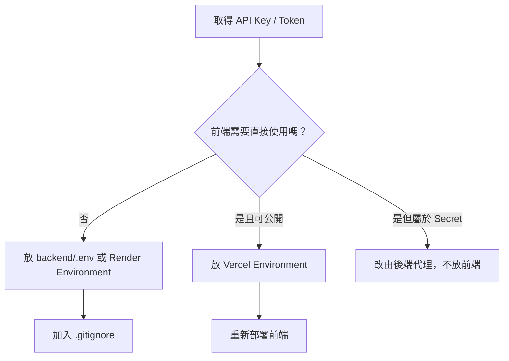

Data Machi 會使用多種 API Key、Token、網址與 Service Account 憑證。最常見的問題不是不會申請，而是**不知道取得之後應該放在哪裡**。



## 四個位置的差異

| 位置 | 適合放什麼 | 不應放什麼 |
| --- | --- | --- |
| `backend/.env` | 本機 Gemini、Trello、Confluence、Sheets 憑證 | 不提交 GitHub |
| Render Environment | 正式後端 Secret 與服務設定 | 不放在公開程式碼 |
| Vercel Environment | 前端需要的 Backend URL、公開設定 | 私密 API Key |
| GitHub | `.env.example`、變數名稱與說明 | 真實 Key、Token、JSON |

## Data Machi 的 Secret 地圖

```env
# 後端：本機 .env / Render Environment
GOOGLE_API_KEY=
GOOGLE_SERVICE_ACCOUNT_JSON=
TRELLO_API_KEY=
TRELLO_TOKEN=
CONFLUENCE_API_TOKEN=

# 前端：本機 .env / Vercel Environment
VITE_API_BASE_URL=
```

<Warning>
  任何以 `VITE_` 開頭的變數，都可能被打包進瀏覽器可以讀取的前端程式。不要把 Gemini、Trello、Confluence 或 Service Account Secret 放在前端。
</Warning>

## 本機與正式環境為什麼要分開？

本機 `.env` 只存在你的電腦；Render 與 Vercel 不會自動讀取它。部署後必須到各平台 Dashboard 重新建立對應的 Environment Variables。反過來，平台上的 Secret 也不會自動下載到本機。

## 本篇驗收

- `.gitignore` 已排除 `.env`、金鑰 JSON 與本機索引檔。
- GitHub 只保留 `.env.example`，內容沒有真實值。
- 前端只保存 Backend URL 等可公開設定。
- 每次新增環境變數後，都知道是否需要重新部署。

## 建議的 Vibe Coding Prompt

```text
請檢查 Repository 中所有可能包含 Secret 的位置，包括 .env、JSON、前端環境變數與硬編碼網址。
先列出風險，不要顯示任何完整金鑰值。
請將可公開設定與私密設定分開，並更新 .env.example 與 .gitignore。
```

<Note>
  把 Secret 放對位置，只解決「不要外洩」；它不代表憑證的所有權、權限範圍與離職交接已經完成。正式部署前，還要在〈實作 17｜權限與資訊安全〉盤點資產所有者、備援管理者、最小權限與 Token 輪替方式。
</Note>

## 建立本機 `.env` 與 `.env.example`

1. 在 `backend` 資料夾建立 `.env`，放入本機實際使用的 Secret。
2. 在 Repository 中保留 `.env.example`，只列出變數名稱與用途。
3. 不要把真實值複製到 `.env.example`。
4. 前端若需要環境變數，僅放可公開的設定，例如 Backend URL。

**圖 1｜比較 `.env` 與 `.env.example`**

> \[圖片預留位置：VS Code 並排顯示 `.env` 與 `.env.example`\]

_圖說：`.env` 保存本機實際值，不可提交 GitHub；`.env.example` 則提供變數名稱與設定範例，讓其他開發者知道需要準備哪些項目。教學圖片中的所有值都應改成假資料。_

## 使用 `.gitignore` 排除敏感檔案

1. 開啟 Repository 根目錄的 `.gitignore`。
2. 加入 `.env`、Service Account JSON、索引檔與其他本機產生檔案。
3. 若檔案曾經被 Git 追蹤，只修改 `.gitignore` 並不會自動移除歷史紀錄，還要另外停止追蹤並檢查 Git 歷史。

**圖 2｜在 `.gitignore` 排除 Secret 與本機檔案**

> \[圖片預留位置：`.gitignore` 內容，標示 `.env`、JSON Key 與索引檔規則\]

_圖說：`.gitignore` 能降低誤提交風險，但不能取代提交前檢查。若 Secret 曾經進入 Commit，應立即撤銷並重新建立憑證，而不是只刪除檔案。_

## 在 Render 建立後端 Secret

1. 進入 Render Web Service 的 Environment 頁面。
2. 依序新增 Gemini、Google Sheets、Trello 與 Confluence 等後端變數。
3. 確認變數名稱與程式讀取名稱完全一致。
4. 儲存後重新部署或重新啟動服務。

**圖 3｜Render Environment Variables**

> \[圖片預留位置：Render Environment 頁面，只顯示變數名稱\]

_圖說：正式後端 Secret 應建立在 Render Environment，而不是寫進 Repository。圖片只保留變數名稱，所有值都必須完整遮蔽。_

## 在 Vercel 建立前端環境變數

1. 進入 Vercel Project Settings 的 Environment Variables。
2. 新增 `VITE_API_BASE_URL` 等可公開設定。
3. 選擇要套用的 Production、Preview 與 Development 環境。
4. 儲存後重新部署前端。

**圖 4｜Vercel Environment Variables 與套用範圍**

> \[圖片預留位置：Vercel Environment Variables，標示變數名稱與環境範圍\]

_圖說：Vercel 前端變數可能被打包進瀏覽器，因此只能放 Backend URL 等公開設定。不要把 Gemini API Key、Token 或 Service Account JSON 放進任何 `VITE_` 變數。_

下一篇會開始申請第一個必要服務：Gemini API。