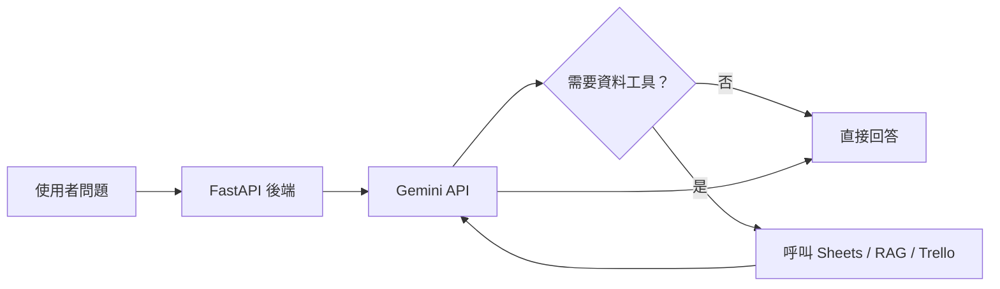

Gemini 是 Data Machi 的語言理解核心。它負責理解使用者問題、判斷要不要呼叫工具，以及把工具結果整理成回答。



## 你需要準備什麼？

- Google 帳號
- 可使用 Gemini API 的 Google Cloud／AI Studio 專案
- API Key
- 了解免費額度與計費方式

## 申請流程

1. 進入 Google AI Studio。

**圖 1｜進入 Google AI Studio 的 API Key 管理入口**

> \[圖片預留位置：Google AI Studio 首頁，標示「Get API key」或 API Key 管理入口\]

_圖說：進入 Google AI Studio 後，先找到 API Key 管理入口。實際介面文字可能因版本更新而略有不同，請以畫面中的 API Key 或 Get API key 選項為準。_

2. 建立或選擇一個 Project。

**圖 2｜選擇或建立 Google Cloud Project**

> \[圖片預留位置：Project 選擇視窗，標示建立新專案與選擇既有專案的位置\]

_圖說：API Key 必須隸屬於一個 Google Cloud Project。若是第一次操作，可以建立新的教學專案；若已有專案，則選擇預計用於 Data Machi 的專案。截圖時請遮蔽公司名稱、Project ID 與帳號資訊。_

3. 建立 API Key。

**圖 3｜建立 Gemini API Key**

> \[圖片預留位置：建立 API Key 的按鈕與建立完成畫面\]

_圖說：選定 Project 後建立新的 Gemini API Key。Key 建立完成後通常只會完整顯示一次，請立即複製並保存到密碼管理工具。教學圖片不可顯示完整 Key，建議只保留前後各 3～4 個字元作為示意。_

4. 複製後立即放入密碼管理工具，不要貼進聊天或公開文件。
5. 在本機建立 `backend/.env`。

**圖 4｜在後端建立 `.env` 設定**

> \[圖片預留位置：VS Code Explorer 與 `backend/.env` 內容，標示檔案位置與環境變數名稱\]

_圖說：在 `backend` 資料夾建立 `.env`，填入 Gemini API Key 與模型名稱。圖片中的值應統一使用 `your_key_here` 等假資料，並確認 `.env` 已加入 `.gitignore`。_

```env
GOOGLE_API_KEY=your_key_here
GEMINI_MODEL=your_primary_model
GEMINI_FAST_MODEL=your_fast_model
```

專案採用雙模型思路：主要模型負責使用者看得到的最終回答，快速模型負責分類、釐清與查核等內部步驟。你也可以先只設定一個模型，確認主流程成功後再增加分工。

## 為什麼要放在後端？

Gemini Key 屬於 Secret。若放在 Vercel 前端，瀏覽器使用者可能在網路請求或 JavaScript Bundle 中找到它。正確流程是前端呼叫 Render，Render 再使用 Key 呼叫 Gemini。

## 最小驗收

在串接其他工具前，先確認：

- 後端啟動時沒有顯示缺少 API Key。
- 呼叫最小聊天 API 可以收到模型回答。
- Key 無效時，前端會顯示可理解的錯誤，而不是空白頁。
- GitHub 搜尋不到 Key 的任何片段。

## 常見問題

<AccordionGroup>
  <Accordion title="本機可以，Render 不行">
    本機 `.env` 不會自動同步到 Render。請在 Render Dashboard 建立相同變數並重新部署。
  </Accordion>

  <Accordion title="模型名稱錯誤">
    模型名稱可能會更新或退役。把名稱放在環境變數中，避免寫死在多個檔案。
  </Accordion>

  <Accordion title="429、503 或 Timeout">
    可能是額度、負載或等待時間問題，不一定是 Key 錯誤。後續可靠性篇會加入 Retry 與 Fallback。
  </Accordion>
</AccordionGroup>

## 建議的 Vibe Coding Prompt

```text
請檢查後端目前如何載入 Gemini API Key 與模型名稱。
目標：
1. Key 只能從環境變數讀取
2. 缺少 Key 時回傳清楚錯誤
3. 模型名稱可透過環境變數切換
4. 不要修改其他資料工具
請先說明修改計畫，再執行。
```

下一篇會建立 Google Service Account，讓後端可以安全讀取 Google Sheets。