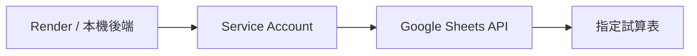
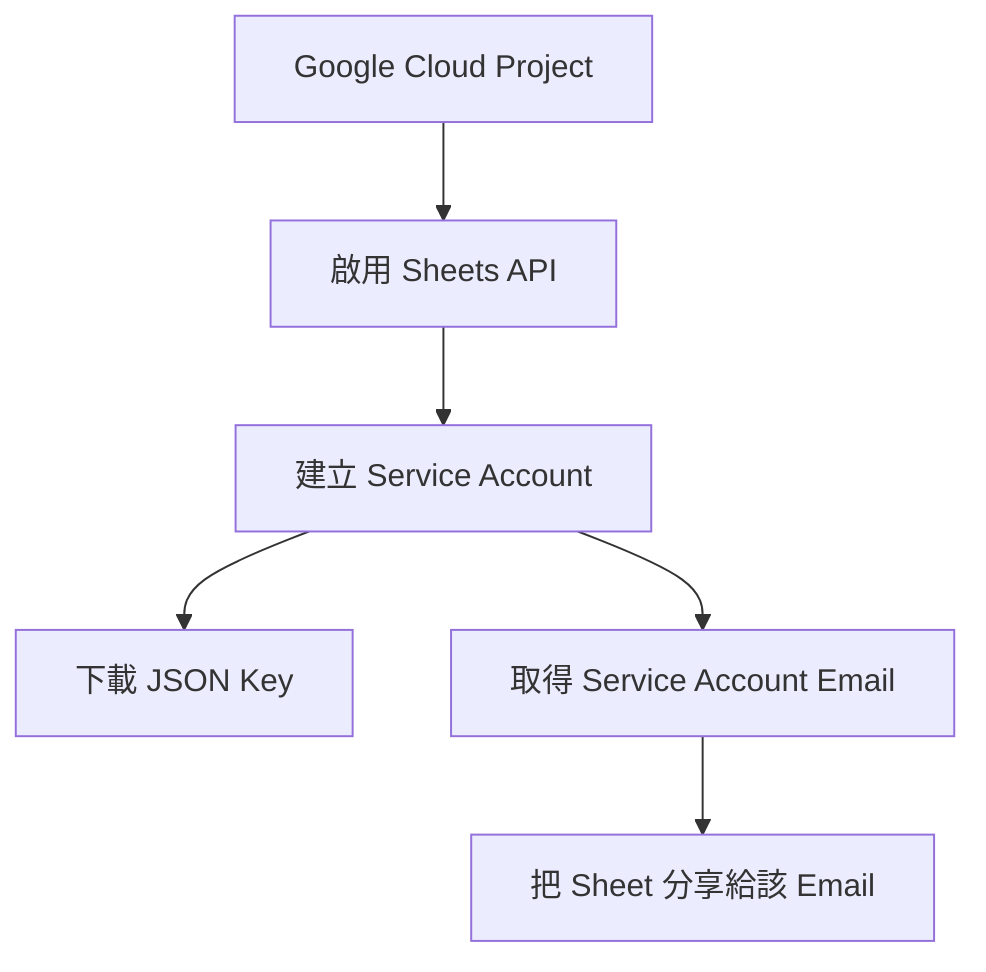

Gemini API Key 讓模型可以思考，但不能自動讀取你的 Google Sheets。若要讓後端存取指定試算表，需要建立一個 **Service Account**，把它視為專門給程式使用的 Google 帳號。



## Gemini Key 與 Service Account 的差異

| 憑證 | 用途 |
| --- | --- |
| Gemini API Key | 呼叫模型 |
| Service Account JSON | 代表後端讀取被分享的 Google Sheet |

## 建立流程

1. 在 Google Cloud 建立或選擇 Project。

**圖 1｜選擇或建立 Google Cloud Project**

> \[圖片預留位置：Google Cloud 專案選擇器，標示建立新專案與選擇既有專案的位置\]

_圖說：Service Account 與 Google Sheets API 都必須建立在指定的 Google Cloud Project 中。正式環境建議使用公司或團隊控制的 Project；截圖時請遮蔽組織名稱、Project ID 與帳號資訊。_

2. 啟用 Google Sheets API；需要時也啟用 Drive API。

**圖 2｜在 API Library 啟用 Google Sheets API**

> \[圖片預留位置：API Library 的 Google Sheets API 搜尋結果與 Enable 按鈕\]

_圖說：在 API Library 搜尋並開啟 Google Sheets API，確認服務名稱後按下 Enable。若後續程式需要透過檔案清單尋找試算表，再依需求啟用 Google Drive API。_

3. 建立 Service Account。

**圖 3｜建立 Data Machi 專用 Service Account**

> \[圖片預留位置：Service Accounts 頁面的 Create service account、名稱與描述欄位\]

_圖說：建立專門供 Data Machi 使用的 Service Account。名稱可使用 `data-machi-reader` 等容易辨識的匿名範例，並在描述中註明用途。第一版只需讀取指定試算表，不必授予專案管理者權限。_

4. 建立 JSON Key，下載後妥善保管。

**圖 4｜為 Service Account 建立 JSON Key**

> \[圖片預留位置：Service Account 的 Keys 頁籤、Add key 與 JSON 選項\]

_圖說：進入 Service Account 的 Keys 頁籤，依序選擇 Add key、Create new key 與 JSON。下載完成後請立即移到安全位置，圖片與文章中都不要展示 JSON 內容。_

5. 找到 Service Account Email。
6. 將測試 Sheet 分享給這個 Email，權限先使用 Viewer。

**圖 5｜將測試 Sheet 分享給 Service Account**

> \[圖片預留位置：Google Sheets 分享視窗，標示 Service Account Email 與 Viewer 權限\]

_圖說：複製 Service Account Email，回到匿名測試 Sheet 的分享視窗，將該 Email 加入並設定為 Viewer。完成後，後端就能以這個程式帳號讀取指定試算表。_



## 憑證放在哪裡？

本機可以暫時將 JSON 放在 `backend/`，但必須加入 `.gitignore`。更安全且適合正式環境的方法，是把整份 JSON 內容存成環境變數：

```env
GOOGLE_SERVICE_ACCOUNT_JSON={"type":"service_account",...}
GOOGLE_SHEET_KEY=your_sheet_id
```

Render 中同樣建立這兩個 Environment Variables。不要把 JSON 檔上傳到 GitHub。

## 建立匿名測試資料

建議先建立一份不含真實企業資訊的測試表，例如：

| Request ID | Created Date | Category | Status |
| --- | --- | --- | --- |
| R001 | 2026-07-01 | Dashboard | Completed |
| R002 | 2026-07-03 | Data Query | In Progress |

先用這份資料驗證權限與查詢，再替換成自己的資料來源。

## 本篇驗收

- 後端能開啟指定 Sheet。
- 未分享給 Service Account 時會出現權限錯誤。
- Sheet ID 與憑證不會出現在公開教學內容。
- Viewer 權限已足夠時，不給 Editor。

## 建議的 Vibe Coding Prompt

```text
請檢查 Google Sheets 工具的憑證載入方式。
目標：本機可讀取 .env，Render 可讀取 GOOGLE_SERVICE_ACCOUNT_JSON，
Repository 不得包含 JSON Key，缺少權限時回傳清楚錯誤。
請不要把任何真實 Sheet ID 寫進程式碼。
```

<Warning>
  Service Account 解決的是「讓程式不要綁定某位員工的登入狀態」，但它本身也必須屬於公司控制的 Google Cloud Project。正式環境不要把 Service Account 建在個人 Project，也不要讓建立者成為唯一可以重新產生或撤銷憑證的人。完整遷移與交接方式會在〈實作 17｜權限與資訊安全〉說明。
</Warning>

下一篇會介紹 Trello 與 Confluence API；這兩項是選配，不影響基礎版 Data Machi 完成。