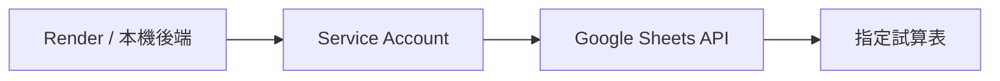
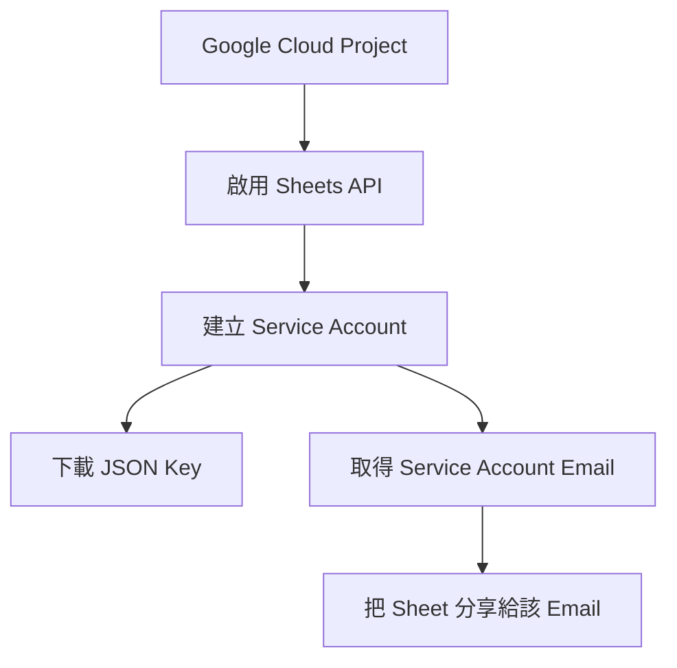

Gemini API Key 讓模型可以思考，但不能自動讀取你的 Google Sheets。若要讓後端存取指定試算表，需要建立一個 **Service Account**，把它視為專門給程式使用的 Google 帳號。



## Gemini Key 與 Service Account 的差異

| 憑證 | 用途 |
| --- | --- |
| Gemini API Key | 呼叫模型 |
| Service Account JSON | 代表後端讀取被分享的 Google Sheet |

## 建立流程

1. 在 Google Cloud 建立或選擇 Project。
2. 啟用 Google Sheets API；需要時也啟用 Drive API。
3. 建立 Service Account。
4. 建立 JSON Key，下載後妥善保管。
5. 找到 Service Account Email。
6. 將測試 Sheet 分享給這個 Email，權限先使用 Viewer。



## 憑證放在哪裡？

本機可以暫時將 JSON 放在 `backend/`，但必須加入 `.gitignore`。更安全且適合正式環境的方法，是把整份 JSON 內容存成環境變數：

```env
GOOGLE_SERVICE_ACCOUNT_JSON={"type":"service_account",...}
GOOGLE_SHEET_KEY=your_sheet_id
```

Render 中同樣建立這兩個 Environment Variables。不要把 JSON 檔上傳到 GitHub。

## 建立匿名測試資料

建議先建立一份不含真實企業資訊的測試表，例如：

| Request ID | Created Date | Category | Status |
| --- | --- | --- | --- |
| R001 | 2026-07-01 | Dashboard | Completed |
| R002 | 2026-07-03 | Data Query | In Progress |

先用這份資料驗證權限與查詢，再替換成自己的資料來源。

## 本篇驗收

- 後端能開啟指定 Sheet。
- 未分享給 Service Account 時會出現權限錯誤。
- Sheet ID 與憑證不會出現在公開教學內容。
- Viewer 權限已足夠時，不給 Editor。

## 建議的 Vibe Coding Prompt

```text
請檢查 Google Sheets 工具的憑證載入方式。
目標：本機可讀取 .env，Render 可讀取 GOOGLE_SERVICE_ACCOUNT_JSON，
Repository 不得包含 JSON Key，缺少權限時回傳清楚錯誤。
請不要把任何真實 Sheet ID 寫進程式碼。
```

下一篇會介紹 Trello 與 Confluence API；這兩項是選配，不影響基礎版 Data Machi 完成。