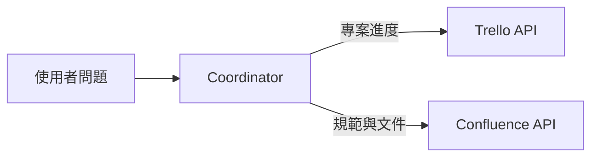
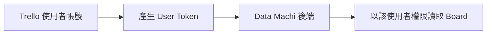
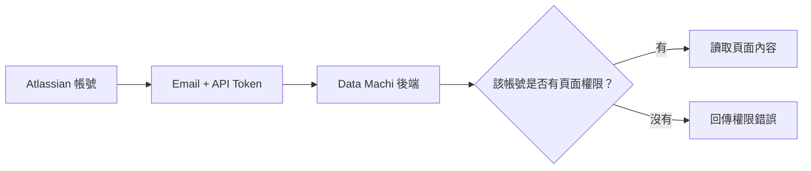
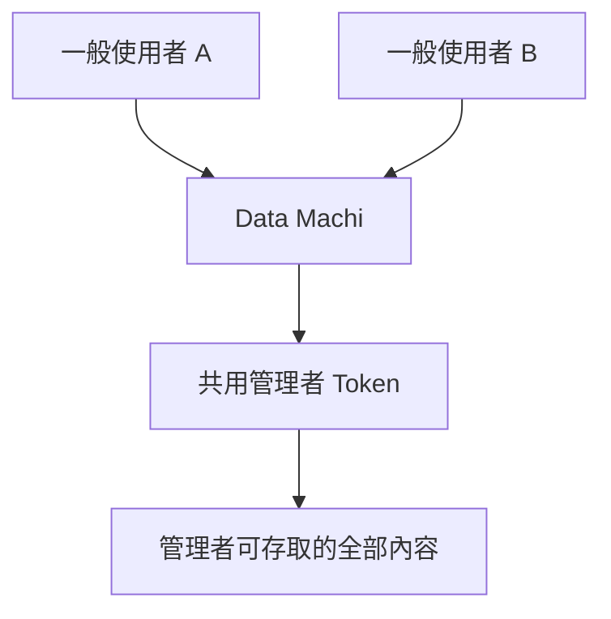
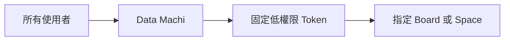
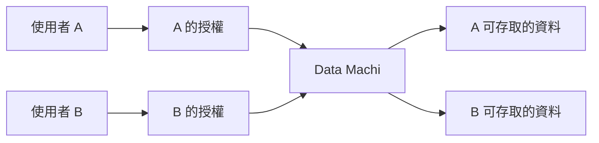
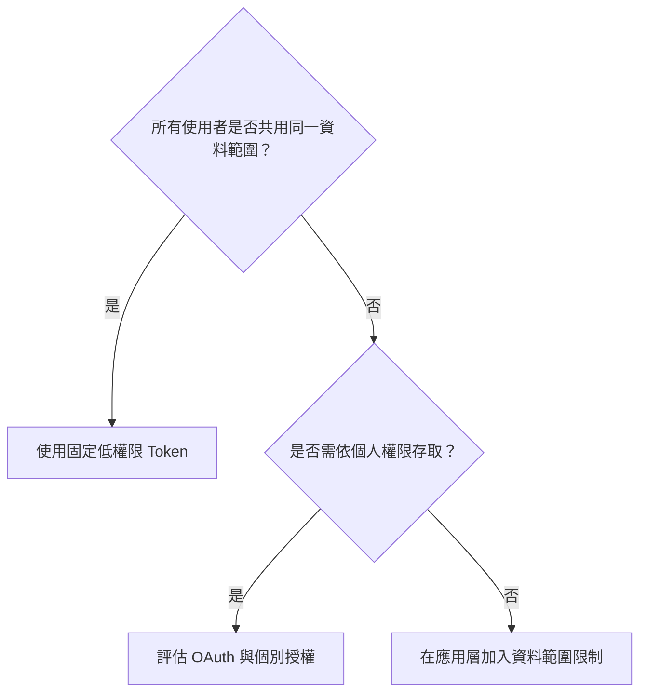

Trello 與 Confluence 都屬於選配資料來源。沒有使用 Atlassian 服務的讀者，可以先完成 Gemini、Google Sheets 與 PDF RAG，再回來擴充。



## 兩種服務解決不同問題

| 服務 | 適合回答 |
| --- | --- |
| Trello | 卡片狀態、負責人、截止日、看板進度 |
| Confluence | 規範、流程、定義、團隊文件與知識文章 |

這兩個服務雖然都屬於 Atlassian，但憑證形式與授權方式不完全相同，因此不能用同一句話概括。

## Trello 需要準備

- Trello 帳號與匿名測試 Board
- Board ID
- API Key
- User Token

```env
TRELLO_BOARD_ID=
TRELLO_API_KEY=
TRELLO_TOKEN=
```

Trello Token 代表產生它的使用者。該使用者能看到哪些 Board、Card 與 Workspace，後端通常就能透過這組 Token 存取相同範圍。



<Warning>
  請使用匿名測試 Board，不要把真實專案名稱、人員姓名或機密卡片放進公開教學。Token 應只存在 `backend/.env` 或 Render Environment，不能放在前端與 GitHub。
</Warning>

## Confluence 需要準備

- Atlassian 帳號
- Confluence Site URL
- 登入 Email
- API Token
- 該帳號可讀取的測試 Space 或頁面

```env
CONFLUENCE_URL=
CONFLUENCE_USERNAME=
CONFLUENCE_API_TOKEN=
```

Confluence 的 Email 與 API Token 是用來證明「後端正在以哪一個 Atlassian 帳號讀取內容」。API 能看到的範圍，通常仍受該帳號原本的頁面與 Space 權限限制。



## 最重要的觀念：後端使用誰的 Token，就繼承誰的權限

假設你用一個管理者帳號建立 Token，而這個帳號可以看到整個 Confluence Site。即使一般使用者原本只能看部分頁面，只要 Data Machi 沒有另外設計權限檢查，後端仍可能查到管理者看得到的內容。



這就是為什麼不建議直接把高權限管理者 Token 當成所有使用者共用的憑證。

<Note>
  這不代表第一版一定要實作 OAuth。更實際的做法，是先建立一個專門供整合使用、權限較低的帳號，只讓它存取教學或指定資料範圍。
</Note>

## 固定憑證與個別授權有什麼差別？

### 固定憑證

後端永遠使用同一組 Trello 或 Confluence Token。

適合：

- 個人專案
- 內部測試
- 所有使用者共用相同資料範圍
- 系統只讀取固定 Board 或固定 Space



### 個別授權

每位使用者用自己的 Atlassian 身分授權，系統依照個人權限存取資料。

適合：

- 不同使用者應看到不同內容
- 產品會提供給多個組織或客戶
- 需要撤銷單一使用者權限
- 需要記錄誰讀取了哪些資料



個別授權通常會牽涉 OAuth、使用者登入、Token 保存、權限範圍、撤銷與更新，因此屬於產品擴充階段，而不是第一版的必要條件。

## 目前 Data Machi 最適合哪一種？

目前的實作目標是讓後端讀取指定的 Trello Board 與 Confluence 內容，因此建議先採用：

- 固定憑證
- 專門的整合帳號
- 最小必要權限
- 只讀取匿名測試資料
- 不提供寫入、刪除或批次更新功能



## 什麼時候才需要考慮 OAuth？

出現以下情況時，再進一步評估 OAuth 或個別授權：

- A 使用者與 B 使用者應看到不同頁面
- 使用者必須登入自己的 Atlassian 帳號
- 需要讓使用者自行撤銷授權
- 需要記錄哪一位使用者查了什麼資料
- 系統會提供給不同公司或外部客戶使用

若以上情況都不存在，第一版先使用固定、低權限且資料範圍受控的 Token，通常更容易完成與測試。

## Token 輪替與稽核是什麼？

### Token 輪替

Token 不應被視為永久不變。若發生人員異動、Token 外洩或權限調整，應該能建立新 Token、更新 Render Environment，並撤銷舊 Token。

### 稽核紀錄

正式產品可能需要記錄：

- 哪位使用者提出問題
- 系統呼叫了哪個工具
- 查詢了哪個 Board 或 Space
- 是否發生權限錯誤
- 是否執行了寫入操作

第一版可以先不建立完整稽核系統，但至少要保留後端 Log，方便辨識錯誤發生在哪一個服務。

## 本篇驗收

- Trello 能列出匿名測試 Board 的卡片。
- Confluence 能讀取指定測試頁面。
- 換成沒有權限的帳號或 Token 時，系統能清楚回報權限不足。
- 後端只使用低權限測試帳號，不使用管理者憑證。
- Token 不存在 GitHub、Vercel 前端或教學截圖。
- 讀者能說明目前採用固定憑證，而不是個別使用者授權。

## 常見問題

<AccordionGroup>
  <Accordion title="為什麼我登入 Confluence 看得到，API 卻讀不到？">
    請確認 API Token 是否由同一個帳號建立、Site URL 是否正確，以及該帳號是否真的具有目標 Space 與頁面權限。
  </Accordion>

  <Accordion title="為什麼不直接使用管理者 Token？">
    因為後端會繼承管理者能看到的完整資料範圍。一旦應用層權限判斷出錯，普通使用者可能間接取得不該看到的內容。
  </Accordion>

  <Accordion title="多人使用就一定要 OAuth 嗎？">
    不一定。若所有人本來就共用同一份資料，而且系統使用的是低權限整合帳號，可以先維持固定 Token。只有需要依使用者身分區分資料時，才需要個別授權。
  </Accordion>
</AccordionGroup>

## 建議的 Vibe Coding Prompt

```text
請檢查目前 Trello 與 Confluence 工具的憑證與權限設計。

目標：
1. 第一版使用固定、低權限、只讀取指定測試資料的整合帳號
2. Trello 與 Confluence 的憑證要分開說明
3. 缺少 Token、權限不足、資源不存在與網路錯誤要回傳不同訊息
4. 不要加入寫入、刪除或更新功能
5. 不要把任何 Token 或真實資源 ID 寫進程式碼

請先說明目前的風險與預計修改的檔案，再開始修改。
```

<Info>
  今天只要記住一件事：固定 Token 並不是錯誤做法，關鍵在於使用低權限帳號、限制資料範圍，並清楚知道後端會繼承該帳號的權限。
</Info>

下一篇會加入 Groq Whisper，讓會議錄音可以轉成文字。