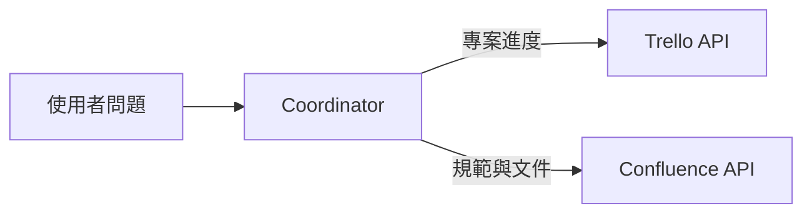

Trello 與 Confluence 都屬於選配資料來源。沒有使用 Atlassian 服務的讀者，可以先完成 Gemini、Google Sheets 與 PDF RAG，再回來擴充。



## 兩種服務解決不同問題

| 服務 | 適合回答 |
| --- | --- |
| Trello | 卡片狀態、負責人、截止日、看板進度 |
| Confluence | 規範、流程、定義、團隊文件與知識文章 |

## Trello 需要準備

- Trello 帳號與測試 Board
- Board ID
- API Key
- API Token

```env
TRELLO_BOARD_ID=
TRELLO_API_KEY=
TRELLO_TOKEN=
```

請建立匿名測試 Board，不要使用真實專案名稱、人員或機密卡片。Token 代表你的存取權限，應放在 `backend/.env` 與 Render Environment。

## Confluence 需要準備

- Atlassian 帳號
- Confluence Site URL
- 登入 Email
- API Token
- 該帳號可讀取的測試 Space／頁面

```env
CONFLUENCE_URL=
CONFLUENCE_USERNAME=
CONFLUENCE_API_TOKEN=
```

API 能讀到的內容仍受原本頁面權限限制。若帳號在網頁中看不到某頁，後端通常也不能透過 API 讀取。

## 個人學習版與正式產品版

個人測試可使用 Email 加 API Token。若要提供給多位使用者或公開散布，應進一步評估 OAuth、權限隔離、Token 輪替與稽核紀錄，而不是共用同一組管理者 Token。

## 本篇驗收

- Trello 能列出匿名測試 Board 的卡片。
- Confluence 能讀到指定測試頁面。
- 移除權限後，API 應回傳權限錯誤，而不是空白成功。
- Token 不存在 GitHub、Vercel 前端或教學截圖。

## 建議的 Vibe Coding Prompt

```text
請檢查 Trello 與 Confluence 工具目前需要哪些環境變數與權限。
先建立最小讀取測試，不要加入寫入、刪除或更新功能。
錯誤訊息需要區分：缺少 Token、權限不足、資源不存在與網路失敗。
```

下一篇會加入 Groq Whisper，讓會議錄音可以轉成文字。