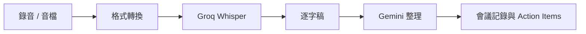

Data Machi 的會議記錄功能會先把錄音轉成逐字稿，再交給 Gemini 整理摘要、議程與行動項目。語音辨識與文字整理是兩個不同任務，因此可以使用不同服務。



## 需要準備

- Groq 帳號
- Groq API Key
- 瀏覽器可錄音，或一份匿名測試音檔
- 本機若需要格式轉換，安裝 ffmpeg

## Key 應該放在哪裡？

你的專案採用「使用者在會議功能中自行輸入 Groq Key，後端不長期保存」的方式。這代表：

- Key 只隨本次轉錄請求送出。
- 不寫進 GitHub。
- 不預設保存在 Render。
- 前端若暫存，也應明確告知保存方式與範圍。

這種方式適合個人或小型工具；若未來要提供多人共用，則需要重新評估集中管理、額度與權限。

## 為什麼需要 ffmpeg？

瀏覽器錄音常是 WebM／Opus，手機音檔也可能使用不同格式。模型服務不一定接受所有格式，因此先轉成支援的音訊格式，再送去轉錄，能降低失敗率。

## 本篇驗收

- 短音檔能成功產生逐字稿。
- 未提供 Key 時，畫面會引導使用者輸入，而不是顯示不明錯誤。
- 轉錄失敗與 Gemini 整理失敗能被分開辨識。
- 測試音檔不包含真實會議或個人資料。

## 建議的 Vibe Coding Prompt

```text
請檢查會議錄音到逐字稿的完整流程。
請分開標示音訊格式轉換、Groq 轉錄與 Gemini 整理三個階段，
並確保 Groq API Key 不會寫入 log、Repository 或長期資料庫。
```

下一篇會從開源 Repository 建立一份真正屬於你的 Data Machi 副本。