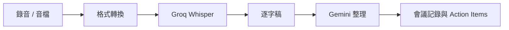

Data Machi 的會議記錄功能會先把錄音轉成逐字稿，再交給 Gemini 整理摘要、議程與行動項目。語音辨識與文字整理是兩個不同任務，因此可以使用不同服務。



## 需要準備

- Groq 帳號
- Groq API Key
- 瀏覽器可錄音，或一份匿名測試音檔
- 本機若需要格式轉換，安裝 ffmpeg

## Key 應該放在哪裡？

你的專案採用「使用者在會議功能中自行輸入 Groq Key，後端不長期保存」的方式。這代表：

- Key 只隨本次轉錄請求送出。
- 不寫進 GitHub。
- 不預設保存在 Render。
- 前端若暫存，也應明確告知保存方式與範圍。

這種方式適合個人或小型工具；若未來要提供多人共用，則需要重新評估集中管理、額度與權限。

## 為什麼需要 ffmpeg？

瀏覽器錄音常是 WebM／Opus，手機音檔也可能使用不同格式。模型服務不一定接受所有格式，因此先轉成支援的音訊格式，再送去轉錄，能降低失敗率。

## 本篇驗收

- 短音檔能成功產生逐字稿。
- 未提供 Key 時，畫面會引導使用者輸入，而不是顯示不明錯誤。
- 轉錄失敗與 Gemini 整理失敗能被分開辨識。
- 測試音檔不包含真實會議或個人資料。

## 建議的 Vibe Coding Prompt

```text
請檢查會議錄音到逐字稿的完整流程。
請分開標示音訊格式轉換、Groq 轉錄與 Gemini 整理三個階段，
並確保 Groq API Key 不會寫入 log、Repository 或長期資料庫。
```

## 建立 Groq API Key

1. 登入 Groq Console，進入 API Keys 頁面。
2. 選擇建立新的 API Key。
3. 使用容易辨識的名稱，例如 `data-machi-transcription`。
4. 建立完成後立即複製 Key，並保存到密碼管理工具。
5. 不要把 Key 寫入 GitHub、公開文件或後端 Log。

**圖 1｜進入 Groq API Keys 頁面**

> \[圖片預留位置：Groq Console 的 API Keys 頁面與 Create API Key 按鈕\]

_圖說：登入 Groq Console 後，進入 API Keys 頁面並建立 Data Machi 專用 Key。介面可能隨版本更新而調整，請以 API Keys 或 Create API Key 等選項為準。_

**圖 2｜命名並保存 Groq API Key**

> \[圖片預留位置：Key 名稱欄位與建立完成畫面\]

_圖說：使用可辨識的用途名稱建立 Key。完整 Key 通常只會顯示一次，請立即保存；圖片中必須完全遮蔽 Key。_

**圖 3｜在會議功能輸入 Groq Key 並上傳音檔**

> \[圖片預留位置：Data Machi 會議頁面，標示 Groq Key、錄音與上傳音檔的位置\]

_圖說：進入會議功能後，先輸入本次使用的 Groq Key，再選擇錄音或上傳匿名音檔。請使用測試檔名與測試內容，不要讓真實會議名稱、逐字稿或參與者資訊出現在圖片中。_

**圖 4｜檢查逐字稿與會議摘要結果**

> \[圖片預留位置：10～20 秒匿名音檔的逐字稿與摘要結果\]

_圖說：先確認 Groq 已成功產生逐字稿，再檢查 Gemini 是否完成摘要與行動項目整理。畫面應清楚區分「語音轉文字」與「文字整理」兩個階段，方便判斷錯誤發生位置。_

下一篇會從開源 Repository 建立一份真正屬於你的 Data Machi 副本。