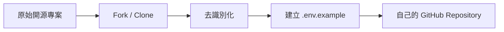

前面已準備好主要服務，現在才正式建立自己的專案副本。這一步不是把原始 Repository 原封不動複製，而是先移除不屬於你的品牌、資料來源與正式環境設定。



## 優先檢查的位置

- README、頁面標題、Logo 與前端文案
- `backend/agents` 中的 Prompt 與資料描述
- 預設 Spreadsheet Key、Board ID、Space URL
- CORS 中的正式網域
- Render、Vercel 與部署設定檔
- 範例資料、測試截圖與錯誤訊息

## 去識別化不只是改名稱

除了品牌文字，也要移除可推回真實組織的資訊，例如部門名稱、地區代碼、內部指標、真實 Email、工單欄位與專案看板結構。教學中應替換為匿名資料，例如 `Your Organization`、`Project Board`、`Knowledge Base`。

## 建立自己的環境變數範本

```env
GOOGLE_API_KEY=
GEMINI_MODEL=
GOOGLE_SERVICE_ACCOUNT_JSON=
GOOGLE_SHEET_KEY=
TRELLO_BOARD_ID=
CONFLUENCE_URL=
VITE_API_BASE_URL=
```

`.env.example` 只列出變數名稱與用途，不放真實值。

## 本篇驗收

- GitHub Repository 已屬於你自己的帳號。
- 搜尋不到原組織名稱與真實網域。
- 所有 Secret 都由環境變數讀取。
- README 清楚列出必要與選配服務。
- 專案在沒有選配 API 時仍可啟動基礎功能。

## 建議的 Vibe Coding Prompt

```text
請掃描整個 Repository，找出品牌名稱、真實網址、預設資料來源 ID、Email、部門與市場資訊。
先建立清單，再改成中性名稱與環境變數。
不要刪除功能，只移除識別資訊與硬編碼設定。
```

## 建立自己的 Repository 副本

1. 進入原始 GitHub Repository。
2. 依專案提供的方式選擇 **Fork** 或 **Use this template**。
3. 選擇 Repository 所屬的 Owner。
4. 輸入新的 Repository 名稱，並設定 Visibility。
5. 建立完成後，確認網址已經切換成自己的 Repository。

**圖 1｜從原始專案建立副本**

> \[圖片預留位置：GitHub Repository 首頁，標示 Fork 或 Use this template\]

_圖說：從原始 Data Machi 專案建立自己的副本。若專案提供 Template，優先依教學指定方式操作；若使用 Fork，後續仍要檢查原專案識別資訊與部署設定。_

**圖 2｜設定 Repository Owner、名稱與 Visibility**

> \[圖片預留位置：建立 Repository 的設定畫面\]

_圖說：選擇 Repository 所屬帳號或 Organization，填入新的專案名稱並確認公開或私人設定。教學畫面請使用匿名範例名稱，不要顯示公司內部 Organization。_

**圖 3｜全域搜尋需要去識別化的資訊**

> \[圖片預留位置：GitHub 或 VS Code 全域搜尋結果，標示品牌名稱、網址、Email 與資料來源 ID\]

_圖說：建立副本後，使用全域搜尋逐項檢查品牌、網址、Email、Sheet ID、Board ID 與其他環境設定。搜尋範例與畫面內容都應使用假資料，避免公開真實識別資訊。_

**圖 4｜確認 `.env.example` 與 `.gitignore`**

> \[圖片預留位置：並排顯示 `.env.example` 與 `.gitignore`\]

_圖說：`.env.example` 只保留環境變數名稱與用途，`.gitignore` 則排除 `.env`、Service Account JSON 與其他敏感檔案。建立副本後，應在第一次 Commit 前完成這項檢查。_

下一篇會在本機啟動前端與後端，確認專案骨架可以運作。