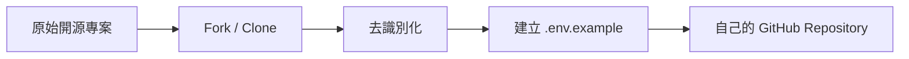

前面已準備好主要服務，現在才正式建立自己的專案副本。這一步不是把原始 Repository 原封不動複製，而是先移除不屬於你的品牌、資料來源與正式環境設定。



## 優先檢查的位置

- README、頁面標題、Logo 與前端文案
- `backend/agents` 中的 Prompt 與資料描述
- 預設 Spreadsheet Key、Board ID、Space URL
- CORS 中的正式網域
- Render、Vercel 與部署設定檔
- 範例資料、測試截圖與錯誤訊息

## 去識別化不只是改名稱

除了品牌文字，也要移除可推回真實組織的資訊，例如部門名稱、地區代碼、內部指標、真實 Email、工單欄位與專案看板結構。教學中應替換為匿名資料，例如 `Your Organization`、`Project Board`、`Knowledge Base`。

## 建立自己的環境變數範本

```env
GOOGLE_API_KEY=
GEMINI_MODEL=
GOOGLE_SERVICE_ACCOUNT_JSON=
GOOGLE_SHEET_KEY=
TRELLO_BOARD_ID=
CONFLUENCE_URL=
VITE_API_BASE_URL=
```

`.env.example` 只列出變數名稱與用途，不放真實值。

## 本篇驗收

- GitHub Repository 已屬於你自己的帳號。
- 搜尋不到原組織名稱與真實網域。
- 所有 Secret 都由環境變數讀取。
- README 清楚列出必要與選配服務。
- 專案在沒有選配 API 時仍可啟動基礎功能。

## 建議的 Vibe Coding Prompt

```text
請掃描整個 Repository，找出品牌名稱、真實網址、預設資料來源 ID、Email、部門與市場資訊。
先建立清單，再改成中性名稱與環境變數。
不要刪除功能，只移除識別資訊與硬編碼設定。
```

## 建議補充的操作截圖

> 📸 **操作截圖建議｜Fork 或建立 Repository 副本** 截取 GitHub Repository 的 Fork／Use this template 操作入口，以及建立副本時的 Owner、Repository name 與 Visibility。請使用公開範例名稱。

> 📸 **操作截圖建議｜Repository 搜尋去識別化資訊** 顯示 GitHub 或 VS Code 全域搜尋品牌名稱、網址、Email 與資料來源 ID 的結果，讓讀者理解如何逐項清理；搜尋內容需使用假資料。

> 📸 **操作截圖建議｜`.env.example` 與 `.gitignore`** 並排顯示 `.env.example` 只保留變數名稱，以及 `.gitignore` 已排除 `.env`、JSON Key 等敏感檔案。

下一篇會在本機啟動前端與後端，確認專案骨架可以運作。