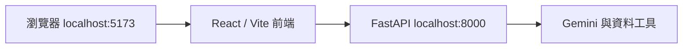
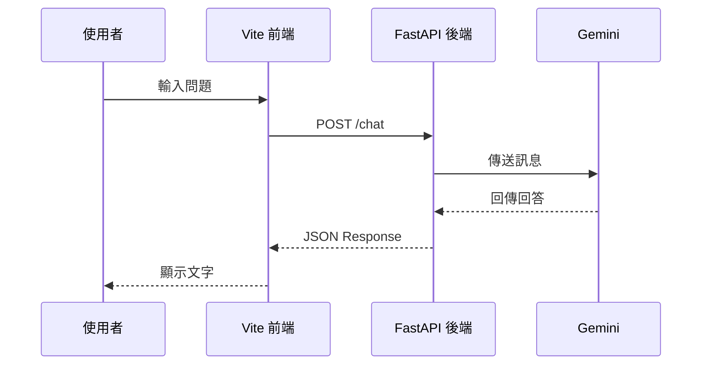

在部署前，先確認專案能在本機運作。Data Machi 需要同時啟動前端與後端，兩者分別使用不同的 Port。



## 啟動後端

```bash
cd backend
python -m venv .venv
source .venv/bin/activate
pip install -r requirements.txt
python main.py
```

Windows 啟用虛擬環境時通常使用：

```powershell
.\.venv\Scripts\activate
```

啟動成功後，先開啟 `http://localhost:8000/docs`，確認 FastAPI 的 API 文件可以顯示。

## 啟動前端

另開一個 Terminal：

```bash
cd frontend
npm install
npm run dev
```

開啟 Vite 顯示的網址，通常是 `http://localhost:5173`。

## 一則訊息如何流動？



## 常見錯誤

- `localhost:5173` 打得開但不能聊天：通常是後端未啟動、API URL 錯誤或 CORS。
- `localhost:8000/docs` 打不開：先看後端 Terminal 的套件或環境變數錯誤。
- 前端白畫面：查看瀏覽器 Console 與 Vite Terminal。
- 安裝失敗：確認 Node.js、Python 版本與目前所在資料夾。

## 本篇驗收

- 前端與後端可同時啟動。
- `/docs` 可以開啟。
- 瀏覽器 Console 沒有持續的連線錯誤。
- 關閉後端後，前端能顯示清楚的連線失敗訊息。

## 建議的 Vibe Coding Prompt

```text
請檢查目前專案的本機啟動流程。
請確認 README 中的 Python、Node.js、前端與後端指令與實際檔案一致，
並補上如何測試 /docs、如何停止服務，以及常見的 CORS 與 Port 問題。
```

下一篇會先只串接 Gemini，完成最小 AI 對話主幹。