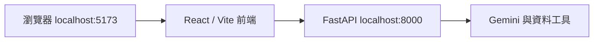
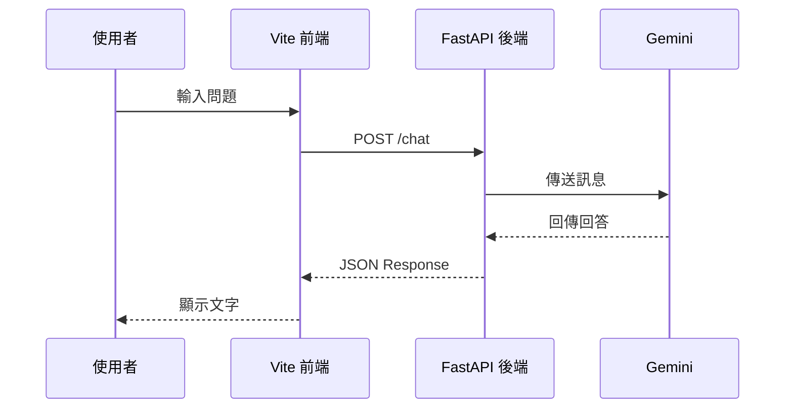

在部署前，先確認專案能在本機運作。Data Machi 需要同時啟動前端與後端，兩者分別使用不同的 Port。



## 啟動後端

```bash
cd backend
python -m venv .venv
source .venv/bin/activate
pip install -r requirements.txt
python main.py
```

Windows 啟用虛擬環境時通常使用：

```powershell
.\.venv\Scripts\activate
```

啟動成功後，先開啟 `http://localhost:8000/docs`，確認 FastAPI 的 API 文件可以顯示。

## 啟動前端

另開一個 Terminal：

```bash
cd frontend
npm install
npm run dev
```

開啟 Vite 顯示的網址，通常是 `http://localhost:5173`。

## 一則訊息如何流動？



## 常見錯誤

- `localhost:5173` 打得開但不能聊天：通常是後端未啟動、API URL 錯誤或 CORS。
- `localhost:8000/docs` 打不開：先看後端 Terminal 的套件或環境變數錯誤。
- 前端白畫面：查看瀏覽器 Console 與 Vite Terminal。
- 安裝失敗：確認 Node.js、Python 版本與目前所在資料夾。

## 本篇驗收

- 前端與後端可同時啟動。
- `/docs` 可以開啟。
- 瀏覽器 Console 沒有持續的連線錯誤。
- 關閉後端後，前端能顯示清楚的連線失敗訊息。

## 建議的 Vibe Coding Prompt

```text
請檢查目前專案的本機啟動流程。
請確認 README 中的 Python、Node.js、前端與後端指令與實際檔案一致，
並補上如何測試 /docs、如何停止服務，以及常見的 CORS 與 Port 問題。
```

## 確認本機專案結構

在執行指令前，先用 VS Code 開啟 Repository 根目錄，確認前端、後端與環境變數範本都在預期位置。若資料夾結構不同，後續安裝與啟動指令也要跟著調整。

**圖 1｜Data Machi 的本機資料夾結構**

> \[圖片預留位置：VS Code Explorer，標示 `frontend`、`backend`、`.env.example` 與主要啟動檔案\]

_圖說：以 Repository 根目錄開啟專案後，先確認前端與後端資料夾的位置。接下來的 Terminal 指令必須在正確資料夾執行，否則容易出現找不到套件或啟動檔案的錯誤。_

**圖 2｜啟動 FastAPI 後端並開啟 `/docs`**

> \[圖片預留位置：Terminal 的後端啟動指令、成功監聽網址，以及瀏覽器中的 `/docs`\]

_圖說：在 `backend` 資料夾執行啟動指令後，Terminal 應顯示服務監聽網址。接著開啟健康檢查或 `/docs`，確認 FastAPI 已正常啟動。圖片中不要顯示 Secret、本機使用者名稱或私人路徑。_

**圖 3｜啟動 React／Vite 前端**

> \[圖片預留位置：第二個 Terminal 的前端啟動指令、Vite Local URL 與瀏覽器首頁\]

_圖說：另開一個 Terminal，在 `frontend` 資料夾啟動 Vite。Terminal 顯示 Local URL 後，用瀏覽器開啟首頁，確認前端可以獨立載入。_

**圖 4｜前端、後端與瀏覽器同時運作**

> \[圖片預留位置：兩個 Terminal 與瀏覽器的整體畫面\]

_圖說：Data Machi 的前端與後端是兩個獨立服務。開發時通常需要同時保留一個 FastAPI Terminal、一個 Vite Terminal，以及瀏覽器測試畫面。關閉其中任一服務，都可能讓聊天功能失效。_

下一篇會先只串接 Gemini，完成最小 AI 對話主幹。