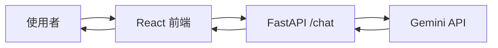

在加入 Sheets、RAG 或 Trello 前，先完成最小可行流程。這一步只驗證三件事：前端能送出訊息、後端能呼叫 Gemini、回答能回到畫面。



## 為什麼要先做最小版本？

若一開始同時串接五個工具，出錯時很難判斷問題來自前端、後端、模型、資料權限還是路由。先讓主幹成功，後續每新增一個工具都能單獨驗證。

## 開始前確認

- 本機前端與後端都已啟動。
- `GOOGLE_API_KEY` 已放在 `backend/.env`。
- 前端 API Base URL 指向本機後端。
- GitHub 中沒有真實 API Key。

## 測試流程

先使用不需要外部資料的問題，例如：

```text
請用三句話說明你能協助處理哪些工作。
```

成功時應看到：

1. 前端顯示送出中或處理中。
2. 後端 Terminal 收到 `/chat` 請求。
3. Gemini 回傳內容。
4. 前端顯示完整回答。

## 不要急著加入的功能

本篇先暫時忽略：

- Google Sheets
- PDF 文件搜尋
- Trello 與 Confluence
- 對話記憶
- Fallback 與 Verification

先確認最小對話穩定，再逐步增加複雜度。

## 常見錯誤

| 現象 | 優先檢查 |
| --- | --- |
| 401／認證失敗 | Gemini API Key |
| 404 | 前端 API 路徑與後端 Route |
| 422 | Request JSON 格式 |
| CORS Error | 後端允許的 Origin |
| 長時間無回應 | 模型負載、Timeout 或網路 |

## 本篇驗收

- 連續送出三個簡單問題都能收到回答。
- 錯誤時前端不會永久停在 Loading。
- 後端 Log 不顯示完整 Secret。
- 回答語言能跟隨使用者輸入。

## 建議的 Vibe Coding Prompt

```text
請建立或檢查最小聊天流程，只保留 React 前端、FastAPI /chat 與 Gemini 呼叫。
先不要加入任何 Tool、RAG 或 Memory。
請提供一個最小測試，以及 401、422、CORS 和 Timeout 的排查方式。
```

## 執行第一個最小對話

1. 確認前端與後端都已啟動。
2. 在聊天輸入框輸入一個不需要外部資料的問題，例如「請用一句話說明什麼是 RAG」。
3. 送出問題後，觀察 Loading 是否正常結束。
4. 確認畫面成功顯示 Gemini 回答，後端也沒有出現缺少 API Key 或模型名稱錯誤。

**圖 1｜完成第一個 Gemini 對話**

> \[圖片預留位置：聊天介面，包含測試問題、Loading 狀態與成功回答\]

_圖說：第一個測試只驗證前端、FastAPI 與 Gemini API 的主幹，不應呼叫 Sheets、RAG 或其他工具。若這一步失敗，應先處理 API Key、模型名稱或前後端連線，再繼續加入資料工具。_

**圖 2｜從瀏覽器 Network 檢查聊天 API**

> \[圖片預留位置：Network 面板，標示 Request URL、Status Code 與 Response Preview\]

_圖說：若聊天畫面沒有正常回應，可以從瀏覽器 Network 檢查請求是否送到正確後端、HTTP 狀態碼為何，以及回傳內容是否包含錯誤訊息。Header 中的 Token、Cookie 與敏感資料必須遮蔽。_

**圖 3｜缺少 API Key 時的錯誤狀態**

> \[圖片預留位置：使用假環境測試缺少 API Key 的前端錯誤訊息\]

_圖說：移除測試環境中的 API Key 後，前端應結束 Loading 並顯示可理解的設定錯誤。正確的產品體驗不應是空白頁、無限轉圈或只顯示技術堆疊。_

下一篇會加入第一個可人工核對的資料工具：Google Sheets。