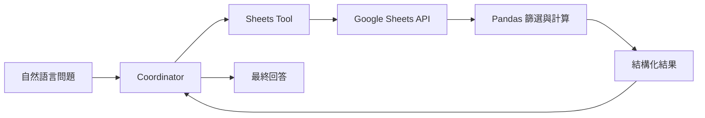

Google Sheets 是最適合當作第一個資料工具的來源，因為讀者可以直接打開表格，人工核對系統回傳的數字是否正確。



## 先建立匿名測試表

建議使用簡單欄位：

| Request ID | Created Date | Category | Status | Owner |
| --- | --- | --- | --- | --- |
| R001 | 2026-07-01 | Dashboard | Completed | User A |
| R002 | 2026-07-03 | Data Query | In Progress | User B |
| R003 | 2026-07-04 | Dashboard | Completed | User A |

接著把 Sheet 分享給 Service Account Email，並將 Sheet ID 放入後端環境變數。

## LLM 與程式各自負責什麼？

| 工作 | 建議執行者 |
| --- | --- |
| 理解「七月完成多少件」 | LLM |
| 將欄位別名對應到 `Status` | Tool 規則 |
| 日期篩選、Count、Groupby | Pandas |
| 將數字整理成自然語言 | LLM |

不要讓模型直接閱讀大量列後自行加總。模型負責理解問題，精確計算交給程式。

## 建議的測試問題

- 目前共有多少筆需求？
- Completed 有幾筆？
- Dashboard 類別中有幾筆已完成？
- 哪些負責人的案件仍在進行中？

每個答案都應與 Sheet 人工篩選結果一致。

## 工具結果應保留什麼？

除了回答文字，建議保留：

- 使用的工作表名稱
- 套用的欄位與篩選條件
- 符合條件的筆數
- 查詢時間
- 是否命中快取

這些資料可以支援後續 Verification 與除錯。

## 常見失敗

- `SpreadsheetNotFound`：Sheet ID 錯誤或尚未分享。
- 欄位找不到：表頭拼字、空格或別名不一致。
- 日期篩選錯誤：日期仍是文字格式。
- 資料更新但結果沒變：TTL 快取尚未過期。

## 本篇驗收

- 至少四個測試問題都能與人工結果一致。
- 空結果會回答「找不到」，而不是猜測。
- 欄位不存在時會明確說明。
- 回答不洩露 Service Account 或 Sheet ID。

## 建議的 Vibe Coding Prompt

```text
請使用匿名測試 Sheet 檢查目前 Sheets Tool。
先列出支援的欄位、別名、日期格式與查詢類型，
再建立四個可人工核對的測試案例。
精確計算必須由 Pandas 完成，不要讓 LLM 自行加總資料列。
```

下一篇會加入 PDF RAG，讓 Data Machi 可以回答文件內容並保留來源。