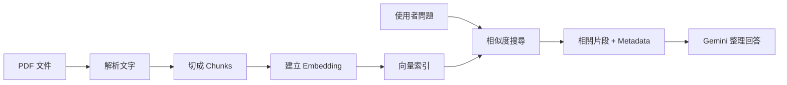

Google Sheets 適合回答結構化數字；PDF RAG 則用來處理規範、報告、手冊與研究文件。RAG 的核心不是讓模型記住整份文件，而是先搜尋相關片段，再把片段交給模型回答。



## 先準備匿名 PDF

不要直接使用內部文件。可以自行建立一份 3～5 頁的測試文件，包含：

- 文件標題
- 幾個清楚的小節
- 一張簡單表格
- 明確日期與定義
- 一段文件中完全沒有提到的資訊，用來測試拒答

## RAG 建置流程

1. 上傳或放入測試 PDF。
2. 解析文字；掃描型 PDF 可能需要 OCR。
3. 依段落或頁面切割 Chunk。
4. 為每個 Chunk 建立 Embedding。
5. 儲存至 FAISS 或其他向量索引。
6. 問題進來後，先搜尋相關 Chunk。
7. 將來源頁碼、檔名與片段一起交給模型。

## 為什麼需要 Metadata？

只有回答文字，使用者無法驗證。每個 Chunk 至少應保留：

- 檔名
- 頁碼
- 章節或標題
- Chunk ID
- 相似度或排序資訊

## Lazy Initialization

大型索引不一定要在後端一啟動時就全部載入。可以在第一次需要文件搜尋時才載入快取，降低啟動時間。不過第一次查詢會比較慢，前端應顯示「正在準備文件索引」而不是無限 Loading。

## 建議測試

- 問文件明確寫到的定義。
- 問指定頁面的內容。
- 問一個跨兩段才能回答的問題。
- 問文件完全沒寫的內容，確認系統不猜測。
- 同時上傳兩份文件，測試文件範圍是否正確。

## 常見失敗

- 文件存在但搜尋不到：解析失敗、Chunk 太大／太小或索引未更新。
- 找到不相關頁面：問題過於模糊、Metadata 過少或 Top K 不適合。
- 回答正確但無來源：工具只回傳文字，未保留 Metadata。
- 掃描 PDF 空白：需要 OCR 或視覺解析。

## 本篇驗收

- 回答能顯示來源檔名與頁碼。
- 找不到支持資料時會明確拒答。
- 切換指定文件後，不會引用未選取文件。
- 更新 PDF 後能重新建立索引。

## 建議的 Vibe Coding Prompt

```text
請使用匿名 PDF 檢查文件 RAG 流程。
請分別確認：文字解析、Chunk、Embedding、索引、檢索與來源 Metadata。
建立四個測試：明確命中、跨段落、指定文件、無答案拒答。
不要把整份 PDF 原文直接塞進 Prompt。
```

## 上傳匿名 PDF 並建立索引

### 步驟 1：準備匿名測試 PDF

準備一份 3～5 頁的匿名測試 PDF，內容包含清楚標題、小節、日期、定義與至少一個可驗證的表格或段落。

**圖 1｜匿名測試 PDF 的內容結構**

> \[圖片預留位置：測試 PDF 封面與目錄，標示文件標題、小節與頁碼\]

_圖說：測試 PDF 應包含明確標題、小節、日期與至少一個可驗證的定義。請使用自製匿名內容，不要直接截取企業內部文件。_

### 步驟 2：上傳或選擇 PDF

在 Data Machi 的文件功能中選擇或上傳測試 PDF，確認畫面顯示正確檔名與文件範圍。

**圖 2｜在 Data Machi 上傳或選擇 PDF**

> \[圖片預留位置：文件上傳入口、已選取檔名與索引建立狀態\]

_圖說：選擇 PDF 後，系統需要先完成解析與索引。第一次建立索引可能較慢，介面應顯示「正在準備文件索引」等明確狀態，而不是只顯示無限 Loading。_

### 步驟 3：等待解析與索引完成

等待系統依序完成文字解析、Chunk 切割與索引建立。索引完成後再開始提問。

**圖 3｜確認 PDF 索引建立狀態**

> \[圖片預留位置：介面或 Terminal Log，標示解析中、建立索引與完成\]

_圖說：第一次處理 PDF 時，系統需要依序解析文字、切割 Chunk 並建立索引，因此等待時間通常較長。若目前尚未有視覺化進度，可先以結構化 Log 顯示各階段。_

### 步驟 4：提問並核對來源引用

提出文件中有明確答案的問題，確認回答同時顯示來源檔名、頁碼與對應段落。

**圖 4｜核對回答與 PDF 來源引用**

> \[圖片預留位置：問題、回答、來源檔名、頁碼與 PDF 對應頁面局部畫面\]

_圖說：RAG 回答應同時顯示來源檔名與頁碼。將回答與 PDF 對應段落並排，確認模型整理的內容能被人工核對，而不是只有看似合理的文字。_

### 步驟 5：測試文件沒有答案的情況

提出一個文件中完全沒有提到的問題，確認系統會明確拒答，而不是自行補充看似合理的內容。

**圖 5｜文件沒有答案時明確拒答**

> \[圖片預留位置：文件中不存在的問題，以及系統拒絕猜測的回答\]

_圖說：RAG 驗收不只要測試「答得出來」，也要確認找不到支持內容時不會自行補答案。回答應明確說明文件中沒有足夠資訊，並可建議使用者調整問題或更換文件範圍。_

下一篇會使用 Coordinator 統一管理 Gemini、Sheets、RAG 與選配工具。