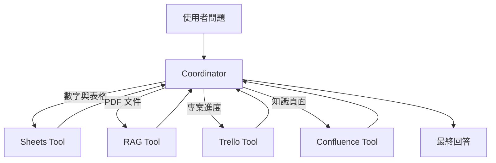
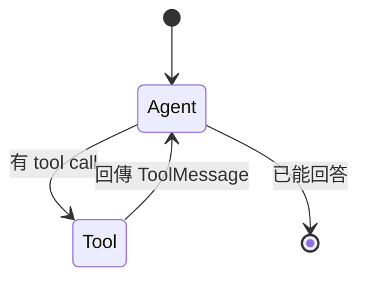
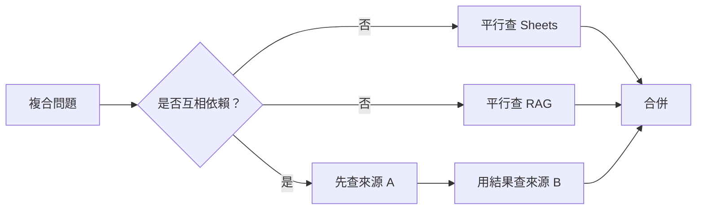

當 Data Machi 同時擁有 Sheets、RAG、Trello 與 Confluence，真正的問題不再是「有沒有工具」，而是「什麼問題應該交給哪個工具」。Coordinator 就像總機，負責判斷、分派與整合。



## LangGraph 在這裡做什麼？

LangGraph 把流程拆成可觀察的 State、Node 與 Edge：

- **State**：保存訊息、工具結果、來源與執行狀態。
- **Agent Node**：讓模型判斷下一步。
- **Tool Node**：執行被選中的工具。
- **Conditional Edge**：依模型結果決定呼叫工具或結束。



這是一個循環 Graph，而不是單向流水線。工具回傳後，Agent 需要再次閱讀結果，判斷是否足夠、是否要補查，或是否能產生最終答案。

## 先從單一 Coordinator 開始

不要因為有四種能力就立刻拆成四個 Agent。若所有工具都能由同一個模型理解與選擇，單一 Coordinator 通常更容易除錯、成本更低，也更適合初期產品。

只有在下列情況才考慮拆分 Agent：

- 工具數量過多，選錯率明顯上升。
- 不同角色需要獨立 Prompt、模型或權限。
- 流程本身具有研究、審核、退回與重做等明確交接。

## 路由測試矩陣

| 問題 | 預期工具 |
| --- | --- |
| 七月完成多少筆需求？ | Sheets |
| 文件中如何定義 SLA？ | RAG 或 Confluence |
| 哪些卡片逾期？ | Trello |
| 請改寫這段文字 | 不需工具 |
| 比較表格數字與文件規範 | Sheets \+ RAG |

## 平行與順序

若同一問題需要獨立查詢 Sheets 與 RAG，可以平行執行；若第二個工具的參數必須依賴第一個結果，就必須維持順序。



## 本篇驗收

- 每種問題會選到預期工具。
- 不需要資料的問題不會亂呼叫工具。
- 複合問題可以整合兩個以上來源。
- Tool 失敗時，Coordinator 能說明哪個來源失敗。
- Trace 能看出每一步的 Node、工具與結果。

## 建議的 Vibe Coding Prompt

```text
請根據目前工具清單建立路由測試矩陣。
先不要拆成 Multi-Agent，使用單一 Coordinator。
請檢查每個工具的名稱、description、輸入 schema 與錯誤回傳，
並建立不需工具、單工具、雙工具與工具失敗四類測試。
```

下一篇會處理多輪追問、先前工具結果與釐清流程。