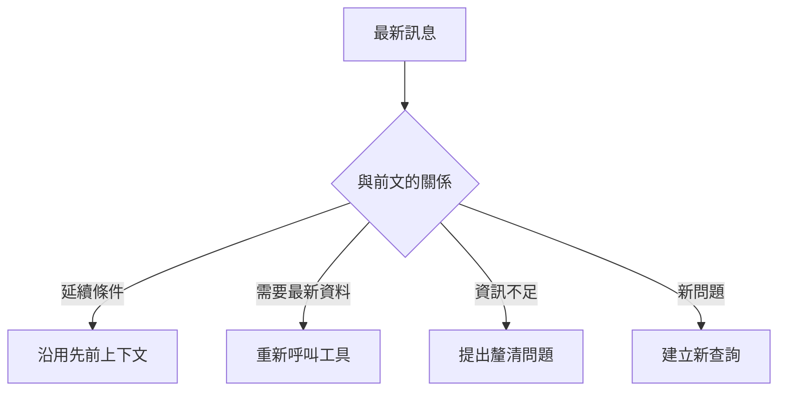
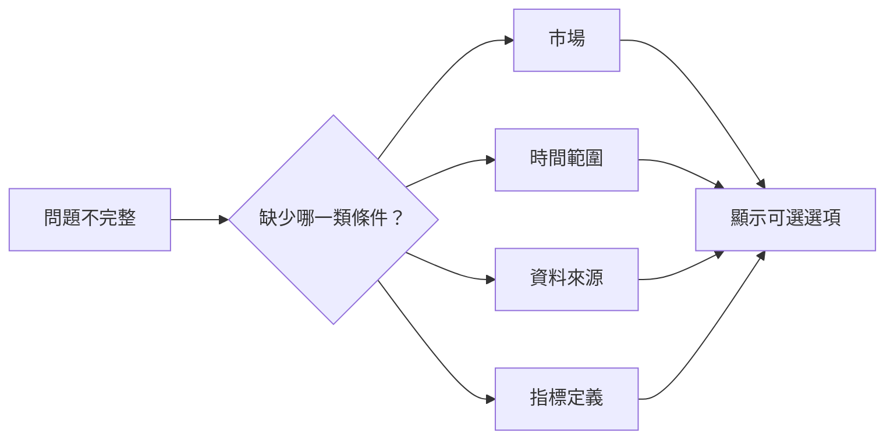

一個可用的資料助理不能只回答單輪問題。使用者經常會接著說「那香港呢？」、「改成去年」或「只看已完成的」。系統需要知道這些話正在延續哪個問題。



## 需要保存哪些資訊？

記憶不是把所有內容永久塞進 Prompt。Data Machi 可以分層保存：

| 類型 | 用途 |
| --- | --- |
| Conversation ID | 識別同一段對話 |
| 近期訊息 | 保留最近幾輪的自然對話 |
| Memory Summary | 壓縮較早內容，避免 Token 無限增加 |
| Prior Tool Context | 保存先前工具查到的資料與條件 |
| Turn Context | 判斷這輪是追問、改寫、重新查詢或新問題 |

## 何時可以沿用舊結果？

例如：

```text
使用者：七月完成多少筆需求？
系統：共 42 筆。
使用者：其中 Dashboard 類別呢？
```

第二題可以沿用先前七月資料，再加上類別條件。但如果使用者說「請重新查最新數字」，就必須重新呼叫工具。

## 何時需要釐清？



釐清問題應該具體且可選，不要只回「請提供更多資訊」。例如：「你想查台灣、香港，還是兩個市場？」比「請說明市場」更容易操作。

## 建議測試情境

1. 同一指標切換市場。
2. 同一期間增加篩選條件。
3. 使用「這個」、「其中」、「去年」等代名詞。
4. 要求最新資料，確認系統重新查詢。
5. 開啟新對話，確認不會錯用上一段記憶。

## 常見失敗

- 保存太多：Prompt 越來越長，延遲與成本上升。
- 保存太少：追問失去條件，需要重複輸入。
- 混用對話：Conversation ID 管理錯誤。
- 明明要求最新，卻沿用快取或先前工具結果。

## 本篇驗收

- 追問能正確延續市場、期間與資料來源。
- 新問題不會被舊上下文干擾。
- 資訊不足時先釐清，不自行猜測。
- 使用者要求最新時一定重新查詢。

## 建議的 Vibe Coding Prompt

```text
請建立多輪對話測試，涵蓋：延續條件、修改條件、要求最新、資訊不足與新問題。
請檢查 Conversation ID、近期訊息、Memory Summary 與 Prior Tool Context 的責任是否重疊，
並為每個情境標示應沿用資料、重新查詢或提出釐清。
```

## 測試多輪追問與資料沿用

1. 第一輪先提出完整問題，例如「七月共有多少筆需求？」。
2. 等待系統完成 Sheets 查詢並回傳結果。
3. 第二輪只輸入「那其中完成的呢？」等省略主詞的追問。
4. 確認系統能從 Conversation ID 與近期訊息判斷「其中」指的是七月需求。
5. 再提出一個需要最新資料的問題，確認系統知道何時必須重新查詢，而不是永遠沿用舊結果。

**圖 1｜第一輪取得完整資料結果**

> \[圖片預留位置：第一輪完整問題、工具呼叫與回答\]

_圖說：第一輪問題提供完整期間與指標，系統將查詢結果保存到目前對話的 State 中，供後續追問判斷。_

**圖 2｜第二輪以代名詞追問**

> \[圖片預留位置：第二輪「那其中完成的呢？」與系統回答\]

_圖說：第二輪沒有重複期間與資料範圍，Coordinator 應根據 Conversation ID、近期訊息與先前工具結果理解追問。若上下文仍不足，應先要求使用者釐清。_

**圖 3｜資訊不足時主動要求釐清**

> \[圖片預留位置：缺少月份、資料來源或文件範圍的問題，以及系統提出的釐清選項\]

_圖說：當問題缺少必要條件時，系統不應自行猜測。畫面應清楚指出缺少哪項資訊，並提供可直接選擇或補充的釐清方式。_

**圖 4｜要求最新狀態時重新呼叫工具**

> \[圖片預留位置：使用者要求重新查詢，以及系統再次執行工具的畫面\]

_圖說：當使用者明確要求「重新查詢」或「最新狀態」時，系統應再次呼叫資料工具，而不是直接沿用先前答案。畫面可同時標示新的查詢時間與更新後結果。_

下一篇會加入 Timeout、Fallback、Verification 與產品化錯誤處理。