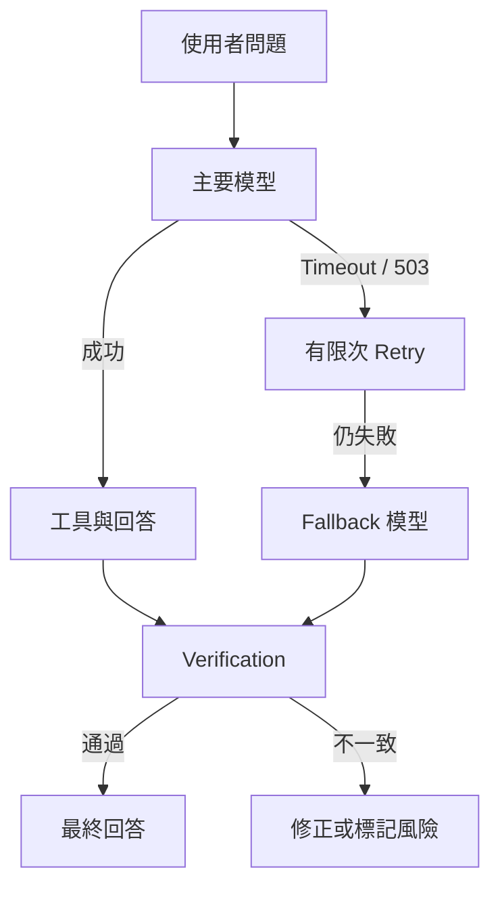

當系統開始串接多個服務，失敗不再只有「程式壞掉」一種。模型可能過載、API 可能逾時、資料工具可能沒有權限，答案也可能與工具結果不一致。可靠性工程的目標，是讓系統在失敗時仍然可理解、可恢復、可追查。



## 四個機制不要混在一起

| 機制 | 解決什麼問題 |
| --- | --- |
| Timeout | 限制單次等待時間 |
| Retry | 暫時性失敗時重新嘗試 |
| Fallback | 主模型不可用時切換替代模型 |
| Verification | 檢查回答是否符合工具結果與來源 |

## 為什麼不能無限重試？

若模型持續 503，無限重試只會讓使用者一直等待，並增加成本。較安全的做法是設定有限次數、每次等待與總時間預算，超過後切換模型或回傳可行動錯誤。

## 內部步驟與最終回答需要不同 Timeout

分類、路由與查核通常只輸出短 JSON，可以使用較短 Timeout；長篇報告可能需要更久。若全部共用同一個短上限，長回答會在生成一半時被中斷。

## Verification 檢查什麼？

- 回答中的數字是否存在於工具結果。
- 日期、篩選條件與市場是否一致。
- 文件敘述是否有來源支持。
- 工具失敗時是否仍假裝查詢成功。
- 是否洩露 Prompt、Secret 或內部錯誤細節。

## 產品化錯誤訊息

不要只顯示 `500 Internal Server Error`。應區分：

- API Key 缺失或無效
- 模型過載或逾時
- Sheet 未分享或不存在
- PDF 索引尚未建立
- 找不到支持回答的資料
- 前後端連線失敗

每個錯誤都應包含「發生什麼事」與「下一步可以做什麼」。

## 本篇驗收

- 刻意填錯 Key 時會收到認證錯誤。
- 模擬 Timeout 時 Loading 能結束。
- 主模型失敗時可切換備援模型。
- 回答數字與工具結果不一致時會被攔截或標記。
- Log 保留錯誤分類，但不記錄完整 Secret。

## 建議的 Vibe Coding Prompt

```text
請盤點聊天流程中的外部呼叫，分別設定 Timeout、Retry 與 Fallback。
請建立錯誤分類，不要把所有例外都回成「請檢查 API Key」。
再加入 Verification，核對回答中的數字、日期、篩選條件與來源。
請列出每個失敗情境的使用者訊息與驗收方式。
```

## 測試 Timeout、Retry 與 Fallback

1. 在測試環境刻意縮短 Timeout，或使用可模擬延遲的測試設定。
2. 送出一個需要模型回答的問題。
3. 確認前端先顯示「等待模型回應」，逾時後改成「重試中」。
4. 檢查後端 Log，確認 Retry 次數與等待時間符合設定。
5. 若主要模型持續失敗，確認系統是否切換到備援模型或回傳可理解的錯誤。

**圖 1｜前端顯示模型等待與重試狀態**

> \[圖片預留位置：同一任務的等待、重試與完成／失敗狀態\]

_圖說：使用者不應只看到持續轉動的 Loading。當系統正在等待、重試或切換備援模型時，前端應顯示目前階段，並在最終成功或失敗後結束 Loading。_

**圖 2｜從後端 Log 確認 Retry 次數**

> \[圖片預留位置：後端 Log，標示 Timeout、Retry 次數與 Fallback 結果\]

_圖說：後端 Log 應能協助開發者分辨模型逾時、限流與服務錯誤，但不可記錄完整 Prompt、API Key 或使用者敏感資料。_

**圖 3｜主要模型失敗後切換 Fallback**

> \[圖片預留位置：主要模型失敗、切換備援模型與完成回答的狀態\]

_圖說：當主要模型持續逾時或不可用時，系統可以切換到備援模型完成回答。畫面應讓使用者知道目前使用備援服務，但不要暴露 API Key、內部路由規則或其他 Secret。_

**圖 4｜不同失敗原因對應不同處理方式**

> \[圖片預留位置：額度不足、資料來源權限不足與服務暫時不可用的三種錯誤狀態\]

_圖說：錯誤訊息應指出問題類型與下一步，例如檢查額度、重新分享資料來源或稍後重試。不要把所有失敗都顯示成相同的「系統錯誤」。_

下一篇會先處理權限與資訊安全：確認帳號所有權、最小權限、Token 輪替與離職交接，再把後端部署到正式環境。