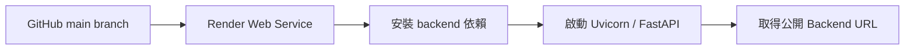
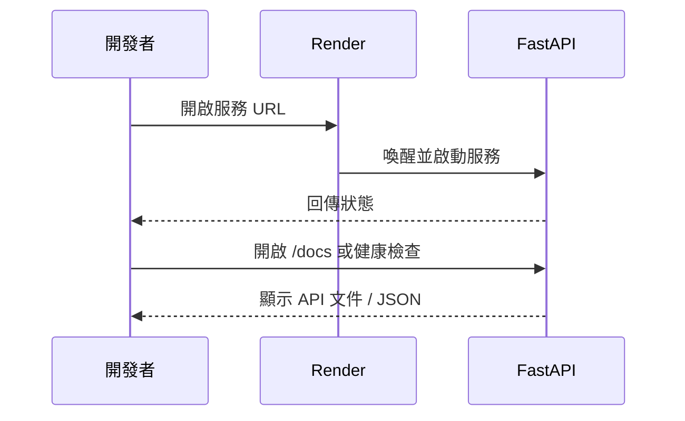

本機後端只在你的電腦開機時存在。要讓 Vercel 前端與其他裝置都能使用 Data Machi，需要把 FastAPI 部署到可公開存取的後端服務。這個專案使用 Render。

<Warning>
  開始前請先完成〈實作 17｜權限與資訊安全〉。正式 Render Service 應建立在公司或團隊 Workspace，至少有一位備援管理者；不要把個人帳號、個人付款方式與個人 Token 當成唯一的正式依賴。
</Warning>



## 常見設定範例

```text
Root Directory: backend
Build Command: pip install -r requirements.txt
Start Command: uvicorn main:app --host 0.0.0.0 --port $PORT
```

若專案已有 `render.yaml`，應先檢查其中的路徑、Python 版本與啟動指令是否仍符合目前 Repository，而不是直接假設設定正確。

## 加入後端環境變數

至少可能包含：

```env
GOOGLE_API_KEY=
GEMINI_MODEL=
GEMINI_FAST_MODEL=
GOOGLE_SERVICE_ACCOUNT_JSON=
GOOGLE_SHEET_KEY=
ALLOWED_ORIGINS=
```

Trello、Confluence 等選配服務，只在實際使用時加入。修改 Environment Variables 後通常需要重新部署或重新啟動服務。

## 如何驗證後端成功？



建議檢查：

- Render 部署狀態為 Live。
- 服務 URL 可以開啟。
- `/docs` 或自訂 `/health` 正常回應。
- `/chat` 能直接用 Swagger 或 API Client 測試。
- Log 中沒有缺少套件、環境變數或 Port 錯誤。

## 免費服務的冷啟動

部分方案在閒置後可能休眠。下一次請求需要等待服務重新啟動，使用者可能感覺第一次回答較慢。前端應顯示清楚的連線與等待狀態，正式使用時也要評估方案限制。

## 常見失敗

| 現象 | 優先檢查 |
| --- | --- |
| Build Failed | `requirements.txt`、Python 版本、Root Directory |
| Service Exited | Start Command、`main:app` 路徑、Port |
| 本機正常，Render 缺 Key | Environment Variables 尚未建立 |
| PDF／索引消失 | 平台檔案系統與持久化策略 |
| 請求被 CORS 擋住 | `ALLOWED_ORIGINS` 尚未加入 Vercel URL |

## 本篇驗收

- Render URL 可從手機或其他網路開啟。
- `/docs` 與最小 `/chat` 測試成功。
- 所有 Secret 只存在 Render Environment。
- 新 Commit 能觸發自動部署。
- 部署失敗時能從 Log 找到具體階段。

## 建議的 Vibe Coding Prompt

```text
請檢查目前 Repository 的 Render 部署設定。
確認 Root Directory、requirements.txt、Python 版本、Start Command、$PORT 與健康檢查。
請列出 Render 需要的環境變數名稱，但不要輸出任何真實值。
修改後提供一份從部署 Log 到 /docs 的驗收清單。
```

## 在 Render 建立 Web Service

### 步驟 1：建立新的 Web Service

登入 Render，進入公司或團隊 Workspace，選擇 **New Web Service**。

**圖 1｜建立新的 Render Web Service**

> \[圖片預留位置：Render Dashboard 的 New Web Service 入口\]

_圖說：在團隊 Workspace 中建立新的 Web Service。正式服務不應只存在於個人 Workspace，並應事先加入備援管理者。_

### 步驟 2：連接 GitHub Repository 並選擇 Branch

連接 GitHub，選擇 Data Machi Repository，以及正式部署使用的 Branch。

**圖 2｜連接 GitHub Repository 與部署 Branch**

> \[圖片預留位置：Repository 與 Branch 選擇畫面\]

_圖說：選擇 Data Machi 所在的 GitHub Repository，以及預計觸發正式部署的 Branch。一般情況下可使用 `main`，但仍應依實際版本流程調整。_

### 步驟 3：設定 Root Directory、Runtime 與啟動指令

將 Root Directory 設為 `backend`，確認 Python Runtime，並填入 Build Command 與 Start Command。

**圖 3｜設定 Root Directory 與啟動指令**

> \[圖片預留位置：Root Directory、Build Command 與 Start Command 欄位\]

_圖說：因為 FastAPI 位於 `backend`，Root Directory 應指向 `backend`。Build Command 負責安裝套件，Start Command 則以 `$PORT` 啟動 Uvicorn。_

### 步驟 4：建立 Environment Variables

依功能建立 Gemini、Google Sheets、CORS 與其他後端需要的環境變數。選配服務只在實際使用時加入。

**圖 4｜新增 Render Environment Variables**

> \[圖片預留位置：Environment Variables 設定頁，只顯示變數名稱\]

_圖說：將 Gemini、Google Sheets 與 CORS 等後端設定建立在 Render Environment。圖片只顯示變數名稱，不可顯示任何真實 Secret。_

### 步驟 5：部署前逐欄核對設定

再次確認 Runtime、Build Command、Start Command 與 `$PORT`，避免使用本機設定直接部署。

**圖 5｜逐欄核對 Runtime、Build 與 Start Command**

> \[圖片預留位置：Render 設定頁，標示 Runtime、Build Command、Start Command 與 `$PORT`\]

_圖說：部署失敗時，先逐欄核對 Python Runtime、安裝依賴的 Build Command，以及啟動 FastAPI 的 Start Command。Start Command 必須使用 Render 提供的 `$PORT`，不能寫死本機 Port。_

### 步驟 6：檢查環境變數清單

確認所有必要變數名稱都已建立，拼字與程式完全一致，且沒有把 Secret 放到公開欄位。

**圖 6｜檢查 Render Environment Variables 清單**

> \[圖片預留位置：Render Environment Variables 清單與新增入口，只顯示變數名稱\]

_圖說：部署前確認所有必要變數名稱都已建立，並檢查拼字是否與程式一致。圖片中的值必須完全遮蔽，也要留意瀏覽器自動填入或密碼管理工具浮層是否意外顯示 Secret。_

### 步驟 7：部署並驗證服務健康狀態

開始部署並查看 Build Log。部署完成後，開啟公開 URL、`/docs` 或 `/health`，確認後端可以實際回應請求。

**圖 7｜確認 Render 部署成功與服務健康狀態**

> \[圖片預留位置：Service 狀態為 Live、公開 URL、Uvicorn 啟動 Log，以及 `/docs` 或 `/health` 回應\]

_圖說：部署完成後，先確認 Service 狀態為 Live，再檢查 Log 是否成功啟動 Uvicorn。最後開啟公開 URL 的 `/docs` 或 `/health`，確認後端不只建置成功，也能實際回應請求。_

下一篇會將 React／Vite 前端部署到 Vercel。