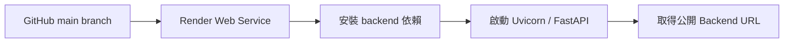
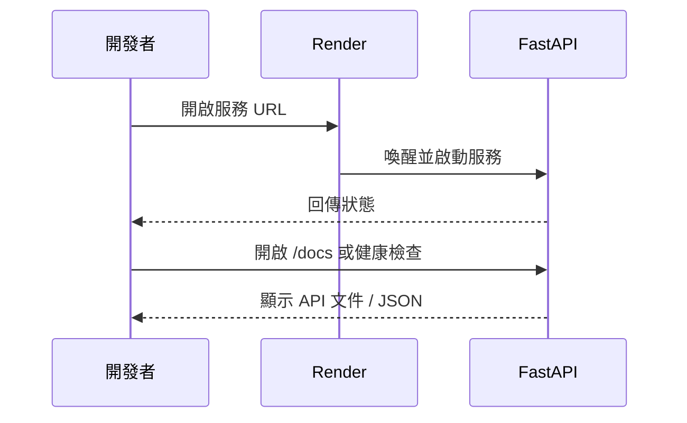

本機後端只在你的電腦開機時存在。要讓 Vercel 前端與其他裝置都能使用 Data Machi，需要把 FastAPI 部署到可公開存取的後端服務。這個專案使用 Render。



## 建立 Render Web Service

1. 登入 Render，選擇 **New Web Service**。
2. 連接你的 GitHub Repository。
3. 選擇正式部署使用的 Branch。
4. 將 Root Directory 設為 `backend`。
5. 設定 Python Runtime。
6. 填入 Build Command 與 Start Command。
7. 建立 Environment Variables。
8. 部署並查看 Log。

## 常見設定範例

```text
Root Directory: backend
Build Command: pip install -r requirements.txt
Start Command: uvicorn main:app --host 0.0.0.0 --port $PORT
```

若專案已有 `render.yaml`，應先檢查其中的路徑、Python 版本與啟動指令是否仍符合目前 Repository，而不是直接假設設定正確。

## 加入後端環境變數

至少可能包含：

```env
GOOGLE_API_KEY=
GEMINI_MODEL=
GEMINI_FAST_MODEL=
GOOGLE_SERVICE_ACCOUNT_JSON=
GOOGLE_SHEET_KEY=
ALLOWED_ORIGINS=
```

Trello、Confluence 等選配服務，只在實際使用時加入。修改 Environment Variables 後通常需要重新部署或重新啟動服務。

## 如何驗證後端成功？



建議檢查：

- Render 部署狀態為 Live。
- 服務 URL 可以開啟。
- `/docs` 或自訂 `/health` 正常回應。
- `/chat` 能直接用 Swagger 或 API Client 測試。
- Log 中沒有缺少套件、環境變數或 Port 錯誤。

## 免費服務的冷啟動

部分方案在閒置後可能休眠。下一次請求需要等待服務重新啟動，使用者可能感覺第一次回答較慢。前端應顯示清楚的連線與等待狀態，正式使用時也要評估方案限制。

## 常見失敗

| 現象 | 優先檢查 |
| --- | --- |
| Build Failed | `requirements.txt`、Python 版本、Root Directory |
| Service Exited | Start Command、`main:app` 路徑、Port |
| 本機正常，Render 缺 Key | Environment Variables 尚未建立 |
| PDF／索引消失 | 平台檔案系統與持久化策略 |
| 請求被 CORS 擋住 | `ALLOWED_ORIGINS` 尚未加入 Vercel URL |

## 本篇驗收

- Render URL 可從手機或其他網路開啟。
- `/docs` 與最小 `/chat` 測試成功。
- 所有 Secret 只存在 Render Environment。
- 新 Commit 能觸發自動部署。
- 部署失敗時能從 Log 找到具體階段。

## 建議的 Vibe Coding Prompt

```text
請檢查目前 Repository 的 Render 部署設定。
確認 Root Directory、requirements.txt、Python 版本、Start Command、$PORT 與健康檢查。
請列出 Render 需要的環境變數名稱，但不要輸出任何真實值。
修改後提供一份從部署 Log 到 /docs 的驗收清單。
```

下一篇會將 React／Vite 前端部署到 Vercel。