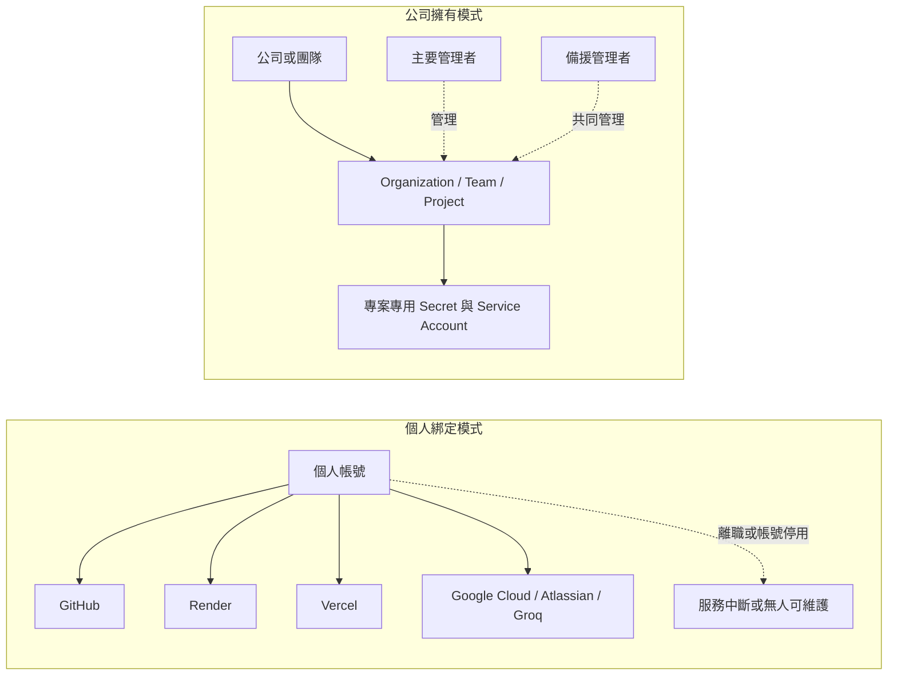
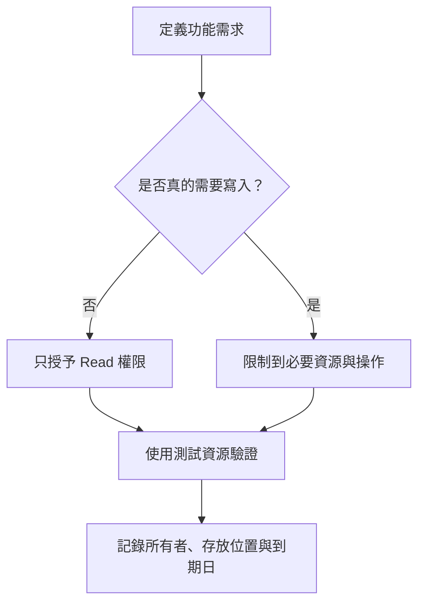
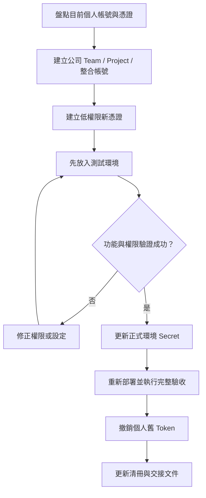
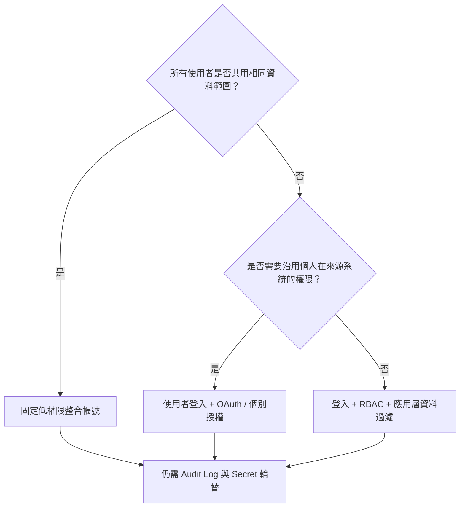

前面的章節已經讓 Data Machi 能呼叫 Gemini、Google Sheets、Trello、Confluence 與 Groq。正式部署前，還要回答一個比「功能能不能跑」更重要的問題：**這些服務、帳號與憑證究竟屬於誰？**

開發初期由主要開發者使用自己的帳號申請 API 很常見，但正式系統若長期依賴個人身分，當帳號停用、權限改變或人員離開時，系統也可能一起失效。

## 個人擁有與公司擁有的差別



理想原則不是「個人不能管理」，而是：

> **資產由公司或團隊擁有，個人只是被授權的管理者之一。**

## 先分清楚三層權限

<CardGroup cols={3}>
  <Card title="平台管理權限" icon="user-gear">
    誰可以修改程式、查看部署設定、建立 API Key、管理帳務、查看 Log 或邀請成員。
  </Card>

  <Card title="系統執行權限" icon="robot">
    Data Machi 本身可以讀取哪些 Sheet、Space、Board、文件與 API，是否具有寫入或刪除權限。
  </Card>

  <Card title="使用者資料權限" icon="users-viewfinder">
    不同使用者透過 Data Machi 能查到哪些內容，以及哪些工具只對特定角色開放。
  </Card>
</CardGroup>

這三層不能互相取代。把 Google Sheets 改成 Service Account，能避免系統綁定某位員工，但不會自動完成使用者登入、RBAC 或資料列權限。

## 目前 Data Machi 的第一階段做法

如果目前使用者共用相同資料範圍，可以先採用固定、低權限的整合身分：

| 服務 | 建議正式歸屬 | 建議執行身分 |
| --- | --- | --- |
| GitHub | 公司 Organization | 開發者透過個人帳號加入團隊 |
| Render | 公司 Workspace | 專案 Environment Secrets |
| Vercel | 公司 Team | 專案 Environment Variables |
| Gemini / Google Sheets | 公司 Google Cloud Project | 專案 API Key 與 Service Account |
| Confluence | 公司 Atlassian 組織 | 低權限整合帳號或 Service Account |
| Trello | 公司管理的專用帳號 | 只加入必要 Workspace／Board |
| Groq | 公司 Organization／Project | 專案專用 API Key |

<Warning>
  不要為了方便直接使用全域管理者帳號。系統使用哪個身分的 Token，就會繼承該身分可存取的資料與操作能力。
</Warning>

## 最小權限原則怎麼落地？

最小權限不是抽象口號，而是逐項回答「這個功能真的需要嗎？」

- 只需要讀取報表，就不要給 Sheet 編輯權限。
- 只需要查詢卡片，就不要給 Trello 刪除或搬移卡片的能力。
- 只需要讀取特定 Space，就不要讓整合帳號加入全站管理群組。
- 開發者需要部署，不代表必須成為帳務 Owner。
- 正式環境與測試環境應使用不同的 Key，避免測試誤用正式資料。



## 建立憑證與資產清冊

請建立一份不含完整 Secret 的清冊，至少記錄：

| 服務 | 資產所有者 | 憑證名稱 | 權限範圍 | 存放位置 | 到期／輪替日 | 備援管理者 |
| --- | --- | --- | --- | --- | --- | --- |
| Gemini | 公司 GCP Project | Production API Key | 模型呼叫 | Render | 待填 | 待填 |
| Sheets | 公司 GCP Project | Data Machi Service Account | 指定 Sheet 讀取 | Render | 定期檢查 | 待填 |
| Confluence | 整合帳號 | Read Token | 指定 Space | Render | 待填 | 待填 |
| Trello | Bot 帳號 | Board Token | 指定 Board | Render | 待填 | 待填 |

<Note>
  清冊只能記錄 Secret 的名稱、末四碼或 Secret Manager 位置，不要把完整 API Key 或 Token 貼進文件。
</Note>

## 從個人帳號遷移到公司資產

不要先撤銷舊 Token。安全遷移應採雙軌切換：



### 步驟 1：盤點目前資產與憑證

列出 GitHub、Render、Vercel、Google Cloud、Atlassian 與 Groq 的所有者、管理者、Secret 名稱與目前存放位置。

### 步驟 2：建立公司 Team、Project 與備援管理者

將 GitHub Repository 移至公司 Organization，Render 與 Vercel 移至公司 Workspace／Team，並至少加入一位備援管理者。

### 步驟 3：建立低權限新憑證

將 Gemini 與 Sheets 移至公司 Google Cloud Project，Confluence、Trello 改用公司控制的低權限整合身分，Groq 改用公司 Project Key。

### 步驟 4：先在測試環境驗證

把新憑證放入測試環境，確認功能、資料範圍與錯誤處理符合預期。

### 步驟 5：切換正式環境並重新部署

更新正式環境 Secret，重新部署前端與後端，再執行完整驗收。

### 步驟 6：撤銷舊憑證並更新清冊

只有在新憑證驗證成功後，才撤銷個人舊 Token，並更新資產清冊、輪替日期與交接文件。

## 什麼時候需要 OAuth 或 RBAC？

固定 Service Account 適合所有使用者共用相同資料範圍的第一版產品。當不同使用者必須看到不同資料時，才需要更完整的身分與授權設計。



- **OAuth**：讓 Data Machi 代表目前登入者存取來源系統，權限通常跟著該使用者。
- **RBAC**：依角色控制可使用的功能，例如一般使用者、分析人員與管理者。
- **Audit Log**：記錄誰在何時查詢或修改了什麼，方便調查與稽核。
- **Token 輪替**：建立新 Token、切換並驗證後，再撤銷舊 Token。

## 離職交接測試

真正的交接標準不是「有一份文件」，而是另一位管理者能在沒有原開發者協助下完成以下事項：

- 找到 Repository、Render、Vercel 與 Cloud Project。
- 重新部署前端與後端。
- 找到環境變數清單，但看不到文件中的明文 Secret。
- 建立並輪替一組 Token。
- 知道如何撤銷失效憑證。
- 判斷每個整合帳號可以存取哪些資料。
- 在移除原開發者帳號後，系統仍可正常運作。

## 本篇驗收

- 所有正式服務都有公司或團隊層級的所有權。
- 至少有一位備援管理者。
- 正式系統不依賴唯一個人帳號。
- 每個 Secret 都有用途、存放位置、權限範圍與輪替方式。
- 整合帳號僅能讀取必要資源。
- 測試與正式環境使用不同憑證。
- 已記錄離職、帳號停用與 Token 外洩時的處理流程。

## 建議的 Vibe Coding Prompt

```text
請盤點目前 Repository 與部署設定中的帳號、Secret 與權限風險。

請檢查：
1. 哪些服務可能綁定個人帳號
2. 是否有 API Key、Token、Email 或正式 URL 被硬編碼
3. 哪些憑證權限可能過高
4. 正式與測試環境是否共用憑證
5. 是否缺少第二位管理者與交接文件
6. 如果改成公司 Team、Project 或 Service Account，建議的遷移順序

請先輸出盤點表與風險分級，不要立即修改、撤銷或產生任何新憑證。
```

## 盤點平台權限與完成 Token 輪替

### 步驟 1：檢查 GitHub Organization 與 Repository 權限

進入公司 GitHub Organization 或 Repository Settings，開啟 People、Collaborators 或 Teams 權限頁面。確認 Repository 不只由單一個人帳號控制，並至少安排一位備援管理者。

**圖 1｜檢查 Repository 的 People 與 Teams 權限**

> \[圖片預留位置：GitHub Repository 的 People／Teams 權限頁，標示角色欄位\]

_圖說：正式 Repository 應由公司 Organization 擁有，並至少有兩位能處理緊急維護的管理者。教學圖片中的姓名、Email、Organization 與公司名稱都必須匿名化。_

### 步驟 2：確認備援管理者與最小權限

依實際工作分配 Admin、Maintain、Write 或 Viewer 等角色，確保主要開發者離開後仍有人能維護系統。

**圖 2｜確認備援管理者與最小權限**

> \[圖片預留位置：成員角色或 Team 權限設定，標示 Admin、Maintain、Write 等角色\]

_圖說：不是所有人都需要 Admin。依實際工作分配角色，並確認主要開發者離開或帳號停用後，備援管理者仍能修改設定、合併 PR 與重新部署。_

### 步驟 3：檢查其他雲端平台的成員角色

逐一檢查 Render Workspace、Vercel Team 與 Google Cloud IAM，確認正式環境至少有一位備援管理者，並避免所有人都使用最高權限。

**圖 3｜檢查 Render、Vercel 與 Google Cloud 的成員角色**

> \[圖片預留位置：Render Workspace、Vercel Team 與 Google Cloud IAM 的角色設定拼圖\]

_圖說：各平台的角色名稱不同，但都應依最小權限分配 Owner、Developer、Viewer 等能力。正式環境至少要有一位備援管理者；圖片不需展示真實成員姓名、Email 或公司資訊。_

### 步驟 4：建立憑證與資產清冊

將服務所有者、Secret 名稱、存放位置、權限範圍、輪替日期與備援管理者記錄到清冊，但不要保存完整 Secret。

**圖 4｜建立憑證與資產清冊**

> \[圖片預留位置：使用假資料的清冊，包含服務、Secret 名稱、存放位置、權限範圍、輪替日期與備援管理者\]

_圖說：清冊只記錄憑證名稱、用途、存放位置與管理責任，不保存完整 Secret。透過輪替日期與備援管理者欄位，可以降低憑證過期或人員異動造成的風險。_

### 步驟 5：加入新 Token 並完成重新部署

先建立新 Token、更新環境變數並重新部署。完成實際功能驗證前，不要先撤銷舊 Token。

**圖 5｜先加入新 Token 並完成重新部署**

> \[圖片預留位置：新 Secret 已加入環境變數，以及重新部署成功的畫面\]

_圖說：Token 輪替時，先建立新 Token、更新環境變數並重新部署。完成實際功能驗證前，不要先撤銷舊 Token，否則可能造成服務中斷。_

### 步驟 6：驗證成功後撤銷舊 Token

確認新 Token 已在正式環境正常運作，再撤銷舊 Token，並更新憑證清冊中的輪替日期與管理者。

**圖 6｜驗證成功後撤銷舊 Token**

> \[圖片預留位置：舊 Token 的撤銷畫面與清冊更新結果\]

_圖說：確認新 Token 已在正式環境正常運作後，再撤銷舊 Token，並更新憑證清冊中的輪替日期與管理者。_

下一篇才會將 FastAPI 後端部署到 Render。部署之前先完成這份盤點，才能避免把個人帳號與過高權限一起帶進正式環境。