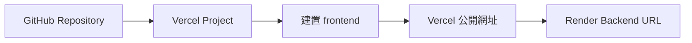
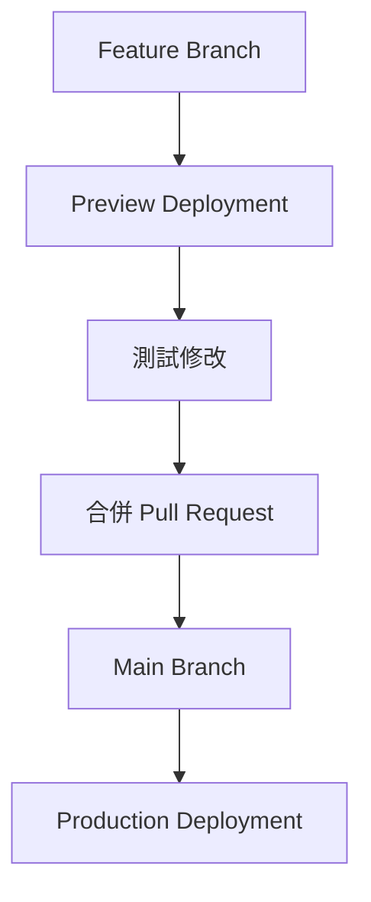

Render 已經讓後端在線上運作，下一步是把 React／Vite 前端部署到 Vercel，讓使用者可以直接透過瀏覽器使用 Data Machi。



## 建立 Vercel Project

1. 登入 Vercel，選擇 **Add New Project**。
2. 匯入同一個 GitHub Repository。
3. Root Directory 設為 `frontend`。
4. Framework Preset 選擇 Vite。
5. 確認 Build Command 與 Output Directory。
6. 建立前端環境變數。
7. 執行第一次部署。

## 前端最重要的環境變數

```env
VITE_API_BASE_URL=https://your-backend.onrender.com
```

這個網址不是 Secret，可以放在 Vercel Environment，但不要散落在多個 React 元件中。所有 API 呼叫應該統一從環境變數或共用 API Client 讀取。

<Warning>
  `VITE_` 變數會被打包到瀏覽器端，因此只能放可公開設定。Gemini Key、Trello Token、Confluence Token 與 Service Account JSON 都不應出現在 Vercel 前端。
</Warning>

## Preview 與 Production

Vercel 可能為每個 Branch 或 Pull Request 建立 Preview URL，而主要分支則對應 Production URL。



Preview 很適合檢查前端版面與基本流程，但若後端 CORS 只允許 Production URL，Preview 可能無法呼叫 Render。後續串接篇會處理這個差異。

## 如何驗證前端成功？

- Vercel Deployment 狀態為 Ready。
- 首頁與聊天介面能正常載入。
- 瀏覽器 Console 沒有找不到環境變數或 JavaScript 錯誤。
- Network 面板能看到請求送往正確的 Render URL。
- 後端失敗時，畫面會顯示可理解的錯誤，不會永久 Loading。

## 常見失敗

| 現象 | 優先檢查 |
| --- | --- |
| Build Failed | Node.js 版本、`package.json`、Root Directory |
| 白畫面 | 瀏覽器 Console、路由與環境變數 |
| 呼叫 localhost | `VITE_API_BASE_URL` 未設定或未重新部署 |
| 404 on refresh | SPA Rewrite／路由設定 |
| CORS Error | Render 尚未允許目前 Vercel 網域 |

## 本篇驗收

- Production URL 可在桌機與手機開啟。
- API 請求指向 Render，而不是 localhost。
- GitHub 新 Commit 能觸發 Vercel 自動部署。
- Preview 與 Production 的環境設定已清楚區分。

## 建議的 Vibe Coding Prompt

```text
請檢查 React / Vite 前端的 Vercel 部署設定。
確認 Root Directory、Build Command、Output Directory 與 VITE_API_BASE_URL。
請把所有 Backend URL 集中管理，不要散落在元件中，
並提供 Browser Console、Network 與部署 Log 的驗收方式。
```

## 在 Vercel 建立前端 Project

1. 登入 Vercel，進入公司或團隊 Team。
2. 選擇新增 Project。
3. 從 GitHub 匯入 Data Machi Repository。
4. 確認部署 Branch。
5. 將 Root Directory 設為 `frontend`。
6. 確認 Framework Preset 為 Vite，並檢查 Build Command 與 Output Directory。
7. 建立 `VITE_API_BASE_URL` 等前端環境變數。
8. 開始部署並檢查 Build Log。

**圖 1｜從 GitHub 匯入 Data Machi Repository**

> \[圖片預留位置：Vercel 新增 Project 與 Import Git Repository 畫面\]

_圖說：在 Vercel Team 中新增 Project，找到 Data Machi 的 GitHub Repository 並選擇 Import。正式專案建議放在團隊 Team，而不是只存在個人帳號。_

**圖 2｜設定 frontend Root Directory 與 Vite**

> \[圖片預留位置：Root Directory、Framework Preset、Build Command 與 Output Directory\]

_圖說：因為 React／Vite 前端位於 `frontend`，Root Directory 應指向該資料夾。確認 Vercel 正確辨識 Vite，並依 Repository 實際設定檢查建置指令。_

**圖 3｜設定前端 Backend URL**

> \[圖片預留位置：Vercel Environment Variables，顯示 `VITE_API_BASE_URL` 名稱與匿名網址\]

_圖說：將 Render 後端網址填入 `VITE_API_BASE_URL`。這個值會被打包到瀏覽器前端，因此只能放可公開的 API Base URL，不可放任何私密 API Key。_

**圖 4｜確認 Vite、Root Directory 與 Build 設定**

> \[圖片預留位置：Vercel 設定頁，標示 Framework Preset、Root Directory、Build Command 與 Output Directory\]

_圖說：部署前逐欄確認 Framework Preset 為 Vite、Root Directory 指向 `frontend`，並依 Repository 實際設定核對 Build Command 與 Output Directory。_

**圖 5｜設定前端 Environment Variable 的套用範圍**

> \[圖片預留位置：`VITE_API_BASE_URL` 新增畫面與 Production／Preview／Development 選項\]

_圖說：建立 `VITE_API_BASE_URL` 時，依需求選擇套用到 Production、Preview 與 Development。教學中可使用示意 Render 網址，避免暴露私人 Preview 網域。_

**圖 6｜確認 Vercel Deployment 與正式網址**

> \[圖片預留位置：Deployment 狀態為 Ready、正式 Domain 與前端首頁\]

_圖說：Vercel 顯示 Ready 後，開啟 Production Domain，確認前端首頁可以載入。這一步只代表前端部署成功，下一篇還要驗證它能否正確呼叫 Render 後端。_

下一篇會正式串接 Vercel 與 Render，處理 CORS、網址與環境差異。