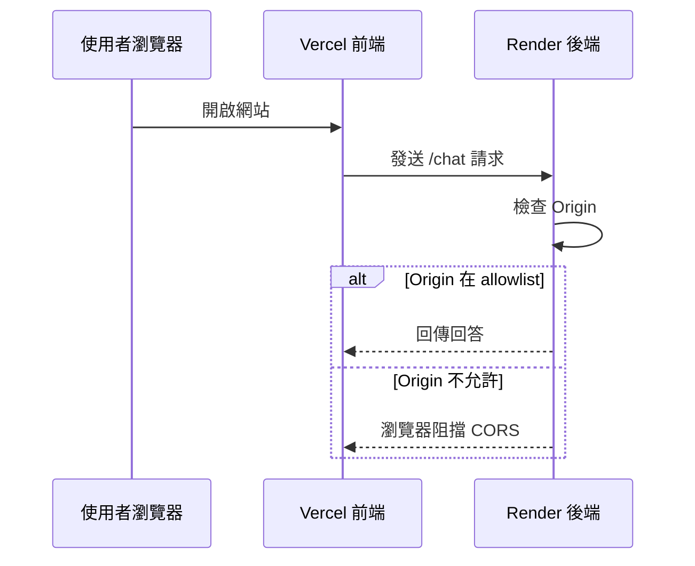
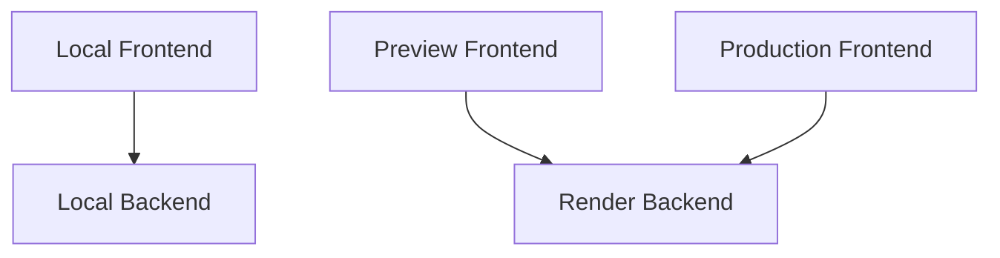

前端與後端都部署成功，不代表兩者一定能溝通。瀏覽器會檢查來源網域；若 Render 沒有允許目前的 Vercel 網址，即使後端本身正常，前端仍會被 CORS 阻擋。



## 兩邊要互相知道什麼？

- **Vercel 前端**需要知道 Render Backend URL。
- **Render 後端**需要知道哪些前端 Origin 可以呼叫它。

```env
# Vercel
VITE_API_BASE_URL=https://your-backend.onrender.com

# Render
ALLOWED_ORIGINS=https://your-app.vercel.app,http://localhost:5173
```

多個 Origin 通常以逗號分隔，實際格式依你的後端程式而定。

## 為什麼不直接允許 `*`？

若後端允許所有網站跨來源呼叫，其他網站可能直接使用你的後端配額與運算資源。正式環境應限制為自己的 Production URL、需要的 Preview URL 與本機開發網址。

## 本機、Preview、Production 地圖

| 環境 | 前端 URL | 後端 URL | 用途 |
| --- | --- | --- | --- |
| Local | `localhost:5173` | `localhost:8000` | 本機開發 |
| Preview | Vercel Preview URL | Render 正式或測試服務 | PR 驗收 |
| Production | 正式 Vercel URL | 正式 Render URL | 使用者服務 |



Preview URL 可能每次都不同。你可以選擇只在 Production 做完整 API 測試，或設計適合的 Preview CORS 策略，但不要為方便而永久開放所有來源。

## 串接步驟

1. 在 Render 複製正式 Backend URL。
2. 到 Vercel 設定 `VITE_API_BASE_URL`。
3. 重新部署 Vercel。
4. 在 Vercel 複製 Production URL。
5. 到 Render 設定 `ALLOWED_ORIGINS`。
6. 重新啟動或部署 Render。
7. 從 Vercel 正式網址送出測試問題。
8. 同時查看 Browser Network 與 Render Log。

## 常見判斷方式

- 瀏覽器顯示 CORS，但 Render 沒收到請求：可能在 Preflight 階段被擋。
- Render 收到 `OPTIONS` 但沒有 `POST`：檢查 CORS Methods／Headers。
- Vercel 仍呼叫舊網址：環境變數更新後尚未重新部署。
- 本機正常、正式失敗：正式 URL 或 allowlist 未同步。
- Postman 正常、瀏覽器失敗：Postman 不受瀏覽器 CORS 限制。

## 本篇驗收

- Vercel Production 可以完成聊天。
- 本機前端仍可呼叫本機後端。
- 未允許的測試網站無法跨來源呼叫 Render。
- Network 面板顯示正確的 Request URL、Status 與 Response。
- Render Log 能對應到前端送出的請求。

## 建議的 Vibe Coding Prompt

```text
請檢查前端 API Base URL 與 FastAPI CORS 設定。
請列出 Local、Preview、Production 三個環境的 URL 流向，
確認 allow_origins、allow_methods、allow_headers 與 credentials 設定符合目前請求方式。
不要使用 * 作為正式環境的永久解法。
```

下一篇會進行完整驗收，並建立遠端 Vibe Coding、版本回復與持續維護流程。