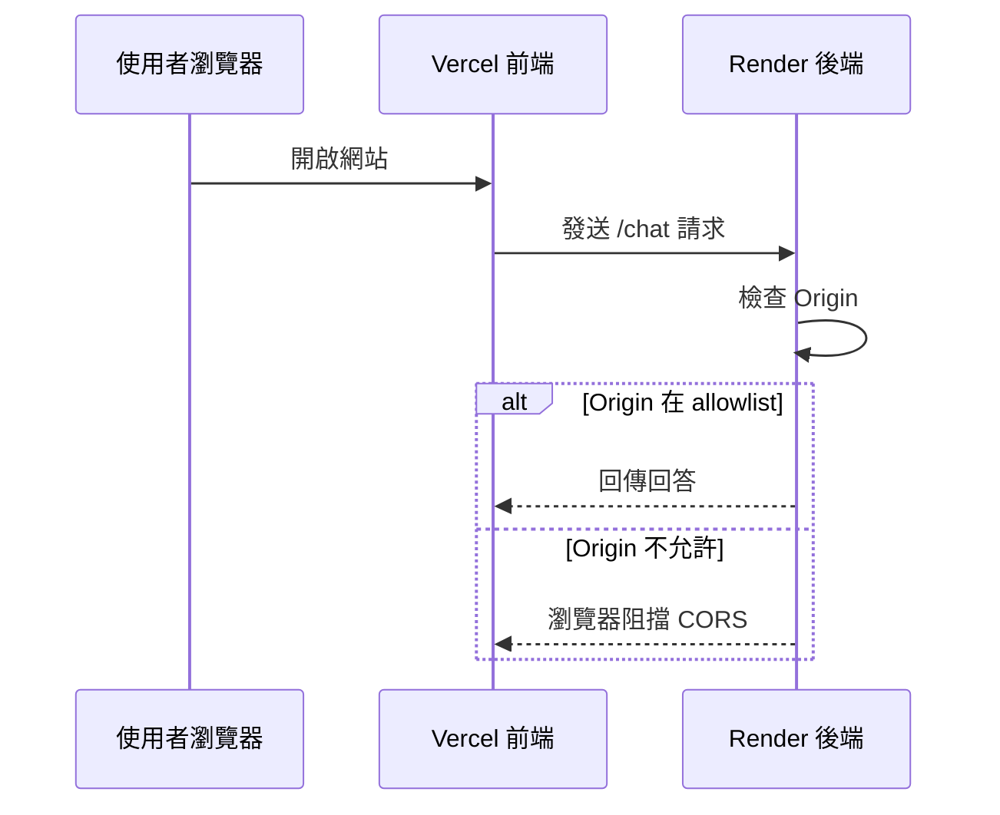
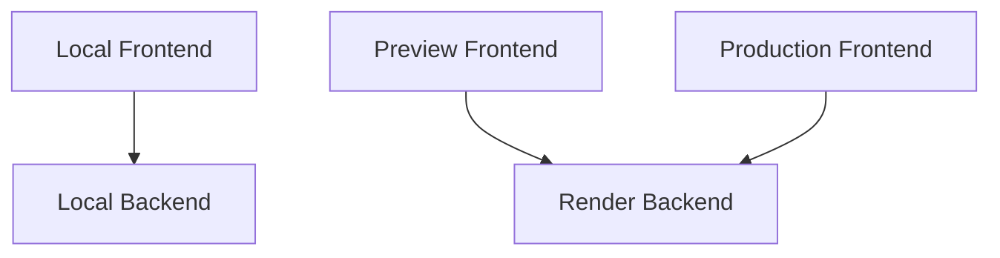

前端與後端都部署成功，不代表兩者一定能溝通。瀏覽器會檢查來源網域；若 Render 沒有允許目前的 Vercel 網址，即使後端本身正常，前端仍會被 CORS 阻擋。



## 兩邊要互相知道什麼？

- **Vercel 前端**需要知道 Render Backend URL。
- **Render 後端**需要知道哪些前端 Origin 可以呼叫它。

```env
# Vercel
VITE_API_BASE_URL=https://your-backend.onrender.com

# Render
ALLOWED_ORIGINS=https://your-app.vercel.app,http://localhost:5173
```

多個 Origin 通常以逗號分隔，實際格式依你的後端程式而定。

## 為什麼不直接允許 `*`？

若後端允許所有網站跨來源呼叫，其他網站可能直接使用你的後端配額與運算資源。正式環境應限制為自己的 Production URL、需要的 Preview URL 與本機開發網址。

## 本機、Preview、Production 地圖

| 環境 | 前端 URL | 後端 URL | 用途 |
| --- | --- | --- | --- |
| Local | `localhost:5173` | `localhost:8000` | 本機開發 |
| Preview | Vercel Preview URL | Render 正式或測試服務 | PR 驗收 |
| Production | 正式 Vercel URL | 正式 Render URL | 使用者服務 |



Preview URL 可能每次都不同。你可以選擇只在 Production 做完整 API 測試，或設計適合的 Preview CORS 策略，但不要為方便而永久開放所有來源。

## 常見判斷方式

- 瀏覽器顯示 CORS，但 Render 沒收到請求：可能在 Preflight 階段被擋。
- Render 收到 `OPTIONS` 但沒有 `POST`：檢查 CORS Methods／Headers。
- Vercel 仍呼叫舊網址：環境變數更新後尚未重新部署。
- 本機正常、正式失敗：正式 URL 或 allowlist 未同步。
- Postman 正常、瀏覽器失敗：Postman 不受瀏覽器 CORS 限制。

## 本篇驗收

- Vercel Production 可以完成聊天。
- 本機前端仍可呼叫本機後端。
- 未允許的測試網站無法跨來源呼叫 Render。
- Network 面板顯示正確的 Request URL、Status 與 Response。
- Render Log 能對應到前端送出的請求。

## 建議的 Vibe Coding Prompt

```text
請檢查前端 API Base URL 與 FastAPI CORS 設定。
請列出 Local、Preview、Production 三個環境的 URL 流向，
確認 allow_origins、allow_methods、allow_headers 與 credentials 設定符合目前請求方式。
不要使用 * 作為正式環境的永久解法。
```

## 將 Vercel 與 Render 正式串接

### 步驟 1：取得 Render Backend URL

在 Render Service 中複製正式後端網址，確認網址能開啟 `/docs` 或 `/health`。

### 步驟 2：設定 Vercel 的 `VITE_API_BASE_URL`

回到 Vercel Environment Variables，將 Render 公開網址填入 `VITE_API_BASE_URL`，再重新部署前端。

### 步驟 3：取得 Vercel Production Domain

從 Vercel Project 複製 Production Domain。

**圖 1｜複製 Vercel Production Domain**

> \[圖片預留位置：Vercel Project Domains 頁面，標示 Production Domain\]

_圖說：在 Vercel Project 中找到正式網域。請使用完整 Origin，例如 `https://your-app.vercel.app`，不要複製特定頁面路徑。_

### 步驟 4：將 Vercel Domain 加入 CORS Allowlist

回到 Render Environment Variables，將完整 Vercel Origin 加入 `ALLOWED_ORIGINS`。確認包含正確的 `https://`，且沒有多餘路徑。

**圖 2｜在 Render 設定 `ALLOWED_ORIGINS`**

> \[圖片預留位置：Render Environment Variables，標示 `ALLOWED_ORIGINS` 與匿名 Vercel 網址\]

_圖說：將 Vercel Production Domain 加入後端 CORS allowlist。網址不可多出 API 路徑，是否保留結尾斜線則應與後端解析方式一致。_

### 步驟 5：重新部署前端與後端

Vercel 與 Render 的環境變數修改後都必須重新部署，新的設定才會生效。

### 步驟 6：從 Network 驗證正式連線

回到 Vercel 正式網站送出測試問題，並使用瀏覽器 Network 面板檢查 OPTIONS、POST、Status Code 與 Request URL。

**圖 3｜從瀏覽器 Network 驗證正式連線**

> \[圖片預留位置：瀏覽器開發者工具 Network，標示 OPTIONS、POST、Status Code 與 Request URL\]

_圖說：重新送出聊天問題後，從 Network 檢查請求是否送往正確的 Render URL。若 OPTIONS 或 POST 被阻擋，優先檢查 CORS、Backend URL 與重新部署是否完成。_

### 步驟 7：辨識並修正 CORS 錯誤

若請求失敗，先從 Console 與 Network 比對 Origin、Request URL、OPTIONS 與 POST 狀態，再回頭修正 `ALLOWED_ORIGINS`。

**圖 4｜辨識瀏覽器中的 CORS 錯誤**

> \[圖片預留位置：瀏覽器 Console／Network 的 CORS 錯誤，標示 Origin、Request URL 與錯誤訊息\]

_圖說：CORS 設定錯誤時，瀏覽器通常會在 Console 或 Network 顯示請求被來源政策阻擋。先核對前端 Origin、後端 Request URL 與 `ALLOWED_ORIGINS` 是否一致。_

**圖 5｜更新 allowlist 並重新部署後請求成功**

> \[圖片預留位置：修正 Render 環境變數、重新部署，以及 Network 中成功回應的畫面\]

_圖說：更新 `ALLOWED_ORIGINS` 後必須重新部署後端。重新測試時，確認 OPTIONS 與 POST 請求成功，並比較修正前後的 Status Code 與 Response。_

### 步驟 8：完成正式環境對話驗收

從 Vercel Production Domain 提出一個測試問題，確認前端、Render、Gemini 與資料工具能完成整條請求鏈。

**圖 6｜完成正式環境的完整對話測試**

> \[圖片預留位置：從 Vercel 正式網址提出問題、前端顯示工具狀態並成功取得回答\]

_圖說：最後從 Vercel Production Domain 提出一個測試問題，確認前端能呼叫 Render、後端能使用 Gemini 或資料工具，並將回答正常顯示。這張圖是前後端正式串接完成的最終驗收證據。_

下一篇會進行完整驗收，並建立遠端 Vibe Coding、版本回復與持續維護流程。